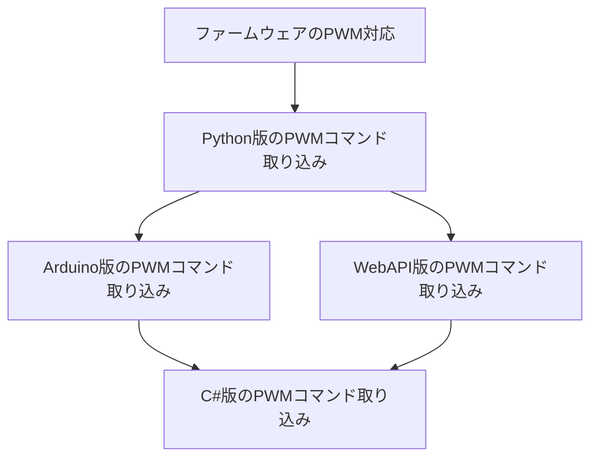

# PMO Report
Updated: 2025-09-29 Rev.4

## 今回の更新内容
- 進捗：更新あり
- ルール：更新なし

---

# 前半：現在の進捗状況

### 通信経路の進捗表
| タスク       | ファームウェア | Python版 | WebAPI版 | Arduino版 | C#版   | 現状・クリティカルパス |
|--------------|---------------|----------|----------|-----------|--------|-----------------------|
| 通信経路対応 | 合格          | 合格     | 未実施   | 不合格    | 未実施 | Python版待ち          |
| PWM対応      | 実装中        | 待機中   | 未着手   | 未着手    | 未着手 | Python版＋WebAPI版＋Arduino版待ち |

### PWMコマンドの進捗表
| チーム       | PWM対応ステータス | 備考                | クリティカルパス   |
|--------------|------------------|---------------------|-------------------|
| Python版     | 実装中／テスト中   | ファームウェア連携中 | ファームウェア     |
| WebAPI版     | 未着手            | URL短縮完了後に開始  | Python版のPWMコマンド取り込み |
| Arduino版    | 未着手            | PICO-2W解消後に開始 | Python版のPWMコマンド取り込み |
| C#版         | 未着手            | 最後に対応           | Python版＋WebAPI版＋Arduino版のPWMコマンド取り込み |

### クリティカルパス図

---

# 後半：PMO運用ルール

## 1. PMOの役割
- 各チームの進捗・課題・残タスクを一元管理する  
- 依存関係とクリティカルパスを明示する  
- テスト計画と進捗を追跡する  
- ファイルのライフサイクルを監督する（テスト合格 → GitHub反映 → プロジェクト更新）  

## 2. チーム構成（例）
- ファームウェアチーム / Python版チーム / WebAPIチーム / Arduino版チーム / C#版チーム  

## 3. 依存関係の基本ルール
- Python版が仕様の基準（ソース・オブ・トゥルース）  
- 流れは「ファームウェア → Python → （Arduino／WebAPI） → C#」  
- C#版は最後に対応（並行による手戻りを防ぐため）  

## 4. テスト管理ルール
- ステータスは「未実施／合格／不合格／スキップ」で統一  
- 新機能テスト＋リグレッションテストの両方が合格して完了とする  

## 5. ファイル管理ルール
- ChatGPTプロジェクトファイルでは先頭にチーム番号を付けて識別する  
- 実際のファイル名は番号を除いたものを使用  
- ソース2行目に更新日付＋枝番を記載  
- GitHubを正本とし、逆流や巻き戻しを防ぐために常に同期状態を管理する  

## 6. 進捗表示の運用
- 進捗は「チーム横断のタスクごと」に管理する  
  - 現在の例：通信経路対応、PWMコマンド対応  
- 各タスクの行にチームごとの進捗を並べ、右端に現状・クリティカルパスを記載する  
- この表を補完するため、**クリティカルパス図を表の直後に配置**する  

### 表の例（簡易）
| タスク       | ファームウェア | Python版 | WebAPI版 | Arduino版 | C#版 | 現状・クリティカルパス |
|--------------|---------------|----------|----------|-----------|------|-----------------------|
| 通信経路対応 | 合格          | 合格     | 未実施   | 不合格    | 未実施 | Python版待ち |
| PWM対応      | 実装中        | 待機中   | 未着手   | 未着手    | 未着手 | Python版＋WebAPI版＋Arduino版待ち |

## 7. 例外運用：プロジェクト先行アップロード
- 一時的にプロジェクトファイルを先に更新する場合、ファイルに暫定フラグを記載する  
- GitHubへの追随は必須であり、期限内に必ず反映する  
- PMOはどちらが最新かを監視し、逆流を防ぐ  
