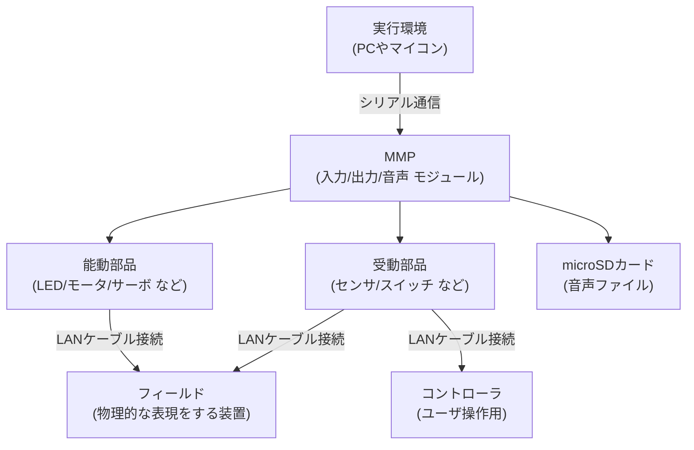

# １章 システム構成
MMPはマイコン・入出力モジュールから構成されています。  

本システムは、以下のレイヤから構成されます。
1. **実行環境**  
ゲームや業務アプリケーションを実装するターゲットマシンです。  
MMPとシリアル通信する必要があるため、この通信機能を持つマシンに限られます。  
ファームウェア層とのやりとりを簡略化するために、ミドルウェアを用意する場合があります。  
 

2. **ファームウェア層(MMP)**  
MMP本体に搭載するマイコンのプログラムです。
外部とシリアル通信で入出力コマンドを処理します。
 

3. **ハードウェア層(周辺機器)** 
MMP本体に接続される周辺機器になります。
周辺機器には、受動･能動部品が含まれます。
   - **能動部品**：PWM制御によるLED/DCモータの出力、サーボポータの角度、電源のON/OFFなどを制御
   - **受動部品**：センサ/スイッチ/ユーザ操作のコントローラなどをアナログ電圧で入力
   - **microSDカード**：音声モジュールが扱う音声ファイルを格納

## 1.1 **実行環境(PC・マイコン)**  
- アプリケーション全体の制御を行う。  
- MMP を介して物理デバイスを制御。
> PCでは高度なプログラム言語/ゲームエンジンが使用でき、高度アプリ開発が可能。  
> 大容量メモリ・高速な処理能力を活かし、大きなアプリケーション開発が可能。  
> 画面表示や入力装置(キーボード/USBコントローラ)といった、MMPにないインタラクティブ機能を実現できます。  

## 1.2 **MMP**  
- 各種外部デバイスとの接続を管理
- PCとはUSBシリアル経由で接続
- USBシリアルがないマイコンは、MMPのGPI経由でシリアル通信が可能
- シリアル通信でコマンドを発行し、MMPに搭載した各種モジュールを制御

## 1.3 **MMP搭載モジュール**  
MMPが搭載するモジュールは次のとおり。

-  **入力モジュール（HC4067：DAC方式）**  
   - 物理的な周辺機器などから、外的変化を電圧で扱う
   - ユーザ操作やセンサー信号を検知する
   - コントローラ入力やセンサーデータを走査する
 

-  **出力モジュール（PCA9865：PWM制御方式）**  
   - 物理的な対象物を(PWM制御により)さまざまな表現を与える  
   - LED/DCモータ/サーボなどを制御
   - PWM制御ではあるが、電源スイッチのON/OFFも可能
 

-  **音声モジュール (DFPlayer：mp3/wav形式)**  
   - アプリケーション中のBGM・効果音を再生  
   - 音声データはmicroSDカード内に格納する

## 1.4 **周辺機器**  
MMPの各モジュールと接続する外部機器は、以下に分類します。

-  **受動部品**  
   - センサーやスイッチなどの入力デバイス
   - アナログ信号やデジタル信号を扱う

-  **能動部品**  
   - LED、モーター、サーボなどの出力デバイス  
   - 強弱や角度などを制御可能

-  **microSDカード**  
   - 音声ファイルなど、外部データを格納

---
# ２章 ソフトウェア構成

本システムは、以下の4つのレイヤから構成されます。

1. **アプリケーション層**：
   - ゲームや業務アプリケーションなど、具体的な処理ロジックを実装
   - ユーザインターフェースやアプリケーション固有の制御を担当

2. **ミドルウェア層**：
   - アプリケーションとファームウェアの橋渡しを行う共通ライブラリ群
   - シリアル通信の送受信、コマンドパーサ、共通制御クラスを含む

3. **ファームウェア層**：
   - MMPマイコン上で動作するプログラム
   - 外部コマンドに基づき、ハードウェアモジュールを直接制御

4. **ハードウェア層**：
   - MMP本体および接続される外部デバイス（入力／出力／音声モジュール、センサ、アクチュエータ等）

## 2.1 レイヤ間の役割と責務

- **アプリケーション層**：
  ゲームや業務ロジックの構築に専念
- **ミドルウェア層**：
  通信やコマンドの送受信処理を共通化
- **ファームウェア層**：
  外部から受信した指令をもとにハードウェアを制御

## 2.3 入出力インターフェース
- アプリケーションの命令はミドルウェアを介して、シリアル通信でファームウェアに送信される
- ファームウェアは対応するハードウェアモジュールを操作し、その結果をミドルウェア経由でアプリケーションに返す