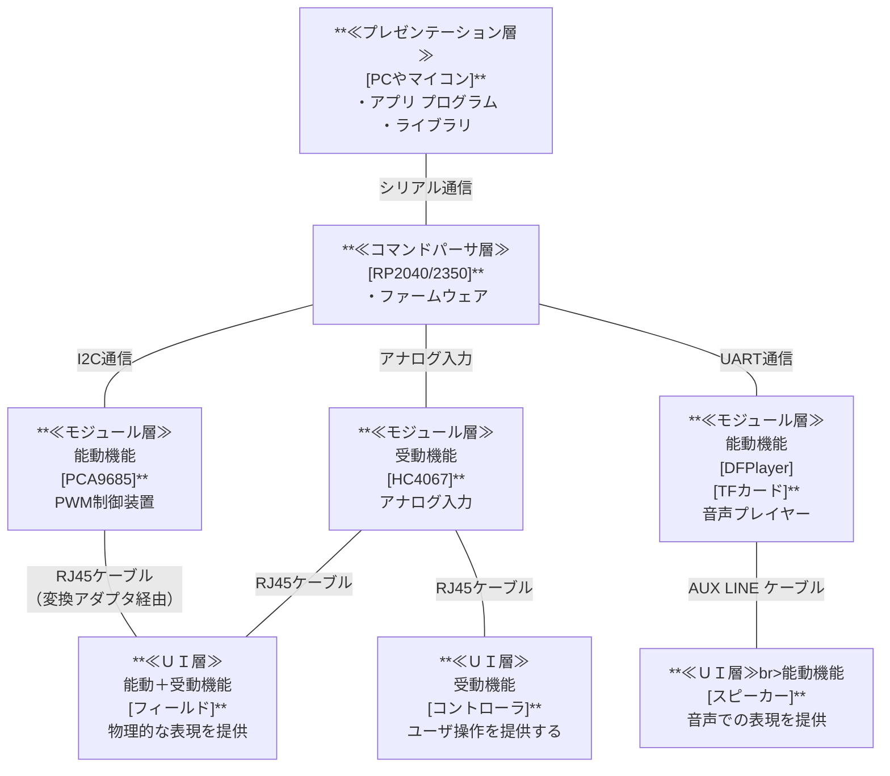

# １章 システム構成

## 1-1. 全貌
MMP本体は`マイコン` `内臓モジュール`から構成されます。
外部に`拡張機器`(`フィールド`/`コントローラ`)を接続し、ユーザとの接点を設けます。  

> このほか、MMP搭載マイコンに直接接続するＵＩ層(拡張機器)があります。
> - マイコンと直接 I2C接続
> - マイコンと直接 デジタル入出力

---
## 1-2. レイヤの詳細
構成レイヤを個別に解説します。

### 1-2-1. **アプリケーション層**
ＰＣやマイコンが担当します。  
ゲームや業務アプリケーションを実装するマシンです。
`コマンドパーサ層`へ、`MMPコマンド`の実行を要求します。

実装には`ライブラリ経由`/`シリアルコマンドを直接実行`の2通りがあります。ライブラリを使用すれば、高品質・高生産性の開発が可能です。
> ライブラリの対応プラットフォーム：
> - .NET COM(C#/VB/PowerShell/Excel VBA/Access VBA)
> - Arduino
> - Python（CPython/MicroPython/CircuitPython)

PCでは高度なプログラム言語/ゲームエンジンが使用可能。  
> 大容量メモリ・高速な処理能力を活かしたアプリケーションが開発可能。  
> 画面表示や入力装置(キーボード/USBコントローラ)など、マイコンにはない、インタラクティブ機能を実装できます。  

### 1-2-2. **コマンドパーサ層**
MMP本体に搭載する`マイコン`が対応します。
`アプリケーション層`の要求に従い、`MMPコマンド`を処理します

**(主な機能)**
  - PCとはUSBシリアル、マイコンはGPIOシリアルで通信
  - 起動時、USB/GPIOの方式選択・ボーレート変更はGPIOのスイッチで決定
  - 起動時、内臓機器の接続状況を取得(`プレゼンテーション層`から参照可)
  - `プレゼンテーション層`の要求に応答
    - `プレゼンテーション層`の要求から、コマンドを特定
    - 特定したコマンドを内蔵モジュールと連携しながら処理
    - 処理結果を`プレゼンテーション層`に返す

### 1-2-3. **モジュール層** 
MMP本体に搭載する`内臓モジュール`が担当します。
`コマンドパーサ層`の指示に従い、`ＵＩ層`と接続し`拡張機器`を制御します。

**(主な機能)**
  -  **アナログ入力モジュール（HC4067：DAC方式）**  
     - 物理的な周辺機器などから、外的変化を電圧で扱う
     - ユーザ操作やセンサー信号を検知する
     - コントローラ入力やセンサーデータを走査する
  -  **ＰＷＭ出力モジュール（PCA9865：PWM制御方式）**  
     - 物理的な対象物を(PWM制御により)さまざまな表現を与える  
     - LED/DCモータ/サーボなどを制御
     - PWM制御ではあるが、電源スイッチのON/OFFも可能
  -  **音声モジュール (DFPlayer：mp3/wav形式)**  
     - 再生/停止/一時停止/再生といった基本機能の制御
     - 音量変更/音質変更/リピート再生指定など付加機能の制御
     - 音声データはmicroSDカード内に格納する
       - microSDカードは複数のフォルダを設けられる
         フォルダ名：ゼロ埋め3桁の数字
       - フォルダには複数の音声ファイルを格納できる
         ファイル名：ゼロ埋め3桁の数字.mp3/.wav

### 1-2-4. **ＵＩ層** 
MMP本体に接続する`周辺機器`が担当します。
`モジュール層`の指示に従い、アプリ利用者のユーザインターフェースを提供します。
`ＵＩ層`の機能は、`受動`･`能動`に大別されます。
この2つの機能を兼ね備える`周辺機器`もあります。

**(主な機能)**
   - **能動機能**：
     - モータドライバ/サーボモータ/電源ON-OFFなどを実際におこなう
   - **受動機能**：
     - センサ/スイッチ/ユーザ操作のコントローラなどを実際におこなう

**(MMP搭載マイコンと直接繋ぐ：I2C)**
I2C通信を用い、多くの周辺機器を拡張することが出来ます。
I2Cのシーケンスに従いアプリケーション層で実装すると、シリアル通信でトンネリングし、コマンドパーサ層が適切にI2Cデバイスを制御します。

**(MMP搭載マイコンと直接繋ぐ：デジタル入出力)**
マイコンで未使用のGPIOピンが少なく**実用的ではありません**。ほとんどのGPIOは「シリアル方式の選択やボーレートの選択」「I2C通信」「DFPlayerのUART」に割り当て済みです。
そのため`アプリケーション層`では、**「HC4067での入力」「PCA9685での出力」で置き換える**よう検討してください。