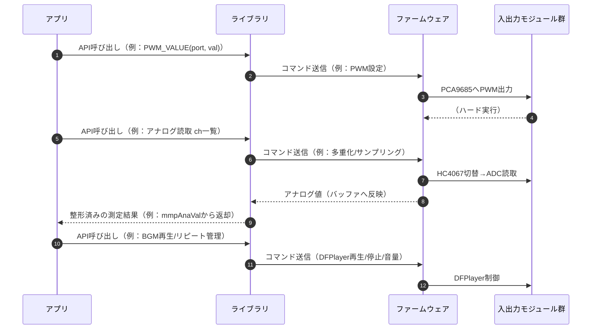

# ３章 ファームウェア

アプリからの要求に対し、**安定かつ確実な物理制御を実現**することを目的に設計されています。

## 3.1 ハードウェア構成の考え方
#### (モジュール化)
  各機能（PWM出力、アナログ入力、音声再生）を独立したICやモジュールに分離し、役割を明確化。

#### (拡張性)
  PCA9685やHC4067など、I2Cやアナログマルチプレクサを用い、将来的なポート追加や機能拡張を容易に。

#### (安全性)
  電源OFFコマンドや出力停止コマンドは冪等性を持たせ、複数経路から同じ指示が来ても安全に処理可能。

#### (即応性)
  ゲームのリアルタイム性に対応するため、各操作は低遅延で応答可能な実装。

## 3.2 ファームウェア設計の考え方
#### (最小責務化)
  1. 通信経路からのコマンドを解析
  1. 直接デバイスを制御
  1. 通信経路に結果(戻り値)を返信

#### (デバイス依存部の集中化)
  ハード固有の制御は全てファームウェア側に集約し、上位層からは抽象化。

#### (確実なリアルタイム処理)
  モーター制御や音声再生など、時間依存性の高い処理はファームウェア側で完結。

#### (テスト容易性)
  コマンド単位で動作確認が可能な構造。

---
# ４章 ライブラリ
アプリの仕様を **高い品質かつ生産性で実装**することを目的に設計されています。
また、幅広いプラットフォームに対応しつつ、同じスタイルのAPI構文を維持しているため、**多言語への学習コストを最低限**に抑えられます。

## 4.1 役割分担
#### (ライブラリ)
  - アプリからの要求を高水準APIとして提供
  - コマンドに変換してMMPへ送信し、戻り値を受信・整形してアプリに返す

#### (ファームウェア)
  - アプリからの要求を解析し「マイコンのGPIO」「I2C通信」「内臓デバイス(HC4067/PCA9685/DFPlayer)」を制御
  - 処理結果／測定値(アナログ値)／危機状態などをアプリへ返す
  - アナログ測定値をバッファ内にキャッシュ、アプリからの要求に応じ、チャンネル単位で値を提供

#### (入出力シーケンス)

 

**(特徴)**
- **抽象化** 
  アプリはハード固有の手順を知らなくてよい。
- **キャッシュ機構** 
  アナログ入力値はライブラリ側でキャッシュし、安定･高速な読み出しを実現
- **冪等性** 
  同じ電源OFF指示を複数回 実行しても安全
- **責務分離** 
  - **ライブラリ** 
    コマンド整形･送受信･値整形
  - **ファームウェア** 
    実機制御の最小単位に専念
