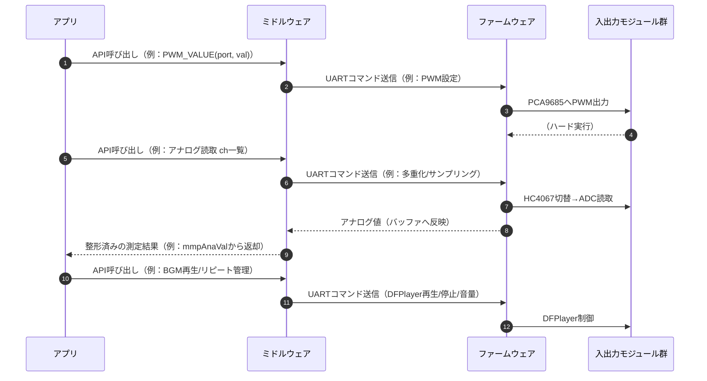

# ３章 ファームウェア

本システムのハードウェアとファームウェアは、ゲームアプリケーションからの要求に対し、安定かつ確実な物理制御を提供することを目的に設計されています。

---
## 3.1 ハードウェア構成の考え方
- **モジュール化**：各機能（PWM出力、アナログ入力、音声再生）を独立したICやモジュールに分離し、役割を明確化。
- **拡張性**：PCA9685やHC4067など、I2Cやアナログマルチプレクサを用い、将来的なポート追加や機能拡張を容易に。
- **安全性**：電源OFFコマンドや出力停止コマンドは冪等性を持たせ、複数経路から同じ指示が来ても安全に処理可能。
- **即応性**：ゲームのリアルタイム性に対応するため、各操作は低遅延で応答可能な実装。

---
## 3.2 ファームウェア設計の考え方
- **最小責務化**：UART経由で受けたコマンドを解析し、直接デバイスを制御するのみ。
- **デバイス依存部の集中化**：ハード固有の制御は全てファームウェア側に集約し、上位層からは抽象化。
- **確実なリアルタイム処理**：モーター制御や音声再生など、時間依存性の高い処理はファームウェア側で完結。
- **テスト容易性**：コマンド単位で動作確認が可能な構造。

---
# ４章 ミドルウェア

---
## 4.1 役割分担
- **ミドルウェア（PC / Python）**
  - アプリからの要求を高水準APIとして提供（例：PWM値を出す、アナログ値を読む、DFPlayerを再生する）。
  - UARTコマンドに変換してMMPへ送信し、戻り値を受信・整形してアプリに返す。
  - 例：`PWM_VALUE(port, value)`、アナログ値キャッシュ（`mmpAnaVal`）の参照。
 
- **ファームウェア（RP2040|2350-Zero / Arduino）**
  - UARTで受け取ったコマンドを解析し、デバイス（HC4067 / PCA9685 / DFPlayer）を直接制御。
  - 必要に応じて測定値（アナログ値）を返信、または状態を内部に反映。

---
## 4.2 入出力シーケンス

 

**(特徴)**
- **抽象化**：
  アプリはハード固有の手順を知らなくてよい。
- **キャッシュ機構**：
  アナログ入力値はミドルウェア側でキャッシュし、安定･高速な読み出しを実現
- **冪等性**：
  同じ電源OFF指示を複数回送っても安全
- **責務分離**：
  - **ミドルウェア**：コマンド整形･送受信･値整形
  - **ファームウェア**：実機制御の最小単位に専念

---
## 4.3 代表的なオペレーション
よく使うコマンドをまとめました。
すべてのコマンドは[こちらをクリック](../ファームウェア\v0.3_Rottenmeier\README.MD)。

| 目的 | ミドルウェア側API | ファームウェア側動作 | デバイス |
|---|---|---|---|
| DC/サーボ/LED駆動 | `PWM_VALUE(port, value)` | PCA9685へデューティ設定 | PCA9685 |
| 多chアナログ取得 | `ANA_READ(ch_list)` | HC4067選択→ADCサンプル | HC4067 |
| BGM/SE再生 | `DFP_PLAY(file_no, vol)` | 再生/停止/音量設定 | DFPlayer |
| BGMリピート | `REPEAT_TICK()` | （なし：判定はミドルウェア） | DFPlayer |