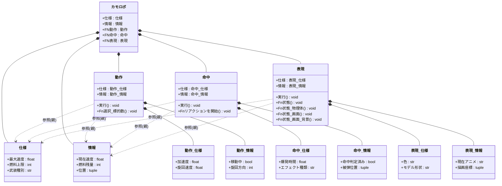
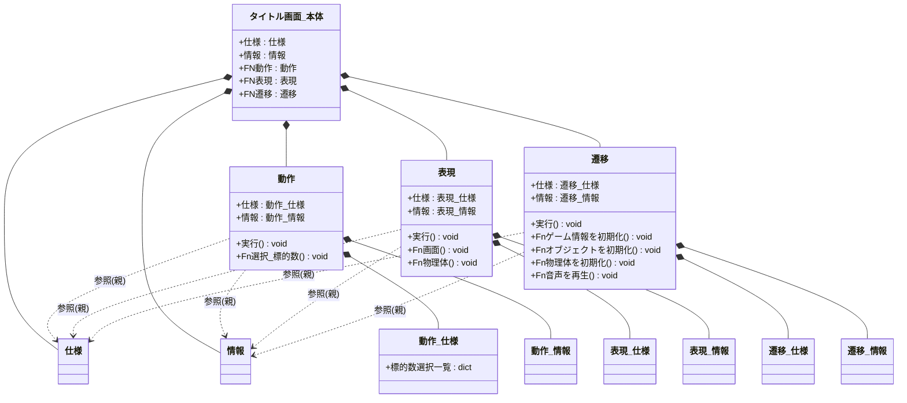
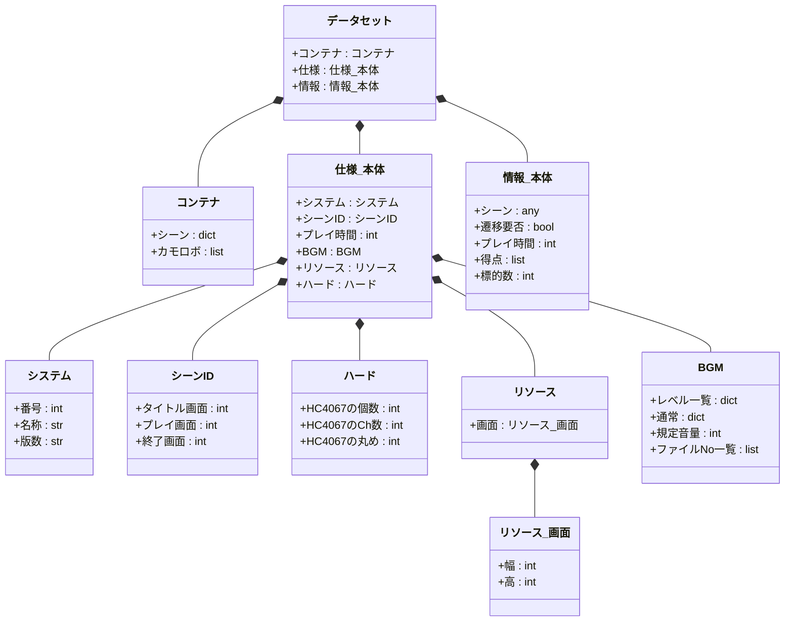

# データ設計
オブジェクトには、**静的･動的なデータを明確に分離**します。
併せて、コーディング**箇所が散在しない**よう、ルールを定めています。

---
### 7.1 ライフサイクルによる区分

静的なデータは**仕様**、動的なデータは**情報**という名称の**要素で分類**します。
"**変数の値を変更してよいのか?**"を この名称(**仕様/情報**)で見分けられます。

- **静的データ**：
  固定のパラメータや設計情報を保持します。
  専用のクラスを設けて変数定義し、**仕様**という名称で、実体化します。
 

- **動的データ**：
  実行中に変化する可変データを保持。
  専用のクラスを設けて変数定義し、**情報**という名称で、実体化します。

**（例：エンティティ系）**

---
**（例：タイトル画面シーン）**

---
**（例：データセット）**

---
### 7.2 実装箇所の違い

使用するスコープに応じて、実装するレベルを決めます。
レベルにより、コーディング箇所が決まります。

- **データセット**: 
  アクセスが、ゲーム全体など多岐にわたる場合
- **コンポジットクラス**: 
  アクセスが、当該クラスの要素クラス横断的な場合
- **要素クラス**: 
  アクセスが、当該要素クラスに限られる場合
