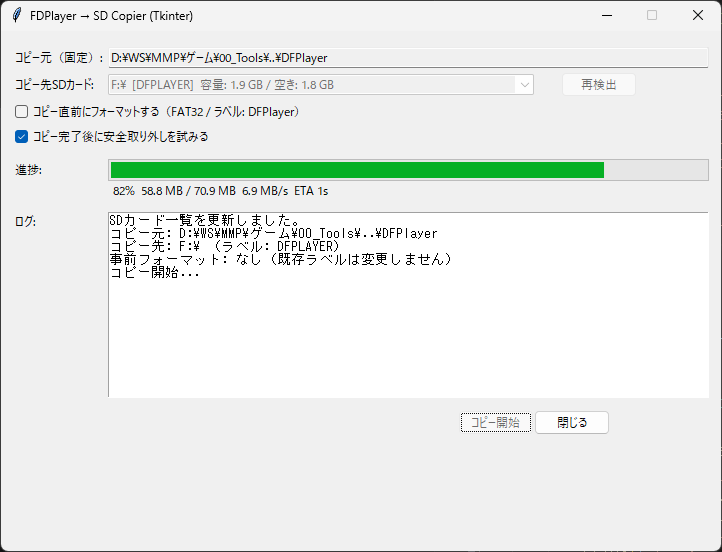

# SDカードコピーツール

## 概要
本ツールは **Windows 専用** のSDカードコピーアプリです。</BR>
実行時カレントディレクトリ直下の **`FDPlayer`** フォルダ内の全内容（ファイル・サブフォルダ）を、選択したSDカードのルート直下にコピーします。

コピー前に任意で **FAT32形式のフォーマット** が可能です。</BR>
フォーマットを行った場合のみ、ボリュームラベルを **`FDPLAYER`** に設定します。</BR>  
コピー中は進行状況バーで進捗を表示し、完了後に安全取り外しも実行できます。</BR>

---

## 画面イメージ

### メイン画面


---

## 主な機能

- SDカードの自動検出とリスト表示（ドライブレター・ボリュームラベル・容量情報を表示）
- 選択したSDカードへのフォーマット（FAT32固定・クイックフォーマット）
- **フォーマット時のみ** ボリュームラベルを `FDPLAYER` に設定
- `FDPlayer` フォルダ内の**中身**をSDカードのルート直下へ再帰コピー
- コピー進行状況のリアルタイム表示（%・速度・ETA）
- コピー後の安全取り外し

---

## 動作仕様

### コピー元
- 実行時カレントディレクトリ直下の `FDPlayer` フォルダ固定
- 存在しない場合はエラー表示
- コピー対象は直下ファイルおよびサブフォルダを含む全内容

### コピー先
- 選択したSDカードのルート直下
- 既存ファイルは上書き
- コピー元フォルダ名は作らず中身のみ展開

### フォーマット
- チェックボックスで選択可能（任意）
- FAT32形式固定
- フォーマット時のみラベルを `FDPLAYER` に設定
- **確認方法**: 「はい／いいえ」のダイアログ（`messagebox.askyesno`）で最終確認します  
  ※ 以前の「ドライブレター再入力」「'FORMAT' タイプ」は不要になりました。

### コピー
- 進行状況バーで進捗率をリアルタイム表示
- 速度（MB/s）と残り時間を表示
- 空き容量不足時はエラー表示

### 安全取り外し
- コピー完了後に自動実行（オプション）
- PowerShell または COM API を使用して安全に取り外し

---

## 必要環境
- **OS**: Windows 10 / 11
- **Python**: 3.8 以降
- **モジュール**: 標準ライブラリのみ（Tkinter含む）
- SDカードリーダーが認識されていること

---

## 実行方法
1. `FDPlayer` フォルダをスクリプトと同じフォルダに置く  
   （このフォルダの**中身**がコピーされます）
2. スクリプト（例: `sd_copy_gui.py`）をダブルクリックで起動
3. GUIで以下を操作
   - **SDカード選択**（プルダウン）
   - 必要に応じて「フォーマット」をチェック（FAT32固定／ラベル `FDPLAYER`）
   - 必要に応じて「コピー後に安全取り外し」をチェック
   - 「コピー開始」をクリック
4. フォーマットを選択している場合、**「はい／いいえ」**確認ダイアログが表示されます  
   「はい」で続行、「いいえ」で中止します。
5. 進捗バーが 100% になり、完了ダイアログが表示されます。

## 注意事項
- FAT32には **1ファイル 4GB 未満** の制限があります
- フォーマットを行うとSDカード内のデータは完全に消去されます
- 既存ファイルは上書きされます
- 管理者権限での実行推奨（フォーマット・安全取り外し成功率向上）


---
# キャッシュ・クリーナー（Tkinter版）

このツールは、指定したプロジェクトフォルダ内の `__pycache__` ディレクトリやその他キャッシュフォルダをまとめて削除するためのGUIアプリです。  
Pythonの `tkinter` を使用しており、チェックボックスで削除対象を選択し、全選択・全解除、実行前確認ダイアログ、終了ボタンなどの機能を備えています。

---

## 1. 使い方

### 1.1 実行方法
1. このスクリプトファイル（`tk_pycache_cleaner_checklist.py`）をPython 3.x環境で実行します。  
   ```bash
   python tk_pycache_cleaner_checklist.py
   ```
2. 起動するとウィンドウが表示されます。

### 1.2 操作手順
1. **基準フォルダ**  
   - 上段の「基準フォルダ」欄に現在のフォルダが表示されます。  
   - 必要に応じて「基準フォルダを変更…」ボタンから他のフォルダを選択できます。
   - 基準フォルダは、対象プロジェクトのサブフォルダ位置を決める基点になります。

2. **対象グループ選択**  
   - 「実行対象グループ」欄に、`共通`、`01_MechBullets`、`02_MechSaurus` などのグループが表示されます。  
   - チェックを入れると、そのグループのキャッシュが削除対象になります。  
   - 「全選択」「全解除」ボタンで一括操作が可能です。

3. **対象プレビュー**  
   - 下段のリストに、選択された各グループ内の削除対象パスが表示されます。  
   - `[✔]` が付いている行は選択済みのグループです。

4. **削除実行**  
   - 「削除実行」ボタンを押すと、チェックされたグループ内のキャッシュディレクトリを削除します。  
   - デフォルトでは実行前に確認ダイアログが表示されます（「削除前に確認ダイアログを表示」チェックでON/OFF可能）。

5. **終了**  
   - 「終了」ボタンでプログラムを閉じます。

## 2. 保守

### 2.1 削除対象の追加・変更
- 削除対象ディレクトリは、スクリプト冒頭の以下のリストで定義されています。
  - `MECH_BULLETS_DIRS`
  - `MECH_SAURUS_DIRS`
  - `MECH_HUNTER_DIRS`
  - `MECH_TORNADO_DIRS`
  - `TEST_TOOL`
- グループ構成やディレクトリの相対パスを変更する場合は、これらのリストを編集してください。
- 各グループの紐付けは `get_target_map()` 関数で行っています。新しいグループを追加する場合は、この辞書にエントリを追加してください。

### 2.2 実行環境
- Python 3.7以上を推奨（`tkinter` モジュール必須）。
- Windows環境での動作を前提にしていますが、パス記述を修正すればLinux/Macでも動作可能です。

### 2.3 注意点
- `__pycache__` 以外にも、リスト内に記載したディレクトリが削除されます。誤って重要なディレクトリを指定しないよう注意してください。
- 削除処理は `shutil.rmtree()` を使用しており、対象ディレクトリ配下のファイルは復元できません。
- 読み取り専用ファイルが含まれる場合、OSの権限設定により削除できないことがあります。
