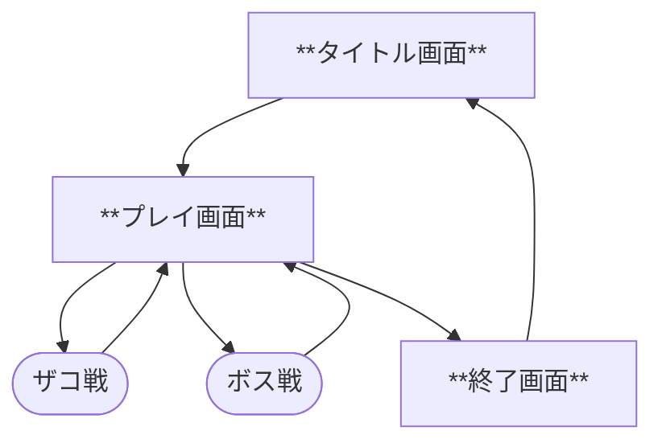
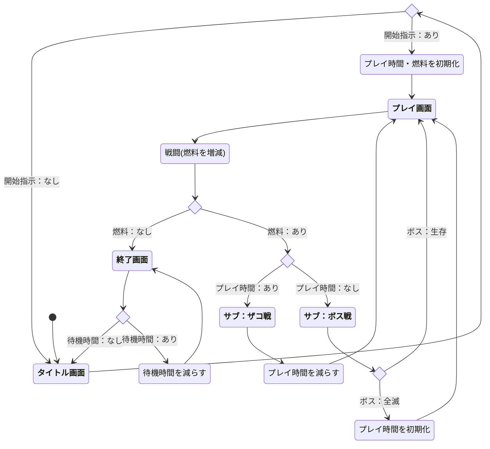

# 高度なシステム構成を学ぶ教材プログラム

複雑なオブジェクト構造を用いた、ゲームシステムの構築方法を学ぶための、教材プログラムです。

## 1. はじめに

実用的な保守・拡張が可能なアーキテクチャへとはなにか。
明確な責任分担をもった設計思想とはなにか。
これらを初学者が順を追って学べる内容にしています。

(注意)
初学者向の理解を深めるために、関数名・変数名など随所に日本語を多用しています。

## 2. 使用技術

- 言語：Python、Pyxel  
- 設計技術：
  - デザインパターン
  - コンポーネント・クラス
  - ＭＶＣモデル
  - データ構造

## 3. 想定ユーザー・利用シーン

- より高度な構造化設計を学びたい人
- 実務レベルの開発に通用する構造的な考えを習得したい人

## 4. インストールと実行

このプロジェクトには Python と最新の Pyxel が必要です。

```bash
# リポジトリをクローン
git clone https://github.com/kureha001/Learn_Pyxel.git
cd Learn_Pyxel

# 必要なライブラリをインストール
pip install -U pyxel
pip install -U pyserial

# プログラムを実行
python main.py
```


# システム全体の設計思想

## 1. エンティティクラスとコンポジット構造

本ゲームシステムでは「コンポジットクラス」と「要素クラス(FN○○)」という構成を採用しています。

- コンポジットクラス：キャラクタやシーンなどの大枠となるエンティティ
- 要素クラス(FN○○)：移動、衝突、発射、描画などの個別機能を分担

これにより、個別の処理の独立性を保ちつつ、共通の制御ロジックを活用できます。

---

## 2. クラス構造と情報の責務

すべてのエンティティ(コンポジットクラス)は、次の責務をもつクラスを内部に持つことがあります：

| クラス | 説明                                       |
|--------|--------------------------------------------|
| 仕様   | 静的データ：データベースからの設定情報など |
| 情報   | 動的データ：現在の状態(座標・カウントなど) |

この2つのクラスは以下のように使い分けられます：

- 複数の要素で共有 → コンポジットクラス側に配置
- 要素内に閉じた使用 → 要素クラス側に配置

また、データベース(敵機DB・ボスDB・アイテムDB)などは配列添字によりアクセスし、仕様・情報クラスに複製することで、可読性・保守性を高めています。

---

## 3. プロセスと要素クラスの対応

コントローラは特定の順序でプロセスを実行します。</BR>
プロセス実行では、対応するオブジェクトのメソッド(FN○○)を実行します。</BR>
これにより、処理の一貫性と拡張性が確保されます。

| 実行順序 | プロセス名 | 対応メソッド | 説明                                     |
|----------|------------|--------------|------------------------------------------|
| ①       | 動作       | `FN動作`     | キャラクタ・背景・特殊効果などの座標更新 |
| ②       | 衝突       | `FN衝突`     | 弾・敵・アイテムとの当たり判定           |
| ③       | 発射       | `FN発射`     | 自弾・敵弾を生成                         |
| ④       | 出現       | なし         | 敵機・ボス・アイテムを生成               |
| ⑤       | 表現       | `FN表現`     | 各オブジェクトを画面表示                 |

### 出現プロセスの補足

- 出現プロセスは、他のプロセスと異なり、**対応する要素クラス(FN○○)は存在しません**。
- 出現対象となるのは、**敵機クラス**に属する「敵機」「ボス」「アイテム」などに限定されます。
- 対象のコンポジットクラスは `/オブジェクト/キャラ/敵機/` 配下の各コンポーネントであり、主に `__init__.py 初期化ファイル` を通じて `本体` クラスを生成します。
- 他のコンポジットクラス(例：自機、背景、シーンなど)は、ゲームの準備や状態遷移時など、**出現プロセスとは別のタイミングで生成**します。

## 4. エンティティクラスとプロセス制御の統合設計

複数のエンティティクラスが、Pyxelのフレーム更新処理に連動する「コントローラ(変更・結果)」によって制御されます。

### 主なエンティティクラス(コンポジットクラス)

- キャラクタ系(自機・敵機・弾・爆発)
- アイテムの効果を管理する特殊効果
- 画面を彩る背景
- ゲーム進行を制御する各種シーン(タイトル画面・プレイ画面・終了画面)

これらのクラスは、以下の特長を備えた構造です：

- 各コンポジットクラスは、特定の機能(動作・衝突・発射・表現など)を「要素クラス(FN○○)」として分離。
- コントローラがフレーム単位でプロセスを実行し、該当する要素クラスの処理を呼び出す構造。

### プロセスとの対応関係

- プロセス名はすべて `P○○` という名称でコントローラ上に存在し、
- 各プロセスに対応する「要素クラス(FN○○)」が実行される

---
# ステータス管理
## 1. シーンの流れ

`シーン`には`メイン`(`タイトル画面`/`プレイ画面`/`終了画面`)と`サブ`(`ザコ戦`/`ボス戦`)があります。
サブは`プレイ画面`の補助として働きます。


---
## 2. シーンを変える

シーンは`タイトル画面`から始まり、条件(*1)に応じて`シーン`を変えます。
*1：`開始指示`/`プレイ時間`/`燃料`の内容

- **`タイトル画面`**：
  プレイヤーが`開始指示`するまで、以下の処理を繰り返します。
  1. プレイ人数の入力を受け付ける
  1. コントローラ種別の入力を受け付ける
  1. チート設定の入力を受け付ける
  1. 以上に矛盾が無ければ、`開始指示`を受け付ける。
     ※`開始指示`があれば、`プレイ時間`・`燃料`を初期化し、`プレイ画面`へ進む。
  </BR>
- **`プレイ画面`**：
  `燃料`が無くなるまで、以下の処理を繰り返します。
  1. プレイ内容(`戦闘`)により`燃料`を増減する。
    ※`燃料`が無ければ、`終了画面`へ進む。
  1. `プレイ時間`に応じて`サブ`(`ザコ戦`/`ボス戦`)へ進む。
      - **`ザコ戦`**：`プレイ時間`を消費する
      - **`ボス戦`**：全滅すると`プレイ時間`を初期化する
  </BR>
- **`終了画面`**：
  `継続時間`が無くなるまで、以下の処理を繰り返します。
  1. `継続時間`を消費する
    ※`継続時間`が無ければ、`タイトル画面`へ進む。

