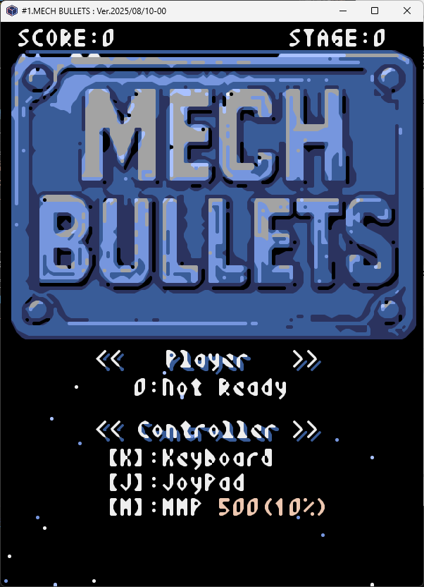
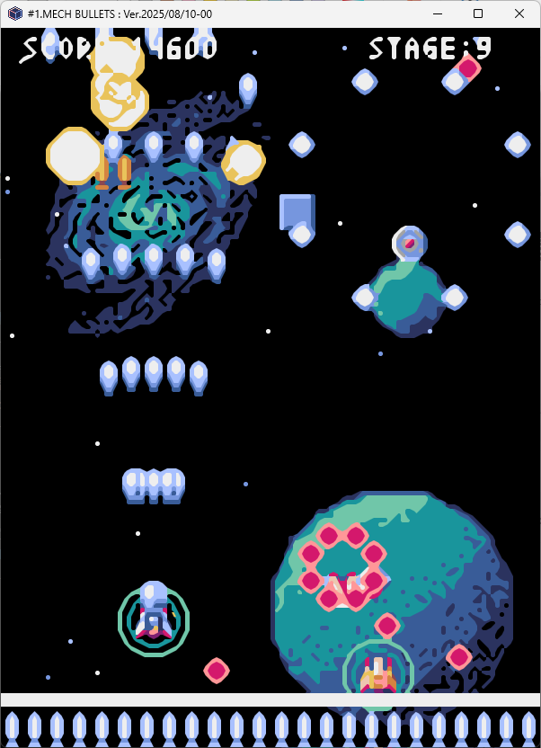
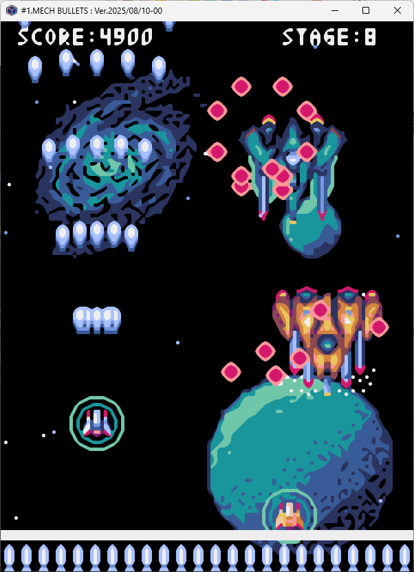
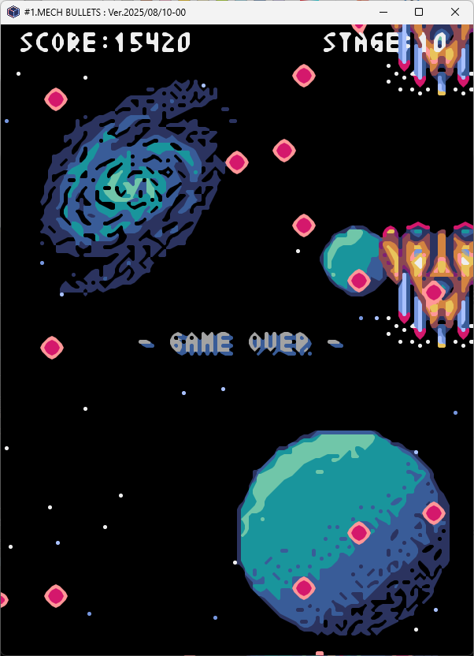
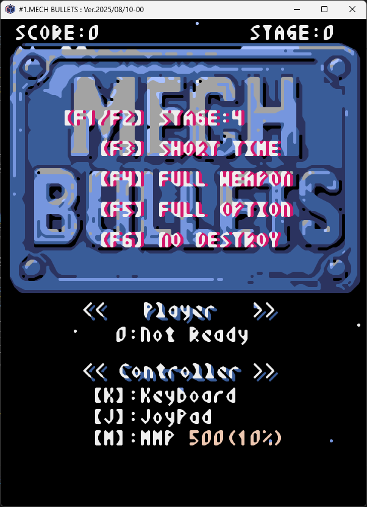

# #01 MECH BULLETS
----
# 遊び方
最大で3人同時に遊びます。
燃料と弾は全員で共有します。
燃料が尽きたらゲームオーバーです。

----
## 1. タイトル画面

ゲーム設定を選び、ゲームを開始します。
1. プレイヤーが各種設定を選びます。
  - 同時に遊ぶ**プレイヤー人数**ををキー選択(**1/2/3**)
  - 使用する**コントローラ**種類をキー選択(**K/J/M**)
    - ［**Ｋ**］: キーボード ※**1人**プレー限定
    - ［**Ｊ**］: :USBジョイパッド ※同時プレーは**2人**まで
    - ［**Ｍ**］: MMP専用ジョイパッド ※同時プレーは**3人**まで
  - 必要があれば、カーソルキー入力で MMP専用ジョイパッドを調整
    - ［**↑**/**↓**］: 中央値
    - ［**←**/**→**］: 移動認識する傾き割合(％)
2. ゲーム設定に矛盾が無ければ、**スペースキー**を押してゲーム開始です。

----
## 2. プレイ画面

敵のミサイルや障害物を避けながら、敵を攻撃します。

### **2.1 操作方法**
**(移動)**
コントローラにより、以下の操作で移動します。
- **キーボード**：カーソルキー
- **USBジョイパッド**：十字ボタンやスティック
- **MMP専用ジョイパッド**：スティック

##### **(攻撃)**
弾が唯一の攻撃武器になります。
ただし、体当たりでも、敵にダメージを与えられます。

発射方法は、コントローラによって異なります。
- **キーボード**：スペースキー
- **USBジョイパッド**：第１ボタン
- **MMP専用ジョイパッド**：第１ボタン

エンジンで発電したエネルギーで、弾が作られます。
そのため時間経過とともに、弾が補充されます。

ほかにも、以下の特性があります。
- 何かに衝突すると消滅する
- 特定アイテムを拾うと、連射が可能になる
- **消滅されない貫通弾**を 一定時間 使えるアイテムがある

### **2.2 プレイヤーの機体特性**
燃料と弾はプレイヤー全員で共有します。
アイテムを拾うと、さまざまな効果を発揮します。

##### **(ダメージと燃料)**
シールドがダメージを吸収します。
シールドのエネルギー源は燃料です。
つまり、ダメージを受けると、燃料が減ります。
- 被弾・体当たりで減る
- 特定アイテムを拾うと回復できる
- **残量が０になるとゲームオーバー**

### **2.3 戦闘シーン**
ゲームはSTAGE1のザコ戦から始まります。
次ステージの先頭には、ボスが待ち構えています。
ボスを倒すと、ザコ戦が再開します。
###### (ザコ戦)
たくさんの戦闘機・障害物などが飛来します。
時折、アイテムも飛来します。
- プレイヤー機と同様、被弾や体当たりでダメージを受る
- **耐久力**： 種類によって違う
- **機雷**：
  - **破壊**：敵機/通常弾を**強制破壊**
    - **体当たり**：自機を強制破壊し**ゲームオーバー**
- **鉄板/隕石**：攻撃はせず行く手を阻む

###### (ボス戦)
ステージごとにボスキャラが現れます。
- 出現直前で、ザコキャラとミサイルが全破壊
- 出現直前で、何種類かのアイテム効果が消える
- 出現直前で、燃料・弾が全回復する
- 画面下に去っても、再び画面上から現れる
- 複数機現れる場合がある
- ボスキャラを倒すと次のステージに進む

### 2.4 アイテム
定期的に現われます。
さまざまな**効果**があり、**持続性**が異なります。
体当たりして拾うことで、**全プレイヤーに効果が発揮**されます。

###### (特性)
- **持続性**：『持続する』『一定時間で消える』の2種類がある
- **強化可否**：拾うたびに効果が強化されるものがある
- **ボス戦で消滅**：ボス戦が始まると、効果が消えるものがある

###### (特性：物資補充系)
- **燃料**：燃料が満タンになる
- **弾**：弾が最大積載になる

###### (特性：性能系)
- **速度アップ**：移動速度が上がる(**永続**・**強化可**)
  ただし、上限あり。

###### (特性：攻撃系)
- **連射**：連射ができる(**永続**)
- **発射数アップ**：発射する弾数が増える(**永続**・**強化可**)
  ただし、上限あり。
- **貫通弾**：破壊されない弾になり破壊力が増す(**一定時間**)

###### (特性：防御系)
- **半減化**：ダメージが半分になる(**一定時間**)
- **無効化**：ダメージを受けない(**一定時間**)

----
## 3. 終了画面

ゲーム終了の案内が流れ、しばらくするとタイトル画面に戻ります。

----
# その他（チート機能）

開発者向のテストが容易になるよう、チート機能があります。
タイトル画面でキー入力すると、設定できます。
- [**F1**]：開始**ステージを１つ進める** ※1を下回ると30に
- [**F2**]：開始**ステージを１つ戻す** ※30を上回ると0に
- [**F3**]：ステージ間の**時間を短く**する ※ザコ戦が短くなる
- [**F4**]：攻撃系のアイテムをすべて装着する
- [**F5**]：すべてのアイテムを装着する
- [**F6**]：アイテムの効果・弾・燃料が**失われない**F ※機雷には無力

プレイ画面中に、強制終了することができます。
- [**F10**]：燃料を０にする ※燃料切れで**ゲームオーバー**
