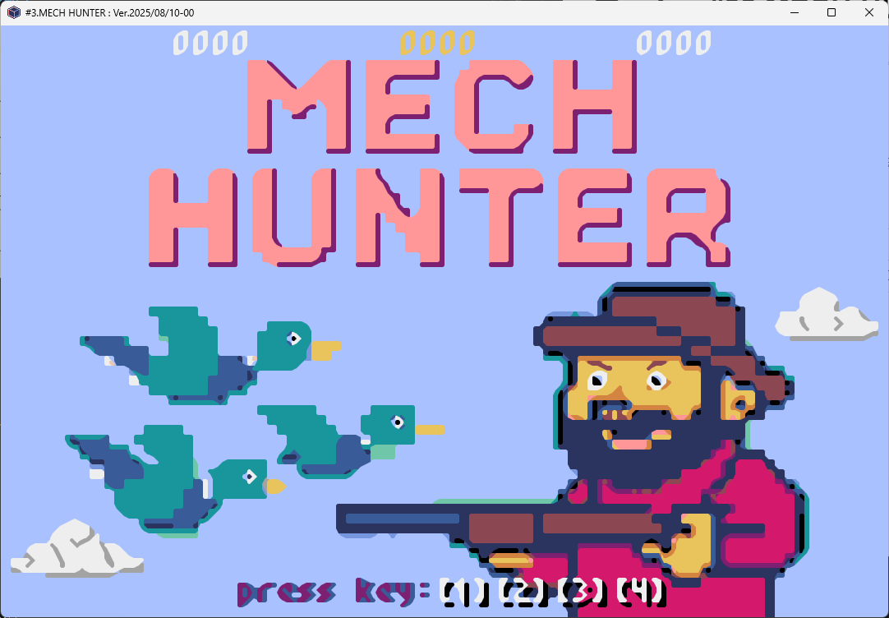
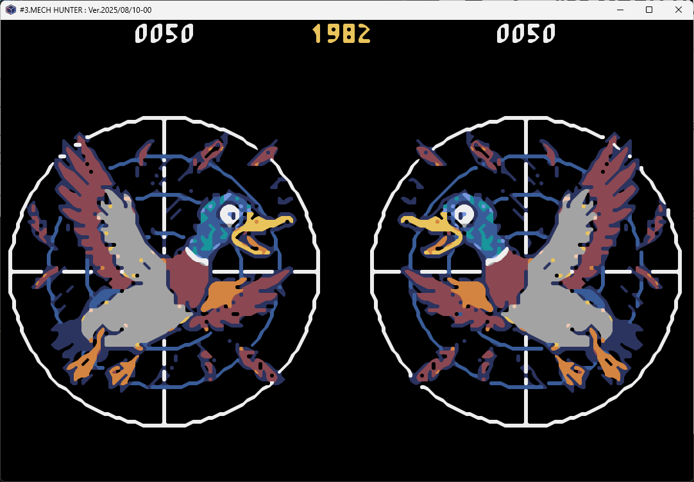
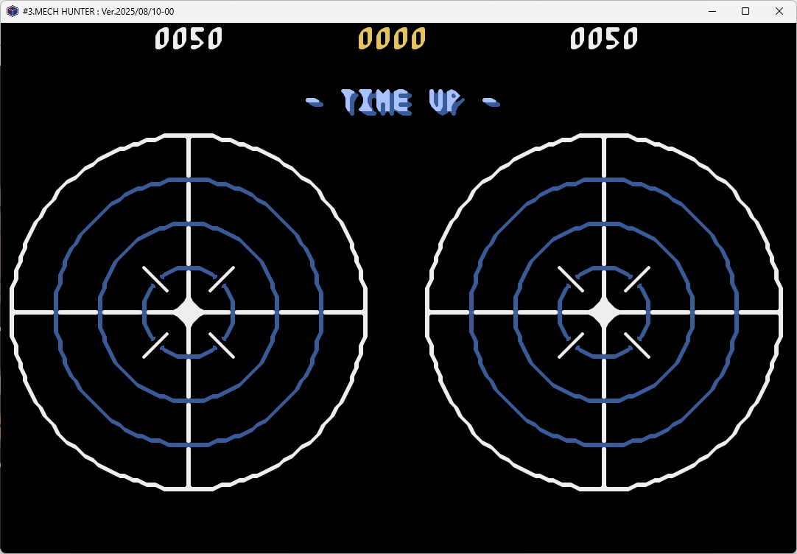

# ゲーム：#03 MECH HUNTER
----
# 遊び方
2チームに分かれ、各プレイヤーは鉄砲(オモチャ)を持ちます。
自分のチームの的（カモロボの舌）に弾を命中させて、点数を競います。
時間内に、より多く得点したチームが勝利します。

----
## 1. タイトル画面

ゲーム設定を選び、ゲームを開始します。
1. チーム当たりのカモロボ数を数字キーで選ぶと、ゲームが始まります。
**※現在、カモロボ数は１のみ正常動作します**

----
## 2. プレイ画面

鉄砲の弾を的（カモロボの舌）に命中して、点数を競います。 
- 命中すると得点(10点)
- 30カウント以内に続けて命中するとボーナス点(50点)
- 命中後は2秒程度、命中を受け付けない
- プレイ時間が無くなると、終了画面に進みます。

----
## 3. 終了画面

ゲーム終了の案内が流れ、しばらくするとタイトル画面に戻ります。