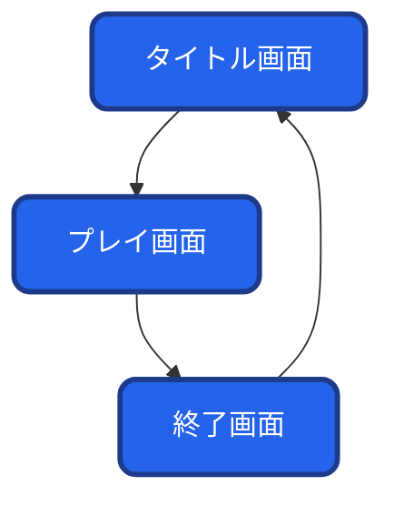
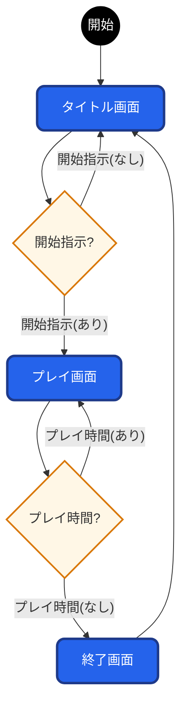
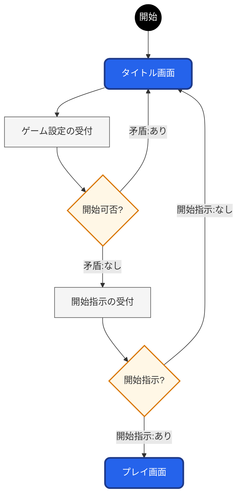
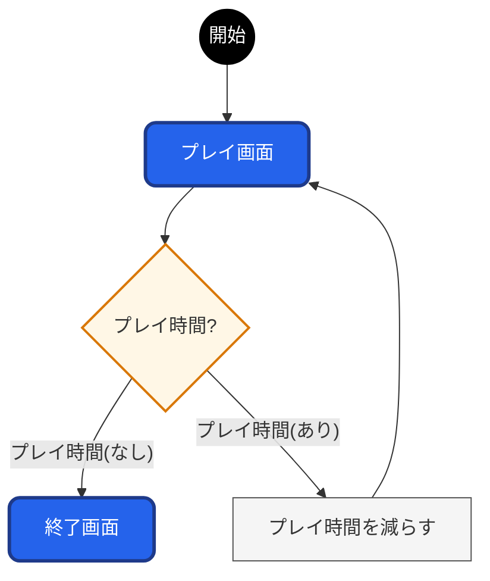
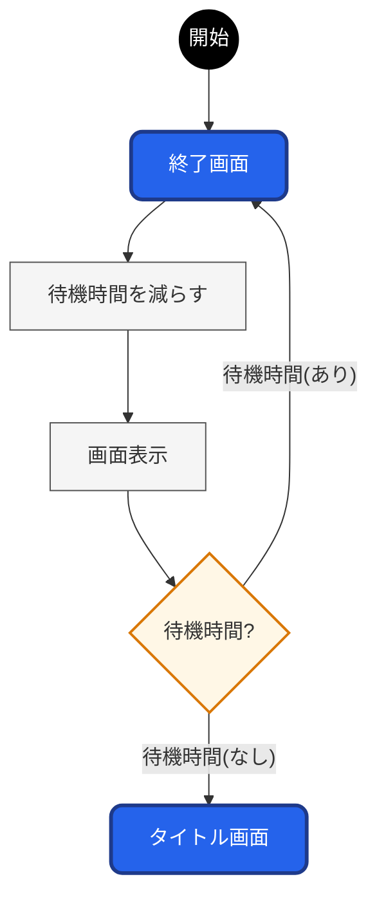

# #03 MECH HUNTER
----
# シーン管理

ゲームの進行状況を`シーン`と呼ばれるもので**区分**します。
各`シーン`には定められた働きをもっています。

----
## 1. シーンの構成
`シーン`には`タイトル画面`/`プレイ画面`/`終了画面`の３つがあります。

**(図解)**

 

---
## 2. シーンの動き

シーンは`タイトル画面`から始まり、条件(`開始指示`)に応じて`シーン`を変えます。

**(図解)**

 

----
## 3. シーンの詳細

### 3.1. タイトル画面

以下の働きを持ちます。
- プレイヤーから`ゲーム設定`を受け付ける。
- プレイヤーから`開始指示`を受け付ける。
- `シーン`を`プレイ画面`に進める。
 

**(処理順序)**
プレイヤーが`開始指示`するまで、以下の処理を繰り返します。
1. `ゲーム設定`(`プレイ人数`/`チート設定`)の入力を受け付ける
1. `ゲーム設定`に矛盾が無ければ、`開始指示`を受け付ける。
1. `開始指示`があれば、`プレイ時間`を初期化し、`シーン`を`プレイ画面`へ進める。
 

**(図解)**

### 3.2. プレイ画面

以下の働きを持ちます。
- `狙撃`をおこなう
- `プレイ時間`を管理する
- `シーン`を`終了画面`に進める
 

**(処理順序)**
`プレイ時間`が無くなるまで、以下の処理を繰り返します。

1. `プレイ時間`が なければ、`シーン`を`終了画面`へ進める。
1. `プレイ時間`を消費する。
 

**(図解)**

### 3.3. 終了画面

`終了画面`は`タイトル画面`に戻るまでの橋渡しを担います。
`継続時間`がある間は**ゲームオーバーを知らせる画面表示**をおこない、無くなると`終了画面`へ進みます。
以下の働きを持ちます。
- `ゲームオーバー`を知らせる。
- `シーン`を`タイトル画面`に戻す。
 

**(処理順序)**
`継続時間`が無くなるまで、以下の処理を繰り返します。
1. `継続時間`が なければ、`シーン`を`終了画面`へ進める。
1. `継続時間`を 消費する。
1. ゲームオーバーを`画面表示`で知らせる。
 

**(図解)**
