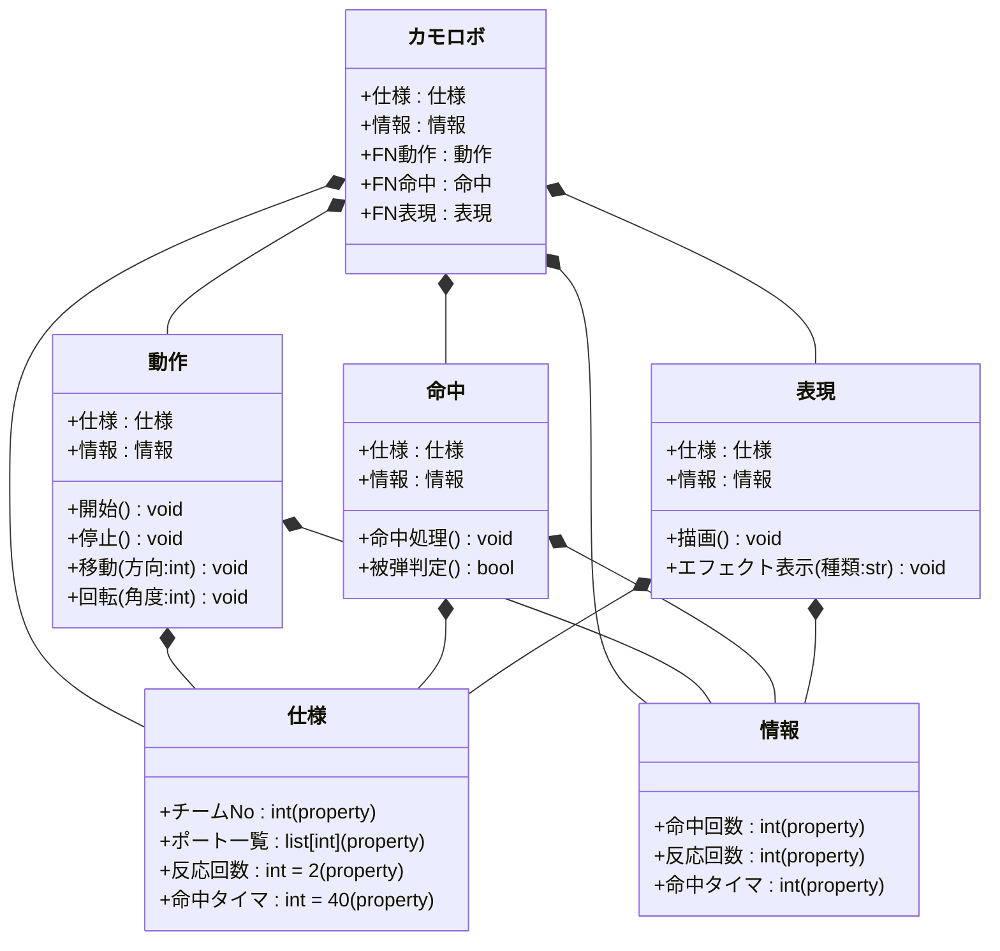

# オブジェクト：カモロボ

```mermaid
classDiagram
class カモロボ {
  +仕様 : 仕様
  +情報 : 情報
  +FN動作 : 動作
  +FN命中 : 命中
  +FN表現 : 表現
}

class 仕様 {
  +チームNo : int (property)
  +ポート一覧 : list[int] (property)
  +反応回数 : int = 2 (property)
  +命中タイマ : int = 40 (property)
}

class 情報 {
  +命中回数 : int (property)
  +反応回数 : int (property)
  +命中タイマ : int (property)
}

class 動作 {
  +仕様 : 仕様
  +情報 : 情報
  +開始() void
  +停止() void
  +移動(方向:int) void
  +回転(角度:int) void
}

class 命中 {
  +仕様 : 仕様
  +情報 : 情報
  +命中処理() void
  +被弾判定() bool
}

class 表現 {
  +仕様 : 仕様
  +情報 : 情報
  +描画() void
  +エフェクト表示(種類:str) void
}

カモロボ *-- 仕様
カモロボ *-- 情報
カモロボ *-- 動作
カモロボ *-- 命中
カモロボ *-- 表現

動作 *-- 仕様
動作 *-- 情報

命中 *-- 仕様
命中 *-- 情報

表現 *-- 仕様
表現 *-- 情報

```