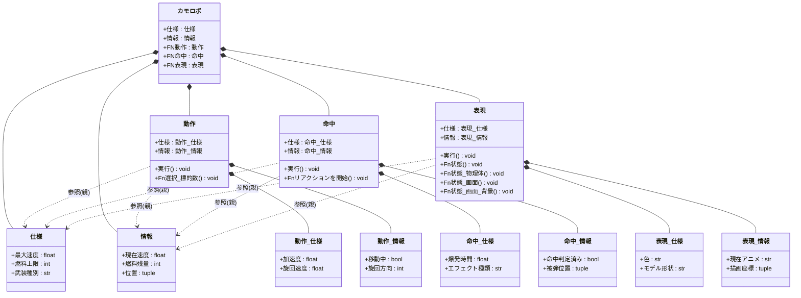

# オブジェクト：カモロボ

```mermaid
classDiagram
class カモロボ {
  +仕様 : 仕様
  +情報 : 情報
  +FN動作 : 動作
  +FN命中 : 命中
  +FN表現 : 表現
}

class 仕様 {
  +最大速度 : float
  +燃料上限 : int
  +武装種別 : str
}
class 情報 {
  +現在速度 : float
  +燃料残量 : int
  +位置 : tuple
}

class 動作 {
  +仕様 : 動作_仕様
  +情報 : 動作_情報
  +実行() void
  +Fn選択_標的数() void
}
class 動作_仕様 {
  +加速度 : float
  +旋回速度 : float
}
class 動作_情報 {
  +移動中 : bool
  +旋回方向 : int
}

class 命中 {
  +仕様 : 命中_仕様
  +情報 : 命中_情報
  +実行() void
  +Fnリアクションを開始() void
}
class 命中_仕様 {
  +爆発時間 : float
  +エフェクト種類 : str
}
class 命中_情報 {
  +命中判定済み : bool
  +被弾位置 : tuple
}

class 表現 {
  +仕様 : 表現_仕様
  +情報 : 表現_情報
  +実行() void
  +Fn状態() void
  +Fn状態_物理体() void
  +Fn状態_画面() void
  +Fn状態_画面_背景() void
}
class 表現_仕様 {
  +色 : str
  +モデル形状 : str
}
class 表現_情報 {
  +現在アニメ : str
  +描画座標 : tuple
}

カモロボ *-- 仕様
カモロボ *-- 情報
カモロボ *-- 動作
カモロボ *-- 命中
カモロボ *-- 表現

動作 *-- 動作_仕様
動作 *-- 動作_情報
命中 *-- 命中_仕様
命中 *-- 命中_情報
表現 *-- 表現_仕様
表現 *-- 表現_情報

動作 ..> 仕様 : 参照(親)
動作 ..> 情報 : 参照(親)
命中 ..> 仕様 : 参照(親)
命中 ..> 情報 : 参照(親)
表現 ..> 仕様 : 参照(親)
表現 ..> 情報 : 参照(親)
```