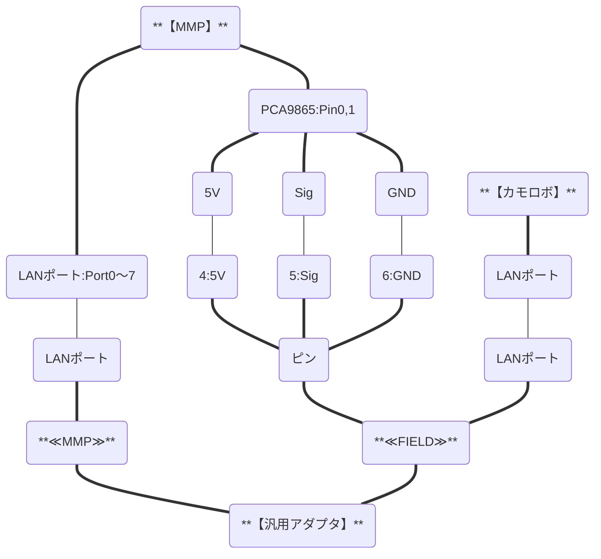
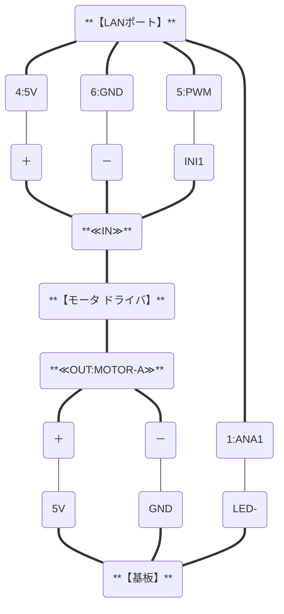

# #03 MECH HUNTER
# ピン配置
----
# 1. ＭＭＰとカモロボの接続

**ＭＭＰ⇔汎用アダプタ⇔カモロボ**つ繋ぎます。
- ＬＡＮポートは8芯のＬＡＮケーブルで接続
- PCA9865との接続は専用ケーブルで接続

```mermaid
graph TD;

id200(**【MMP】**) === id201 & id202;
    id201(LANポート:Port0～7) --- id221;
    id202(PCA9865:Pin0,1   ) === id203 & id204 & id205;
        id203(5V)   --- id232;
        id204(GND)  --- id234;
        id205(Sig)  --- id233;

id900(**【カモロボ】**) === id901;
    id901(LANポート) --- id239;

id210(**【汎用アダプタ】**);
    id220(**≪MMP≫**)    === id210;
        id221(LANポート)  === id220;
    id230(**≪FIELD≫**)  === id210;
        id231(ピン)       === id230;
            id232(4:5V)   === id231;
            id233(5:Sig)  === id231;
            id234(6:GND)  === id231;
        id239(LANポート)  === id230;

```
----
# 2. カモロボ内部の配線

LANポートを通じ、内部のモータ・ドライバと基盤に接続します。

```mermaid
graph TD;

id200(**【LANポート】**) === id201 & id204 & id205 & id206;
    id201(1:ANA1) --- id213;
    id204(4:5V)  --- id231;
    id205(5:PWM) --- id233;
    id206(6:GND) --- id232;

id210(**【基板】**);
    id211(5V)   === id210;
    id212(GND)  === id210;
    id213(LED-) === id210;

id220(**【モータ ドライバ】**) === id240;
id230(**≪IN≫**)   === id220;
    id231(＋)   === id230;
    id232(－)   === id230;
    id233(INI1) === id230;
id240(**≪OUT:MOTOR-A≫**) === id241 & id242;
    id241(＋)   --- id211;
    id242(－)   --- id212;
```