# 🧠 ネットSIMONゲームSYSTEM

## 🔷 概要
**タナカツヱンヂニヤリング**製の`SIMONボード`をネットワーク対応しました。<br>
マイコンをESP32S3に交換し、`WebAPI`を搭載しています。  <br>

`主催者`はWEBブラウザで作られた`ダッシュボード`を用い、試合を進行します。<br>
各`プレイヤー`は主催者の指示に従い、`SIMONボード`でプレイします。

---
## 🧩 システム構成
|層  |名称              |役割                |📁ファイル|
|--- |------------------|--------------------|-----------|
|Ｂ層|ビジネスロジック  |ゲーム進行の中枢    |main.py    |
|Ｄ層|データベース      |共有データベース    |Data.py    |
|Ｎ層|ネットワーク      |Wi-Fi接続管理       |Network.py |
|Ｆ層|ファンクション    |WebAPIサーバ (HTTP) |Function.py|
|Ｐ層|プレゼンテーション|画面・音・LED制御   |Presen.py  |

- **B層（Business Logic）**  
  状態遷移を統括する中核ロジック。  
  状況ID（`idle` / `ready` / `play` / `finish` / `end`）に応じて  
  処理と画面更新を制御します。

- **D層（Data）**  
  グローバル変数群。ネットワーク情報・出題・進捗・結果を保持。  
  全レイヤーから共通アクセス可能なデータベース的役割。

- **N層（Network）**  
  Wi-Fi設定ファイル（`wifi.json`）を読み込み、  
  ネットワーク初期化を担当。接続状況をOLEDに表示します。

- **F層（Function）**  
  内蔵Webサーバを起動し、HTTP GET/POSTのリクエストに応答。  
  `/info`, `/assign`, `/begin`, `/status`, `/result` の5APIを提供。  
  各APIは D層を更新し、状態遷移をトリガーします。

- **P層（Presentation）**  
  OLED表示、LED制御、サウンド出力、ボタン入力を一括管理。  
  UI（物理的インタフェース）を抽象化する層です。

---
## ⚙️ 特徴

- **完全レイヤー分割設計**  
  各モジュールが明確な責務を持ち、相互依存を最小化。  
  デバッグや拡張が容易な構造。

- **状態駆動アーキテクチャ**  
  プレイヤー操作／WebAPI通信の両経路から  
  状況IDを更新し、B層のIF分岐で動作を制御。

- **マルチスレッド対応**  
  WebAPIサーバ（F層）は `_thread` により並列実行され、  
  ゲーム処理との干渉を防止。

- **物理UI統合**  
  LED・サウンド・OLED・ボタン入力をP層で抽象化し、  
  ロジック層がデバイス仕様に依存しない設計。

- **WebAPI制御**  
  主催者からのHTTPリクエストに応じて  
  リアルタイムに競技進行・状況監視・結果通知を行う。

---
## 🌀 状態管理
このゲームシステムは`状態ID`を中心に、ゲームの進行を管理します。<br>
`状態ID`は`SIMONクライアント`が保持しており、値に応じた**処理シーケンスを制御**します。

|#| from  | to       | 概要           | 制御                   |
|-|-------|----------|----------------|------------------------|
|1|起動時<br>end|**idle**|招待を待つ状況|**招待待ち画面**を表示 |
|2|idle   |**request**|参加承認を待つ状況|**参加待ち画面**を表示 |
|3|request|**ready**|ゲーム開始を待つ状況|**開始待ち画面**を表示 |
|4|ready<br>end|**play**|ゲームをプレイ中|**プレイ画面**を表示<br>**出題**シーケンスス)を表示|
|5|play   |**finish**|自分のゲームが終了した状況|**終了画面**を表示     |
|6|finish |**end**|全員のゲームが終了した状況|**結果画面**を表示     |

> #6以降は主催者の操作により、#1か#4に遷移します。
---
## 🧩 状態IDの更新

### 状態遷移（状態IDの更新）
`ダッシュボードの操作`(WebAPI)や`プレイ経過`に応じ、状態を遷移します。

|状態遷移| F層   |B層         |解説|
|--------|-------|------------|----|
|`idle`  |/reset |            ||
|`equest`|/info  |招待待ち画面|リクエストに対しボタン操作で選択|
|`ready` |/assign|            ||
|`play`  |/begin |            ||
|`finish`|       |プレイ画面  |時間切れ/全問正解/ミス超過 で更新|
|`end`   |/result|            ||
|`idle`  |/reset |            ||

---
## 🔷 シーケンス図
主催者・SIMONボード・各レイヤは、メッセージを交換し合いながら、シーケンスを実行します。

```mermaid
sequenceDiagram

    participant U as ダッシュボード
    participant HW as プレイヤー
    participant B as B層
    participant N as N層
    participant F as F層
    participant P as P層
    participant D as D層

    activate HW
    HW->>B: 電源投入

    B->>P: 消音,LED消灯,OLED消去
    B->>N: 設定ファイル読込開始

    N-->>B: Wifi接続情報を受信
    B->>N: Wifi接続開始
    N-->>B: 実行結果を受信
    B->>D: ネット情報を更新

    B->>F: WebAPIサーバー起動
    F-->>B: 実行結果を受信

    B->>D: [状況.状態]="sleep"に更新
    B->>P: スリープ画面の表示を指示

    loop
        alt 状態=="sleep"
            alt B層起点
                HW->>B: スタートボタンを操作
                alt 押下した
                    B->>P: api招待待ち画面()
                    B->>D: [状況.状態]="idle"
                end
            end

        else 状態=="idle"

            alt B層起点
                B->>P: 画面の表示を指示
                HW->>B: スタートボタン
                alt 押下した
                    B->>P: apiスリープ画面()
                    B->>D: [状況.状態]="sleep"
                end

            else F層起点
                U->>F: /info GET
                    D->>F: [基本.名前]
                F->>U: {"name":"[基本.名前]"}

                U->>F: /assign POST
                F->>U: {"ok":true} ※早期
                    F->>D: [基本.背番号]
                    F->>P: api開始待ち画面()
                    F->>D: [状況.状態]="ready"
            end

        else 状態=="ready"
            alt F層起点
                U->>F: /begin POST
                F->>U: {"ok":true} ※早期
                    F->>D: [出題.*]
                    F->>P: api出題演出()
                    D->>P: [出題.問題]
                    F->>D: [状況.開始時刻]=now
                    F->>D: [状況.状態]="play"
            end
        
        else 状態=="play"

            alt B層起点

                alt 時間切れ
                    B->>P: 終了画面_時間切れ()
                    B->>D: [状況.状態]="finish"
                end

                HW->>B: 色ボタンを操作
                B ->>P: btn_色スキャン()
                P ->>B: [色ID]
                D->>B: [出題.問題]

                alt 正解の色IDと一致
                    B->>D: [状況.ステップ]＋１
                    alt 全問正解
                        B->>D: [状況.所要時間]=now
                        B->>P: 終了画面_全問正解()
                            D->>P: [状況.*]=now
                        B->>D: [状況.状態]="finish"
                    else シーケンスの途中
                        B->>P: プレイ画面_標準()
                    end

                else 正解の色IDと不一致
                    D->>B: [状況.ミス回数]
                    B->>D: [状況.ミス回数]＋１
                    D->>B: [出題.ミス上限]
                    alt ミス上限以内
                        B->>P: プレイ画面_ミス()
                            D->>P: [状況.ミス回数]
                            D->>P: [出題.ミス上限]
                    else ミス上限超え
                        B->>P: 終了画面_ミス超過()
                            D->>P: [状況.ミス回数]
                            D->>P: [出題.ミス上限]
                        B->>D: [状況.状態]="finish"
                    end
                end

            else F層起点
                U->>F: /status GET
                    D->>F: [状況.*]
                F->>U: {[状況.*]}
            end

        else  状態=="finish"
            alt F層起点
                U->>F: /status GET
                    D->>F: [状況.*]
                F->>U: {[状況.*]}
                F->>D: [状況.状態]="submit"
            end

        else  状態=="submit"
            alt F層起点
                U->>F: /result POST
                F->>U: {"ok":true} ※早期
                    F->>D: [結果.*]
                    F->>P: api結果画面()
                        D->>P: [結果]
                    F->>D: [状況.状態]="end"
            end

        else  状態=="end"
            alt F層起点
                alt 主催者の判断：次ゲーム
                    U->>F: /begin POST(前出を参照)
                else 主催者の判断：試合終了
                    U->>F: /reset GET
                    F->>U: ["ok":true] ※早期
                        F->>D: [状況.状態]="sleep"
                end
            end
        end
    end

    deactivate HW
```



-----
# 🌐 WebAPI インタフェース一覧
`ダッシュボード`と`SIMONボード`はWebAPIを通して通信します。　 
|項目      |説明                           |
|----------|-------------------------------|
|ポート番号|8080                           |
|方式      |JSONベース / GET・POST         |
|レスポンス|application/json               |
|方向      |`ダッシュボード`→`SIMONボード`|

---
## ① /info   [GET] 参加者情報要求
**目的** : プレイヤー名を取得（エントリー確認用）  
**Request** : なし  
**Response** : `{"name": "<player_name>"}`  
**情報更新** : リクエスト情報を反映、**開始時刻**を初期化
**演出動作** : **参加待ち画面**を表示
**状態更新** : idle → **request**

---
## ② /assign [POST] 参加受理通知
**目的** : 主催側が背番号を通知  
**Request** : `{"no": <int>}`  
**Response** : `{"ok": true}`  
**情報更新** : リクエスト情報を反映、**開始時刻**を初期化
**演出動作** : **開始待ち画面**を表示
**状態更新** : request → **ready**

---
## ③ /begin  [POST] ゲーム開始通知
**目的** : 出題と制限を送信して競技を開始  
**Request** :
```json
{
  "seq": [0,1,2,3],
  "lim_time": 10000,
  "lim_miss": 3,
  "penalty": 600
}
```
**Response** : `{"ok": true}`  
**情報更新** : リクエスト情報を反映、**開始時刻**を初期化
**演出動作** : 出題(シーケンス)を視聴覚的に表現
**状態更新** : ready → **play**

---
## ④ /status [GET] ゲーム状況要求
**目的** : 進捗・ミス数を取得（監視用）  
**Request** : なし  
**Response** :
```json
{
  "state": "idle|ready|play|finish|end",
  "step": <int>,
  "miss": <int>
  "time": <int>
}
```
**情報更新** : なし
**演出動作** : なし
**状態更新** : なし

---
## ⑤ /result [POST] ゲーム結果通知
**目的** : 主催側から順位・参加数を通知  
**Request** :
```json
{
  "順位": <int>,   // 1=優勝, -1=失格
  "nums": <int>    // 参加人数
}
```
**Response** : `{"ok": true}`  
**情報更新** : リクエスト情報を反映
**演出動作** : **結果画面**を表示
**状態更新** : play → **end**

---
## ⑥ /reset [GET] 試合閉幕
**目的** : 試合を始める準備を要求  
**Request** : `{"no": <int>}`  
**Response** : `{"ok": true}`  
**情報更新** : なし
**演出動作** : なし
**状態更新** : end → **idle**