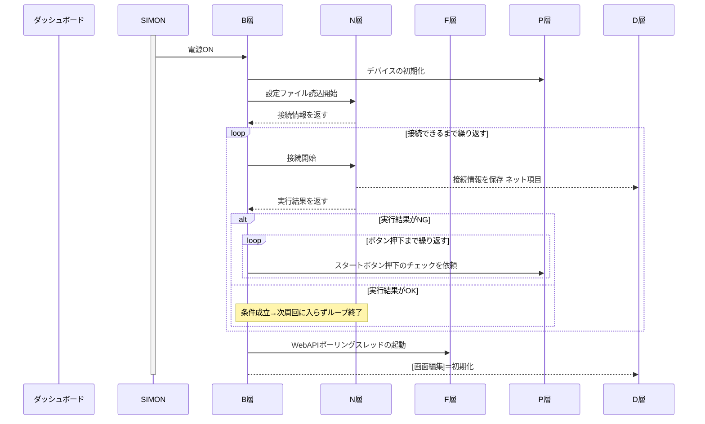
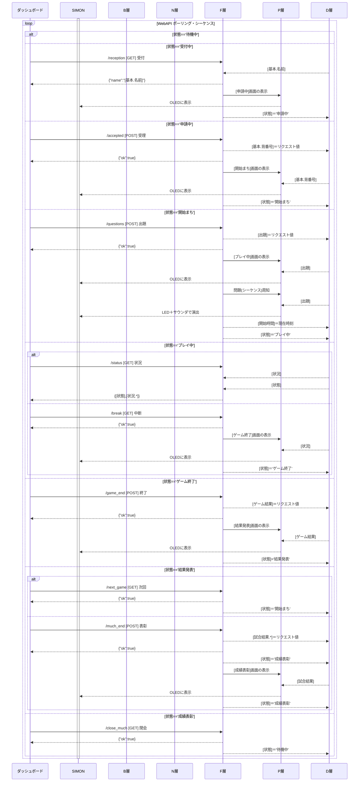
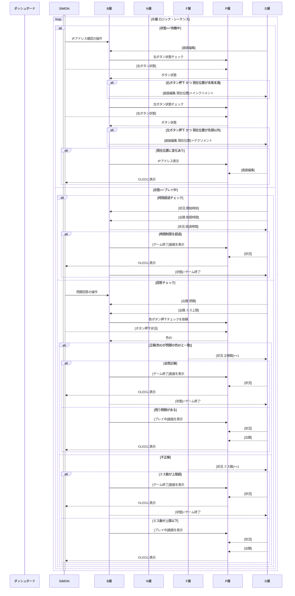

# 🧠 ネット型 SIMON ゲーム

## 🔷 概要

**タナカツヱンヂニヤリング**(たなかつ さん)製の`SIMONボード`をネットワーク対応しました。  
- マイコンをESP32S3に換装...**無線＆インターネット対応**
- Wifi経由の`WebAPI`サーバーを搭載...`参加者の操作`/`主催者の進行`の**２機能を統合**  
- 主催者はW**ネット越しに運営**が可能  
- 参加者は**ネット越しに競技**が可能

> SIMONのnote記事１ →[リンク](https://note.com/mech_tanakatsu/n/nfa5881d394a3)  
> SIMONのnote記事２ →[リンク](https://note.com/livspect/n/ne4cd328fd4ef?utm_source=chatgpt.com)  

---
## 🧩 システム構成
|層  |名称                |役割             |ファイル     |
|--- |--------------------|-----------------|-------------|
|Ｂ層|ビジネスロジック層  |ゲーム進行の中枢 |`main.py`    |
|Ｄ層|データベース層      |共有データベース |`Data.py`    |
|Ｎ層|ネットワーク層      |Wi-Fi接続管理    |`Network.py`<br>`wifi.json`|
|Ｆ層|ファンクション層    |WebAPIサーバ     |`Function.py`|
|Ｐ層|プレゼンテーション層|画面・音・LED制御|`Presen.py`  |

- **B層**  
  **状態遷移を統括**する中核ロジック。  
  ユーザー画面の操作ロジックも含む。  
  状況IDに応じた処理・画面更新を制御。

- **D層**  
  各層から共有する、**データベース**の役割。
  ネットワーク情報・出題・進捗・結果などを保持。  

- **N層**  
  **Wi-Fiによるネットワーク**を機能させる役割。
  Wi-Fi設定ファイルを読み込み、ネットワークの初期化を担当。

- **F層**  
  **WebAPIを機能**させる役割。
  HTTPサーバをスレッド起動し、GET/POSTのリクエストに応答。  
  機能単位にWebAPIを提供し、まとまった処理をこなす。  
  - リクエスト・データの内容をD層に反映
  - D層のデータをレスポンス・データとして返送
  - SIMONボードの演出効果
  - 遷移先状態の初期画面表示
  - 状態遷移をトリガー

- **P層**  
  **物理デバイスを抽象化**する役割。
  `OLED表示`/`LED制御`/`サウンド出力`/`ボタン入力`を一括管理。  

---
## ⚙️ システム設計方針

- **完全レイヤー分割設計**  
  - 各モジュールが明確な責務を持ち**相互依存を最小化**
  - デバッグや拡張が容易な構造

- **状態駆動アーキテクチャ**  
  - SIMONボード操作／WebAPI通信の**両経路から状況IDを更新**
  - B層のIF分岐で動作を制御

- **マルチスレッド対応**  
  - WebAPIサーバ(F層)は**並列実行**されB層処理との**干渉を防止**

- **物理UI統合**  
  - LED・サウンド・OLED・ボタン入力を**P層で抽象化**  
  - その他の層が**デバイス仕様に依存しない**設計

- **WebAPI制御**  
  - 主催者は**WebAPIリクエスト**で指示を出す
  - WebAPIサーバは**並列実行でポーリング**するので、**リアルタイムな進行**を実現

---
## 🌀 状態管理
このゲームシステムは`状態`をもとに進行管理します。
- `状態`はSIMONボードに保持し、`主催者指示(F層)` `参加者操作(B層)` が更新します。
- `状態`の更新には、その他の処理(`画面表示`や`データ送信・更新`)が伴います。

#### （表）状態別に実行可能な指示・操作と 伴う処理
|#| 状態   　  |Ｆ層　|Ｂ層　|画面作成　|送信|更新|
|-|------------|------|------|----------|----|----|
|1|`待機中`　　|    　|1:確認|　　　　　||画面編集|
|1|〃　　　　　|    　|2:参加|受付中　　|||
|2|`受付中`　　|　　　|1:待機|待機中　　|||
|2|〃　　　　  |3:受付|　　　|申請中　　|参加者.名前||
|3|`申請中`  　|4:受理|　　　|開始まち　||試合.基本<br>試合結果|
|4|`開始まち`　|5:出題|　　　|プレイ中　||出題<br>状況|
|5|`プレイ中`  |　　　|5:回答|プレイ中　||状況|
|5|〃　　　　　|　　　|6:失格|ゲーム終了||状況|
|5|〃　　　　　|5:状況|　　　|　　　　　|状況||
|5|〃　　　　　|7:中断|　　　|結果発表　||状況|
|6|`ゲーム終了`|7:終了|　　　|結果発表　||ゲーム結果|
|7|`結果発表`　|4:次回|　　　|開始まち　|||
|7|〃　　　　  |8:表彰|　　　|表彰　　　||試合結果|
|8|`成績表彰`　|1:閉会|　　　|待機中　　||

### 🧩 F層(ダッシュボード操作)による状態遷移
ダッシュボードの操作により、状態を遷移します。
1. ダッシュボードの操作に応じて、SIMONボードへWebAPIリクエストする
1. SIMONボードは、リクエストに応じた状態に遷移する

#### （表）目的・指示別の 状態遷移
|目的|指示|待機中|受付中|申請中|開始まち|プレイ中|ゲーム終了|結果発表|成績表彰|
|--------------------------|------|-|-|-|-|-|-|-|-|
|参加を受付ける  　　　　　|`受付`||→|✔
|参加許可を通知する　　　　|`受理`|||→|✔
|出題する　　        　　　|`出題`||||→|✔
|ゲームを中断(時間切れ)する|`中断`|||||→|✔
|ゲームの結果を発表する　　|`終了`||||||→|✔
|次のゲームに備える 　　　 |`次回`||||✔|||←
|試合の成績を発表する 　　 |`表彰`|||||||→|✔
|試合を閉会する(次に備える)|`閉会`|✔|||||||←
> (表の凡例) →←：遷移元 / ✓：遷移先

### 🧩 B層(SIMONボード操作など)による状態遷移
SIMON操作・タイマー比較により、状態を遷移します。  
ボタン押下や、条件を満たすことで、状態を遷移します。

#### （表）目的・操作別の 状態遷移
|目的|操作|待機中|受付中|申請中|開始まち|プレイ中|ゲーム終了|
|--------------------------|------|-|-|-|-|-|-|
|受付する    　　　　　　　|`白ボタン`|→|✔
|受付しない　　　　　　　　|`白ボタン`|✔|←
|全問正解(完走)でゲーム終了|`全問正解ま続ける`|||||→|✔
|ミス超過(失格)でゲーム終了|`上限超過まで続ける`|||||→|✔
|時間切れ(失格)でゲーム終了|`時間切れまで続ける`|||||→|✔
> (表の凡例) →←：遷移元 / ✓：遷移先

---
## 🧩Ｄ層：スキーマ
各層から共有するデータベースをグローバル変数で提供します。

### ０．状態マスタ

##### 変数名:`状態Ｍ`(辞書)
|キー        |値 |
|------------|---|
|`待機中`    |100|
|`受付中`    |101|
|`申請中`    |102|
|`開始待ち`  |103|
|`プレイ中`  |200|
|`ゲーム終了`|201|
|`結果発表`  |202|
|`成績表彰`  |300|

### １．状態情報
現在の状態(ID)を格納する。
IDマッピングは、`状態マスタ`を参照のこと。
##### 変数名:`状態`

### ２．ネットワーク情報
Wi-fi接続とHTTPサーバに用いるポート番号を格納する。
- N層：設定ファイルから`SSID`をセット
- N層：Wi-fi接続に成功後、`IP`/`GATEWAY`/`SUBNET`/`DNS`をセット

##### 変数名:`ネット`(辞書)
|キー|解説|
|---------|----|
|`SSID`   |JSONファイルより取得|
|`IP`     |DHCPクライアントIPアドレス|
|`GATEWAY`|ゲートウェイIPアドレス|
|`SUBNET` |サブネットマスク|
|`DNS`    |ドメインネームサーバIPアドレス|
|`PORT`   |固定値(8080)|


### ３．基本情報
選手の基本的な情報
- N層：設定ファイルから`名前`をセット
- F層(/recept)：`名前`を「参照→レスポンス」
- F層(/accept)：`背番号`を「リクエスト→セット」
- P層(開始待ち画面)：`背番号`を「参照→OLED表示」

##### 変数名:`基本`(辞書)
|キー|解説|
|----|----|
|`名前`|ダッシュボードで管理する選手名(JSONファイルに格納)|
|`背番号`|試合ごとにダッシュボードから採番される選手識別番号|

### ４．ゲーム出題情報
ゲームごとに設定する、問題の内容や条件。
- F層(/question)：初期化
- B層(プレイ画面)：参照

##### 変数名:`出題`(辞書)
|キー|解説|
|----|----|
|`問題`      |シーケンスを色コードをタプルで格納<br>例： [0,1,2,3,...]|
|`制限時間`  |全問正解までの制限時間[単位:ms]<br>これを超えると失格|
|`ミス上限数`|回答でミスできる上限<br>これを超えると失格|
|`ペナルティ`|回答でミスすると回答不能になる時間|

### ５．ゲーム状況情報
ゲームごとに初期化し、競技中に刻々と変化する情報
- F層(/play)：初期化
- F層(/state)：参照・レスポンス
- B層(プレイ画面)：更新

##### 変数名:`状況`(辞書)
|キー|解説|
|----|----|
|`ステップ数`|回答済みシーケンス位置|
|`ミス回数`|これまでミスした回数|
|`開始時刻`|競技開始した時刻[単位:ms]|
|`所要時間`|開始時刻からの経過時間[単位:ms]|

### ６．ゲーム結果情報
ゲームごとに設定する、問題の内容や条件。
- F層(/game_end)：「リクエスト→セット」
- P層(ゲーム結果画面)：「参照→表示」

##### 変数名:`ゲーム結果`(辞書)
|キー|解説|
|----|----|
|`順位１`|参加者の順位(順位ポイント合計)|
|`順位２`|参加者の順位(所要時間合計)|
|`参加数`|この試合の総参加者数|

### ７．画面編集情報
待機中画面のIPアドレス欄(2行目)の表示情報。
- F層(/new_much) ：初期化
- B層(プレイ画面)：刻々と更新

##### 変数名:`画面編集`(辞書)
|キー|解説|
|----|----|
|`IP`|2行目全体の文字列|
|`現在位置`|OLED左端に表示し始める位置|
|`最端位置`|`IP`の右端の文字|


-----
# 🌐 WebAPI 仕様
`ダッシュボード`の指示は、`SIMONボード`のF層を通じて処理します。  
**F層はWebAPIで実装**しています。
　 
|項目      |説明                           |
|----------|-------------------------------|
|ポート番号|8080                           |
|方式      |JSONベース / GET・POST         |
|レスポンス|application/json               |
|方向      |`ダッシュボード`→`SIMONボード`|

---
## /reception [GET] 受付
**目的** : 受付時の必要情報(参加者の名前)を指示する  
**リクエスト** : なし  
**レスポンス** : `{"name": "<player_name>"}`  
**ＤＢ更新** : リクエスト情報を反映、**開始時刻**を初期化  
**伴う処理** : **申請中**画面を表示  
**状態遷移** : **申請中**  

---
## /accepted [POST] 受理
**目的** : 受付完了の際、背番号を提供する  
**リクエスト** : `{"no": <int>}`  
**レスポンス** : `{"ok": true}`  
**ＤＢ更新** : リクエスト情報を反映、**開始時刻**を初期化  
**伴う処理** : **開始待ち**画面を表示  
**状態遷移** : **開始まち**  

---
## /questions  [POST] 出題
**目的** : ゲーム開始の際、問題と制限を提供する  
**リクエスト** :
```
{
  "seq"     : [<int>,...],  // 問題(シーケンス)：色IDのCSV
  "lim_time": <int>,        // 制限時間[単位:ms]
  "lim_miss": <int>,        // 不正解上限[単位:回]
  "penalty" : <int>         // ペナルティ時間[単位:ms]
}
```
**レスポンス** : `{"ok": true}`  
**ＤＢ更新** : リクエスト情報を反映、**開始時刻**を初期化  
**伴う処理** : **プレイ中**画面を表示、問題(シーケンス)を視聴覚的に表現  
**状態遷移** : **プレイ中**  

---
## /status [GET] 状況
**目的** : ダッシュボード表示に必要な「プレイ状況」を指示する  
**リクエスト** : なし    
**レスポンス** :
```
{
  "state": <int>, // 状態ID
  "step" : <int>, // 正解数
  "miss" : <int>, // 不正解数
  "time" : <int>  // 所要時間[単位:ms]：全問正解以外は0
}
```
**ＤＢ更新** : なし  
**伴う処理** : なし  
**状態遷移** : なし  

---
## /game_end [POST] 終了
**目的** : ゲーム終了の際、ゲーム成績を提供する  
**リクエスト** :
```
{
  "rank"    : <int>,    // 順位：0=失格、1～=順位
  "nums"    : <int>,    // 参加人数
  "point"   : <int>,    // 順位ポイント
  "pointTTL": <int>,    // 順位ポイント合計
  "timeTTL" : <int>     // 所要時間合計[単位:ms]
}
```
**レスポンス** : `{"ok": true}`  
**ＤＢ更新** : リクエスト情報を反映  
**伴う処理** : **結果発表**画面を表示  
**状態遷移** : **結果発表**  

---
## /new_game [GET] 次回
**目的** : 次ゲームに進行する準備を指示する  
**リクエスト** : なし  
**レスポンス** : `{"ok": true}`  
**ＤＢ更新** : なし  
**伴う処理** : なし  
**状態遷移** : **開始まち**  

---
## /much_end [POST] 表彰
**目的** : 試合終了の際、試合成績を提供する  
```
{
  "rank1": <int>,   // 順位(順位ポイント合計)
  "rank2": <int>,   // 順位(所要時間合計)
  "nums" : <int>    // 参加人数
}
```
**レスポンス** : `{"ok": true}`  
**ＤＢ更新** : なし  
**伴う処理** : なし  
**状態遷移** : **成績表彰**  

---
## /new_much [GET] 閉会
**目的** : 試合閉会の際、次試合の準備を指示する  
**リクエスト** : なし  
**レスポンス** : `{"ok": true}`    
**ＤＢ更新** : なし  
**伴う処理** : なし  
**状態遷移** : **待機中**  

---
## 🌀 シーケンス図
シーケンスは3個に大別されます。
1. 初期セットアップ：電源投入～デバイス・サービスの初期設定
1. 定常後のF層(WebAPI シーケンス)に関するもの
1. 定常後のB層(ロジック・シーケンス)に関するもの

---
### １．初期セットアップ
N層のTPCタック・F層のHTTPサーバーを実装します。  

N層はWifiによるTCP通信を確保します。  
Wifiの設定はJSONファイルに格納されています。  

F層はWebAPI機能を提供するため、HTTPサーバーをスレッドで起動します。
スレッド処理ではループ処理により、ポーリングします。


---
### ２．Ｆ層：WebAPI
各APIは状態による実行制限があります。  
制限をパスすれば、機能単位の処理が実行されます。
機能は、`レスポンス`/`D層の参照・更新`/`P層の実行`/`状態の遷移`など様々な処理を含みます。



---
### ３．Ｂ層：画面操作・経過時間比較)
状態毎に画面機能を実行します。  
画面機能は、`D層の参照・更新`/`P層の実行`/`状態の遷移`など様々な処理を含みます。


