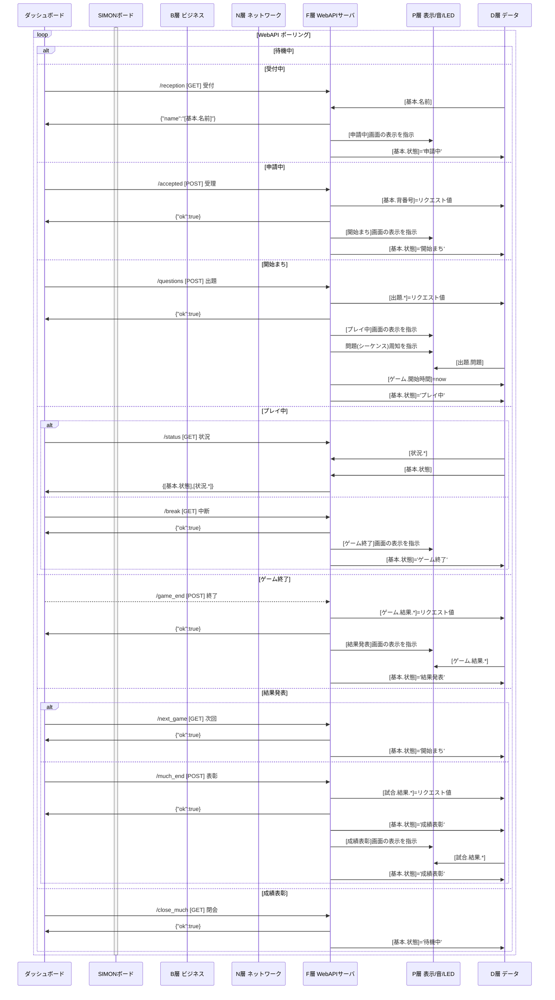
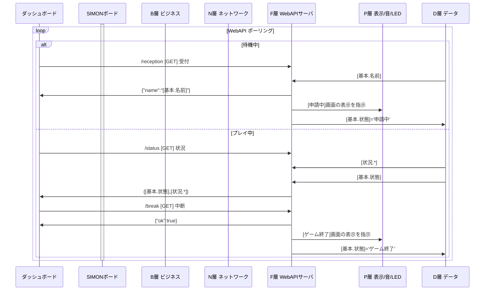
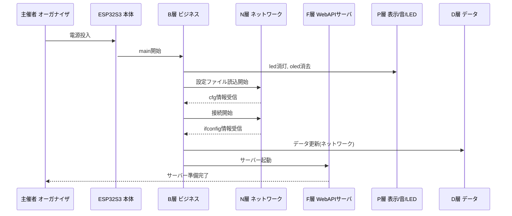

# 🧠 ネットSIMONゲームSYSTEM

## 🔷 概要

**タナカツヱンヂニヤリング**(たなかつ さん)製の`SIMONボード`をネットワーク対応しました。  
マイコンをESP32S3に変更し、Wifi経由の`WebAPI`サーバーを搭載しました。  
主催者は`ダッシュボード`(WEBブラウザ)を操作して試合を進行します。  
参加者は主催者の指示に従い、`SIMONボード`で競技をおこないます。  

> SIMONのnote記事１ [リンク→](https://note.com/mech_tanakatsu/n/nfa5881d394a3)
> SIMONのnote記事２ [リンク→](https://note.com/livspect/n/ne4cd328fd4ef?utm_source=chatgpt.com)

---
## 🧩 システム構成
|層  |名称                |役割                |📁ファイル|
|--- |--------------------|--------------------|-----------|
|Ｂ層|ビジネスロジック層  |ゲーム進行の中枢    |main.py    |
|Ｄ層|データベース層      |共有データベース    |Data.py    |
|Ｎ層|ネットワーク層      |Wi-Fi接続管理       |Network.py |
|Ｆ層|ファンクション層    |WebAPIサーバ (HTTP) |Function.py|
|Ｐ層|プレゼンテーション層|画面・音・LED制御   |Presen.py  |

- **B層（Business Logic）**  
  状態遷移を統括する中核ロジック。  
  ユーザー画面の操作ロジックも含みます。  
  状況IDに応じて処理と画面更新を制御します。

- **D層（DataBase）**  
  グローバル変数を用いたデータベース。  
  ネットワーク情報・出題・進捗・結果を保持。  
  全レイヤーから共通アクセス可能なデータベース的役割。

- **N層（Network）**  
  Wi-Fi設定ファイル（`wifi.json`）を読み込み、  
  ネットワーク初期化を担当。

- **F層（Function）**  
  内蔵Webサーバをスレッド起動し、HTTP GET/POSTのリクエストに応答。  
  機能単位にWebAPIを提供し、まとまった処理をこなします。  
  - リクエスト・データの内容をD層に反映
  - D層のデータをレスポンス・データとして返送
  - SIMONボードの演出効果
  - 遷移先状態の初期画面表示
  - 状態遷移をトリガー

- **P層（Presentation）**  
  OLED表示、LED制御、サウンド出力、ボタン入力を一括管理。  
  UI（物理的インタフェース）を抽象化する層です。

---
## ⚙️ システム設計方針

- **完全レイヤー分割設計**  
  各モジュールが明確な責務を持ち、相互依存を最小化。  
  デバッグや拡張が容易な構造。

- **状態駆動アーキテクチャ**  
  プレイヤー操作／WebAPI通信の両経路から  
  状況IDを更新し、B層のIF分岐で動作を制御。

- **マルチスレッド対応**  
  WebAPIサーバ（F層）は `_thread` により並列実行され、  
  ゲーム処理との干渉を防止。

- **物理UI統合**  
  LED・サウンド・OLED・ボタン入力をP層で抽象化し、  
  ロジック層がデバイス仕様に依存しない設計。

- **WebAPI制御**  
  主催者からの`WebAPI`のリクエストに応じて  
  リアルタイムに競技進行・状況監視・結果通知を行う。

---
## 🌀 状態管理
このゲームシステムは`状態`をもとに進行管理します。  
`状態`はSIMONボードに保持し、`主催者指示` `参加者操作` が更新します。  
`状態`の更新には、その他の処理(`画面表示`や`データ送信・更新`)が伴います。  

#### （表）状態別に実行可能な指示・操作と 伴う処理
|#| 状態   　  |Ｆ層　|Ｂ層　|画面作成　|送信|更新|
|-|------------|------|------|----------|----|----|
|1|`待機中`　　|    　|1:確認|(画面編集)||画面編集|
| |　　　　　　|    　|2:参加|受付中　　|||
|2|`受付中`　　|　　　|1:待機|待機中　　|||
| |　　　　　  |3:受付|　　　|申請中　　|参加者.名前||
|3|`申請中`  　|4:受理|　　　|開始まち　||試合.基本<br>試合.結果|
|4|`開始まち`　|5:出題|　　　|プレイ中　||ゲーム.出題<br>ゲーム.状況|
|5|`プレイ中`  |　　　|5:回答|(画面編集)||ゲーム.状況|
| |　　　　　　|　　　|6:失格|ゲーム終了||ゲーム.状況|
| |　　　　　　|5:状況|　　　|　　　　　|ゲーム.状況||
| |　　　　　　|7:中断|　　　|結果発表　||ゲーム.状況|
|6|`ゲーム終了`|7:終了|　　　|結果発表　||ゲーム.結果|
|7|`結果発表`　|4:次回|　　　|開始まち　|||
| |　　　　　  |8:表彰|　　　|表彰　　　||試合.結果|
|8|`成績表彰`　|1:閉会|　　　|待機中　　||

### 🧩 主催者(F層)による変更
ダッシュボードの操作により、状態を変更します。
1. ダッシュボードの操作に応じて、WebAPIをリクエストする
1. SIMONボードは、リクエストに応じた状態IDに変更する

#### （表）目的・指示別の 状態変更
|目的|指示|待機中|受付中|申請中|開始まち|プレイ中|ゲーム終了|結果発表|成績表彰|
|--------------------------|------|-|-|-|-|-|-|-|-|
|参加を受付ける  　　　　　|`受付`||→|✔
|参加許可を通知する　　　　|`受理`|||→|✔
|出題する　　        　　　|`出題`||||→|✔
|ゲームを中断(時間切れ)する|`中断`|||||→|✔
|ゲームの結果を発表する　　|`終了`||||||→|✔
|次ゲームへ進行する  　　　|`次回`||||✔|||←
|試合の成績を発表する 　　　|`表彰`|||||||→|✔
|試合を閉会する  　　　　　|`閉会`|✔|||||||←
> (表の凡例) →←：変更元 / ✓：変更先]*

### 🧩 参加者(B層)による変更
プレイ操作により、状態を変更します。  
ボタン押下や、条件を満たすことで、状態を変更します。

#### （表）目的・操作別の 状態変更
|目的|操作|待機中|受付中|申請中|開始まち|プレイ中|ゲーム終了|
|--------------|------|-|-|-|-|-|-|
|受付する    　|`白ボタン`|→|✔
|受付しない　　|`白ボタン`|✔|←
|全問正解で終了|`全問正解ま続ける`|||||→|✔
|ミス超過で失格|`上限超過まで続ける`|||||→|✔
|時間切れで失格|`時間切れまで続ける`|||||→|✔
> (表の凡例) →←：変更元 / ✓：変更先**

-----
# 🌐 WebAPI 仕様
`ダッシュボード`の指示は、`SIMONボード`のF層を通じて処理します。  
**F層はWebAPIで実装**しています。
　 
|項目      |説明                           |
|----------|-------------------------------|
|ポート番号|8080                           |
|方式      |JSONベース / GET・POST         |
|レスポンス|application/json               |
|方向      |`ダッシュボード`→`SIMONボード`|

---
## /reception [GET] 受付
**目的** : 受付時の必要情報(参加者の名前)を指示する  
**リクエスト** : なし  
**レスポンス** : `{"name": "<player_name>"}`  
**ＤＢ変更** : リクエスト情報を反映、**開始時刻**を初期化  
**伴う処理** : **申請中**画面を表示  
**状態変更** : **申請中**  

---
## /accepted [POST] 受理
**目的** : 受付完了の際、背番号を提供する  
**リクエスト** : `{"no": <int>}`  
**レスポンス** : `{"ok": true}`  
**ＤＢ変更** : リクエスト情報を反映、**開始時刻**を初期化  
**伴う処理** : **開始待ち**画面を表示  
**状態変更** : **開始まち**  

---
## /questions  [POST] 出題
**目的** : ゲーム開始の際、問題と制限を提供する  
**リクエスト** :
```
{
  "seq"     : [<int>,...],  // 問題(シーケンス)：色IDのCSV
  "lim_time": <int>,        // 制限時間[単位:ms]
  "lim_miss": <int>,        // 不正解上限[単位:回]
  "penalty" : <int>         // ペナルティ時間[単位:ms]
}
```
**レスポンス** : `{"ok": true}`  
**ＤＢ変更** : リクエスト情報を反映、**開始時刻**を初期化  
**伴う処理** : **プレイ中**画面を表示、問題(シーケンス)を視聴覚的に表現  
**状態変更** : **プレイ中**  

---
## /status [GET] 状況
**目的** : ダッシュボード表示に必要な「プレイ状況」を指示する  
**リクエスト** : なし    
**レスポンス** :
```
{
  "state": <int>, // 状態ID
  "step" : <int>, // 正解数
  "miss" : <int>, // 不正解数
  "time" : <int>  // 所要時間[単位:ms]：全問正解以外は0
}
```
**ＤＢ変更** : なし  
**伴う処理** : なし  
**状態変更** : なし  

---
## /game_end [POST] 終了
**目的** : ゲーム終了の際、ゲーム成績を提供する  
**リクエスト** :
```
{
  "rank"    : <int>,    // 順位：0=失格、1～=順位
  "nums"    : <int>,    // 参加人数
  "point"   : <int>,    // 順位ポイント
  "pointTTL": <int>,    // 順位ポイント合計
  "timeTTL" : <int>     // 所要時間合計[単位:ms]
}
```
**レスポンス** : `{"ok": true}`  
**ＤＢ変更** : リクエスト情報を反映  
**伴う処理** : **結果発表**画面を表示  
**状態変更** : **結果発表**  

---
## /next_game [GET] 次回
**目的** : 次ゲームに進行する準備を指示する  
**リクエスト** : なし  
**レスポンス** : `{"ok": true}`  
**ＤＢ変更** : なし  
**伴う処理** : なし  
**状態変更** : **開始まち**  

---
## /much_end [POST] 表彰
**目的** : 試合終了の際、試合成績を提供する  
```
{
  "rank1": <int>,   // 順位(順位ポイント合計)
  "rank2": <int>,   // 順位(所要時間合計)
  "nums" : <int>    // 参加人数
}
```
**レスポンス** : `{"ok": true}`  
**ＤＢ変更** : なし  
**伴う処理** : なし  
**状態変更** : **成績表彰**  

---
## /close_much [GET] 閉会
**目的** : 試合閉会の際、次試合の準備を指示する  
**リクエスト** : なし  
**レスポンス** : `{"ok": true}`    
**ＤＢ変更** : なし  
**伴う処理** : なし  
**状態変更** : **待機中**  

---
## 🌀 シーケンス図(Ｆ層：WebAPI)
WebAPIはスレッドにより、ポーリングしています。  
各APIは状態による実行制限があります。  



---
## 🌀 シーケンス図(Ｆ層：WebAPI)
WebAPIはスレッドにより、ポーリングしています。  
各APIは状態による実行制限があります。  




---
## 🌀 シーケンス図(セットアップ)
N層とF層を起動します。  

N層はWifiによるTCP通信を確保します。  
Wifiの設定はJSONファイルに格納されています。  

F層はWebAPIによる機能提供をするので、HTTPサーバーをスレッド起動します。
スレッド処理ではループ処理により、ポーリングをおこないます。



