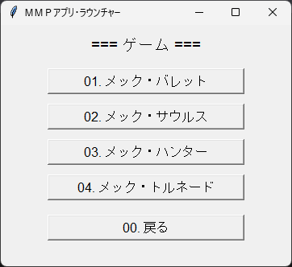
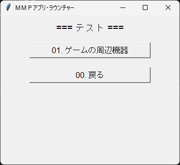
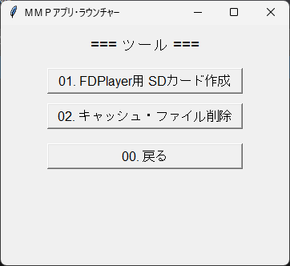

# ＭＭＰアプリ・ラウンチャー
----

**2階層メニュー形式のＧＵＩランチャー**です。  
カテゴリ → プログラム選択 の順に選び、指定フォルダ内の外部 Python プログラムを実行します。  
実行前に対象フォルダへ移動 (`cwd`) してから起動するため、相対パスのリソースも利用できます。

## 画面イメージ





## 機能
- **2階層メニュー構造**
  - 1階層目：カテゴリ選択
  - 2階層目：プログラム選択
- **フォルダ移動後に外部実行**
  - 実行前に対象フォルダへ `chdir` してから起動
- **GUI操作**
  - Tkinter ボタンで操作
  - 実行結果はダイアログで通知
- **GUIフリーズ防止**
  - 実行処理は別スレッドで実行

---
# 保守情報

## 動作環境
- Python 3.7 以上
- Tkinter（標準で同梱）
- 対応OS：Windows / macOS / Linux

## フォルダ構成例
```
├─ menu.py # このランチャープログラム
├─ prog1/
│ └─ main.py
├─ prog2/
│ └─ main.py
├─ game1/
│ └─ main.py
└─ game2/
   └─ main.py
```

## 修正方法

1. `MENU` 辞書にカテゴリとプログラムを登録します。

(例)
```python
# === メニュー構造 {カテゴリ番号: (カテゴリ名, {プログラム番号: (フォルダ, ファイル, タイトル)})} ===
MENU = {
    "1": ("ゲーム", {
        "1": ("01_MechBullets"  , "main.py", "メック・バレット"     ),
        "2": ("02_MechSaurus"   , "main.py", "メック・サウルス"     ),
        "3": ("03_MechHunter"   , "main.py", "メック・ハンター"     ),
        "4": ("04_MechTornado"  , "main.py", "メック・トルネード"   ),
    }),
    "2": ("ツール", {
        "1": ("00_Tools", "sd-card.py" , "FDPlayer用 SDカード作成"),
    }),
}
```