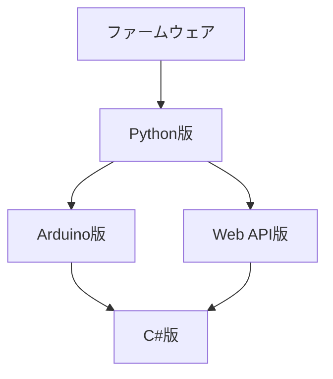

# PMO運用ルール

MMPソリューションの中核をなす「ファームウェア」「ライブラリ」「サーバーウェア」は、双方が密接につながっている。このため、綿密な管理のもと、「整合性の維持」「効率的な開発」を実践しなければならない。

## 1. PMOの役割
PMO（Project Management Office）は、以下を一元管理する。  
- 各チームの進捗・課題・残タスク  
- 依存関係とクリティカルパス  
- テスト計画と進捗（前進テスト／リグレッションテスト）  
- ファイルのライフサイクル（テスト合格 → GitHub反映 → プロジェクトファイル更新）  

---

## 2. チーム構成（例）
- ファームウェアチーム  
- Python版チーム  
- WebAPIチーム  
- Arduino版チーム  
- C#版チーム  

---

## 3. 依存関係の基本ルール
- **Python版が仕様の基準（ソース・オブ・トゥルース）**  
- **ファームウェア → Python → （Arduino／WebAPI） → C#** の順で進行  
- C#版は最後に対応（理由：並行開発による手戻りを防止、需要が少ない）  

---

## 4. テスト管理ルール
- **ステータス**は以下の4種類で統一  
  - **未実施**：やる必要あり、まだ着手していない  
  - **合格**：テスト済み、問題なし  
  - **不合格**：テスト済み、失敗あり  
  - **スキップ**：意図的に省略（理由を必ず備考に明記）  

- **完了条件**  
  - 新機能の前進テスト＋既存機能のリグレッションテストを **通信経路ごとに全てPASS**  
  - 全て**合格後に GitHubへ反映** → **プロジェクトファイル更新**  

---

## 5. ファイル管理ルール
1. **ChatGPTプロジェクトファイル**にはフォルダがないため、  
   → ファイル名の先頭にチーム番号を付ける。  
   - 例：`10_main.py`, `11_menu.cpp`  
2. **実際のファイル名**は番号を除いたもの。  
   - ソース先頭1行目に `# File: main.py` のように記載。  
3. **更新日付＋枝番**をソース2行目に記載。  
   - 例：`# Updated: 2025-09-29 Rev.1`  
4. PMOは「番号付き＝ChatGPT内の識別子」「番号なし＝実際のファイル名」として区別管理する。  
5. **GitHubを必ず正本として利用する**。  
   - プロジェクトファイルが壊れたり更新漏れが発生しても、GitHub上の資源は常に壊れない正本として保証される。  
   - GitHubコミット日付を基準に、最終的な前後関係と正当性を判断する。  

---

## 6. 進捗表示の運用
- **通常はシンプル版表**で全体把握  

| チーム       | シリアル | TCPブリッジ | HTTP(WebAPI) | 備考 |
|--------------|----------|-------------|--------------|------|
| **Python版** | 未実施   | 未実施      | –            | ファーム依存 |
| **WebAPI版** | –        | –           | 未実施       | URL短縮待ち |
| **Arduino版** | 合格     | 不合格      | –            | PICO-2W Wi-Fi不具合 |
| **C#版** | 合格     | 未実施      | –            | 待機中 |

- **必要に応じて詳細版表**をPMOが展開（経路・入口・前進/回帰までドリルダウン可能）  

---

## 7. PMOのアクション
- 「**テスト完了**」の報告を受けたら → **GitHub反映をリマインド**  
- GitHub反映後 → **プロジェクトファイル更新をリマインド**  
- 依存関係や停滞があれば → **理由を明確に説明**（例：先行タスク未了、ファーム待ち）  

---

## 8. 運用イメージ
- 普段はシンプルに俯瞰 → 必要に応じて詳細をドリルダウン  
- ゴーサインの有無／先行タスク残有無を明示  
- 「リリース版＝テスト完了＋GitHub反映＋プロジェクトファイル更新」を保証
- 万が一中間成果物やプロジェクトファイルが消失しても、GitHubの正本とチャットに残るPMO記録から再構築できる体制を保証する。
