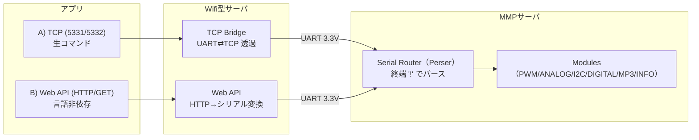

# 🌐 MMPの利用ガイド

シリアル接続で平易に利用する以外に、さまざまな使用法があります。 
Wifiで無線化することもできます
- Wifiであれば、インターネットを介した遠隔制御も可能
- シリアルコマンド以外に、多くの開発言語で扱えるWEB-APIを使用可能

---

## 1. 用途別の構成

- **サーバーA：MMPファーム（有線）** … これ単体だと **シリアル有線運用**。最短・最小構成。  
- **サーバーB：TCPブリッジ＋Web-API（無線）** … Aのシリアルを **Wi‑Fiへ延長**。  
  - **TCPブリッジ**：シリアル生コマンドを **TCPで高速に直送**（終端 `!` 必須）  
  - **Web-API**：HTTP/GETで **言語非依存に制御**（内部でシリアルへ変換）  
- **効果**：ワイヤレス化で **設置が簡単・レイアウト自由・ケーブルレスで安全**。構成により **インターネット越しの遠隔操作** も可能。

---

## 2. 図でみる全体像

> LAN内運用が基本。必要に応じてVPNやFW設定で**インターネット越し遠隔**も構成可能。

---

## 3. 役割と特徴

|  | サーバーA：MMPファーム | サーバーB：TCPブリッジ＋Web‑API |
|---|---|---|
| 主目的 | デバイス制御の本体（有線） | 無線化（Wi‑Fi）＋API公開 |
| 接続 | USB / UART0 | Wi‑Fi（TCP/HTTP）＋ UART直結 |
| 操作プロトコル | シリアル（終端 `!`） | TCPブリッジ（生コマンド）／Web‑API（HTTP/GET） |
| 強み | 最短経路・低レイテンシ | **ワイヤレス**、**レイアウト自由**、**ケーブルレスで安全**、**遠隔操作**、**言語非依存** |
| 想定設置 | 機器近傍 | 機器近傍（UART接続）＋ネットワーク越しクライアント |

---

## 4. 用途別のおすすめ運用

### 運用面（現場・設置）
- **ワイヤレス運用**：配線工数を削減、**設置が簡単**。装置配置の **レイアウトが柔軟**、通路の**ケーブル除去で安全運営**。  
- **遠隔操作**：LAN/VPNを介し、**離れたクライアントから操作**可能（インターネット越しも構成次第で可）。

### アプリ開発（制御方式の選択）
- **速度重視**：**TCPブリッジ**で **シリアル生コマンド** を直接送信（最小オーバーヘッド）。  
- **言語非依存**：**Web‑API** を使えば **HTTP/GET** なので、**開発言語を問わず**に制御可能。

---

## 5. どれを使う？

| シナリオ | 推奨 | 理由 |
|---|---|---|
| 最短レイテンシが最優先（ベンチ、チューニング） | **TCPブリッジ** | シリアル生コマンドでオーバーヘッド最小 |
| 迅速にアプリ試作・多言語で実装 | **Web‑API** | HTTP/GETでツール/言語を選ばない |
| 現場で配線を減らして安全に運用 | **TCPブリッジ or Web‑API** | どちらでもワイヤレス化の恩恵 |
| 社外/遠隔から操作（ネット越し） | **Web‑API**（＋FW/VPN） | ポート制御と認証の設計がしやすい |

---

## 6. 関連ドキュメント

- 🔧 **ファームウェア**：  
  [コマンド リファレンス](./mmpDete/01_リファレンス.md) 
  [アーキテクチャ解説](./mmpDete/02_アーキテクチャ.md) 
  [保守マニュアル](./mmpDete/03_保守.md) 
- 🔌 **TCPブリッジ・WEB-API**：  
  [総合マニュアル](./TcpBridge/README.md) 