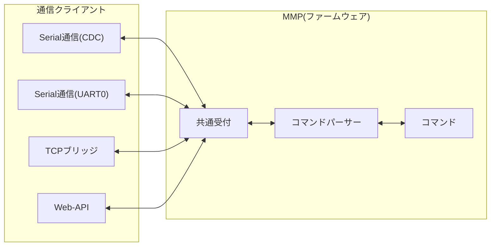

# 🌐 通信クライアント

MMPには大きく２つの方式、合計で4つの接続方法で、クライアントと通信できます。  
この４つの総称を**通信クライアント**、個々を**通信経路**と呼びます。

- **シリアル通信**：ケーブル接続
  - **USB**(CDC)
  - **UART0**(GPIO)
- **Wi-fi通信**：無線接続
  - **TCPブリッジ**
  - **Web-API**

---

## 1. 通信クライアントとMMP

MMPへリクエストする**書式は、通信経路によって異なり**ます。   
ファームウェアとの接点にて書式を統一化し、同じロジックで後続処理が可能です。

- `共通受付`が`通信経路`のリクエストを、`統一書式`に整形
- `コマンドパーサー`が`統一書式`を解析し、該当`コマンド`を実行
- `共通受付`がリクエスト元の`通信経路`へ、`コマンド`の`戻り値`をレスポンス



---
## 2. 通信クライアントの採用検討

アプリの用途・通信クライアントの特徴を考慮します。

|項目|シリアル通信(有線)  |ネット通信(無線)          |
|----|--------------------|--------------------------|
|接続|USB(CDC)<br>UART0(GPIO)|Wi‑Fi (TCP／HTTP)         |
|強み|確実接続<br>高速動作|設置・撤収が簡単<br>配線トラブルが無い|
|用途|高速性を要する場合|複数クライアント<br>遠隔操作<br>子供が走り回るような現場|

---
## 3. Wi-Fi通信における採用検討

Wi-Fiを用いた無線通信を採用する場合、下表の特徴を考慮します。

|用途|推奨|理由|
|----|----|----|
|通信速度に高速性が必要|**TCPブリッジ**| オーバーヘッドが少ない      |
|多言語での実装        |**Web‑API**    | 開発言語の依存性が少ない    |
|遠隔から操作          |**Web‑API**    | ポート制御と認証の設計が容易|

---
## 4. Wi-Fi利用に必要な設定ファイル
Wi-Fi通信を利用する場合には、マイコン内に設定ファイル(JSON)を格納します。

### 4.1. 設定ファイルの格納手順
用途に応じて、設定ファイルを作成します。

💾 作成手順（Arduino IDE）
1. プロジェクトフォルダ直下に`data`フォルダを作成
1. 作成した設定ファイルを`data/config.json`に格納

**（例１：APモードのみ）**
Wi-Fiルーターを使用しない、最小構成です。   
MMP本体とクライアントを直接接続します。
|セクション|説明|
|----------|----|
|`"server"`|TCP/HTTPサーバー設定<br>`max_clients` は接続上限<br>`write_lock_ms` は書込みロック保持時間|
|`"host"`   |`"type": "ap"` のみを定義<br>`"ip"`はESP32の固定IP<br>`"name"` が SSID名|
|`"wifi"`   | STA接続を行わないため空配列|

```json
{
  "server": {
    "max_clients": 4,
    "write_lock": false,
    "write_lock_ms": 30000
  },
  "host": [
    {
      "type": "ap",
      "name": "mmp-ap-mode",
      "ip": "192.168.254.254"
    }
  ],
  "wifi": []
}
```

**（例２：STAモード＋APモード）**
`wifi`に複数設定することで、上から順に接続を試みます。   
Wi-Fiルーターの接続に失敗した場合、APモードで機能します。   

|セクション|説明|
|----------|----|
|`"server"`|TCP/HTTPサーバー設定<br>`max_clients` は接続上限<br>`write_lock_ms` は書込みロック保持時間|
|`"host"`  |デバイス自身のモード設定。<br>`sta` は通常のWi-Fi接続<br>`ap` はアクセスポイント。|
|`"wifi"`  |STAモードで接続可能なルーター一覧。<br>`default: true` の項目が優先接続対象。|

```json
{
  "server": {
    "max_clients": 4,
    "write_lock": false,
    "write_lock_ms": 30000
  },
  "host": [
    {
      "type": "sta",
      "name": "mmp-sta-mode",
      "ip": "254"
    },
    {
      "type": "ap",
      "name": "mmp-ap-mode",
      "ip": "192.168.254.254"
    }
  ],
  "wifi": [
    {
      "label": "home",
      "ssid": "Buffalo-G-C0F0",
      "pass": "6shkfa53dk8ks",
      "default": true
    },
    {
      "label": "mbph",
      "ssid": "kureha",
      "pass": "09017390454",
      "default": false
    },
    {
      "label": "mbrt",
      "ssid": "Kureha-wimax",
      "pass": "090173904541012",
      "default": false
    }
  ]
}
```
> (IPアドレスの指定)
>  ・STAモード：末尾(第四オクテット)のみを指定
>  ・APモード：すべてのオクテットを指定

---
### 4.2. 設定ファイルの格納手順

アップロードには、専用ツールを使います。
> 以下のツールを使用します。
> https://github.com/earlephilhower/arduino-littlefs-upload

> (参考)
> https://qiita.com/kumakumao/items/be51f174bfeb0e4a6a06

### 4.2.1. ツールのインストール
インストールがまだの場合、一度だけ行います。
1. リリース ページに移動し、.vsixファイルをクリックしてダウンロード
1. `C:\Users\<ユーザー名>\.arduinoIDE\plugins`にコピー
1. Arduino IDEを起動 

### 4.2.2. 設定ファイルのアップロード
マイコン上の設定ファイルは削除され、新たなもので置き換わります。
1. [Ctrl]+[Shift]+[P]を押してコマンドパレットを開く
1. `Upload Little FS to Pico/ESP8266/ESP32`を実行


