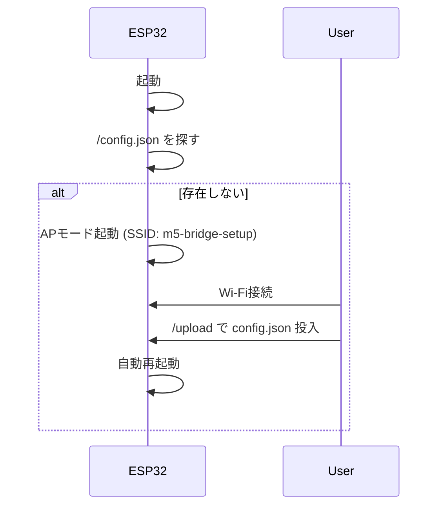
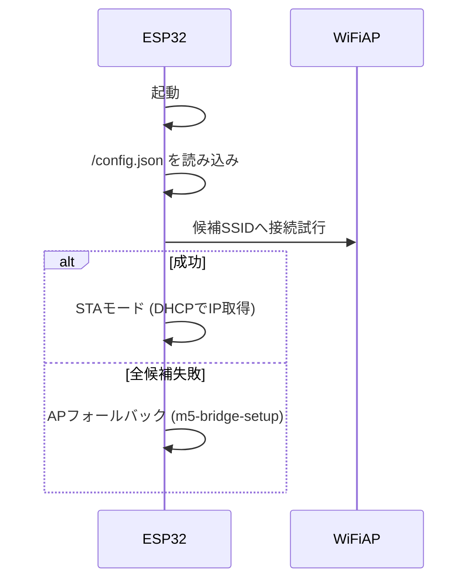

# TCPブリッジ 兼 WEB-API サーバ

## 1. はじめに（目的）
本ツールは **ESP32小型マイコン（M5Stamp S3など）** を利用して、  
PCやRaspberry Pi上で動作する `ser2net` を代替するシリアル⇄TCPブリッジを提供します。 また、MMPコマンドのWEB-APIも提供します。 

- 省スペース  
- 低コスト  
- 保守性の向上（Webから設定可能）  

を目的としています。  

---

## 2. できること
- **UART⇄TCPの透過ブリッジ（RAW）**  
- **他ライブラリ同様、フルセットのMMP機能をもつWEB-API**  
- **2系統のUARTをサポート**（例: TCPポート5331/5332）  
- **Web UI搭載**  
  - `/` : 設定ファイルアップロード  
  - `/config` : 現在の設定表示  
  - `/status` : 起動状況確認  
- **Wi-Fi候補を複数登録可能**（順に接続を試行）  
- **フェイルオーバー**  
  - 接続失敗時は APモード (`m5-bridge-setup`) に切替 → 設定投入可能  

---

## 3. 制約と前提
- **信号レベル**: 3.3V TTL（M5シリーズのGPIOは3.3Vロジック）。  
  - 5Vロジック機器と接続する場合は必ずレベルシフタを使用してください。  
- **GND共通化**: 接続先機器と必ずGNDを共有すること。  
- **速度**: 115200bps ×2系統での動作を想定。  
- **セキュリティ**: LAN用途を前提。Wi-FiパスワードはJSON内に平文で保存されます。  

---

## 4. クイックスタート

1. **初回起動はAPモード**になっているので、WifiをSSID: `m5-bridge-setup`で接続します。
2. WEBブラウザで`http://192.168.4.1/`にアクセスすると、トップ画面が表示されます。 
3. `参照`ボタンをクリックし、設定ファイルを選択します。選択すると`参照`ボタンの横にファイル名が表示されます。
4. `Upload`ボタンをクリックし、取り込みます。
5. 自動再起動後、設定ファイルに従いWi-Fiに接続されます。この時点でWifiをもとのものに繋ぎ直してください。
6. シリアルモニタの接続情報でIPアドレスを確認し、WEBブラウザで開くと、再びTop画面が表示されます。
7. 現在の**接続状況**リンクを押すと、接続状況などを確認できます。
8. 念のため**現在の設定ファイルの中身**リンクを押して、取り込みした内容と一致するかを確認します。

---

## 5. セットアップ詳細
- **配線**:  
  - UART1 = G3 (RX), G1 (TX)  
  - UART2 = G10 (RX), G9 (TX)  
- **IDE設定**:  
  - ボード: `ESP32S3 Dev Module`  
  - Upload Speed: 115200 または 921600  
  - Flash Size: 4MB  
  - Partition Scheme: Default 4MB with spiffs  
  - USB CDC On Boot: Enabled  

---

## 6. 使用方法

### 6-1. TCPブリッジ編
シリアルモニターに現在のIPアドレスが表示されます。そのアドレスをWEBブラウザで開きます。<br>
（例）`http://192.168.1.110`<br>
WEB画面で、設定ファイルの選択とアップロードができます。
また、現在格納する設定ファイルの中身、現在の接続状況を表示できます。

アプリケーションで制御する場合、以下の用に使用します。
- `/upload` : 設定ファイルをアップロード（再起動して反映）。  
- `/config` : 現在の `/config.json` を表示。  
- `/status` : 現在の動作状況を表示。  
- **TCP接続** : `telnet <IP> 5331` または `5332`。  

### 6-2. WEB-API編
各種ライブラリと同様に、MMPの持つ機能をフルセットでWEB-APIで提供する。APIツリー構造とシグネチャは以下の通り。
```
/
├─ GET  /                       … {"ok":true,"service":"MMP-WebAPI","note":"GET-only"}
│
├─ info
│  ├─ GET  /info/version        … 返: {"ok":true,"version":"VER!"相当}
│  ├─ GET  /info/pwm?dev=0      … 返: {"ok":true,"dev":0,"pwm":"0x...."}
│  └─ GET  /info/audio?dev=1    … 返: {"ok":true,"dev":1,"audio":"0x...."}
│
├─ conn
│  ├─ GET  /conn/isOpen         … 返: {"ok":true,"isOpen":true|false}
│  ├─ GET  /conn/baud           … 返: {"ok":true,"baud":115200 など}
│  ├─ GET  /conn/port           … 返: {"ok":true,"port":"UART1" など}
│  └─ GET  /conn/lastError      … 返: {"ok":true,"lastError":"..."}
│
├─ digital
│  ├─ GET  /digital/in?id=GPIO
│  │        例: /digital/in?id=2
│  │        返: {"ok":true,"id":2,"value":0|1}
│  └─ GET  /digital/out?id=GPIO&val=0|1
│           例: /digital/out?id=3&val=1
│           返: {"ok":true|false,"id":3,"val":1}
│
├─ analog
│  ├─ GET  /analog/configure?chTtl=N&devTtl=M
│  │        例: /analog/configure?chTtl=16&devTtl=2
│  │        返: {"ok":true|false,"chTtl":16,"devTtl":2}
│  ├─ GET  /analog/update
│  │        返: {"ok":true|false}
│  └─ GET  /analog/read?ch=0..15&dev=0..3
│           例: /analog/read?ch=2&dev=1
│           返: {"ok":true,"ch":2,"dev":1,"value":1234}
│
├─ pwm
│  ├─ GET  /pwm/out?ch=0..255&val=0..4095
│  │        例: /pwm/out?ch=0&val=600
│  │        返: {"ok":true|false,"ch":0,"val":600}
│  ├─ GET  /pwm/angleInit?angleMin=A&angleMax=B&pwmMin=P&pwmMax=Q
│  │        例: /pwm/angleInit?angleMin=0&angleMax=180&pwmMin=150&pwmMax=600
│  │        返: {"ok":true|false}
│  └─ GET  /pwm/angle?ch=0..255&angle=0..180
│           例: /pwm/angle?ch=0&angle=90
│           返: {"ok":true|false,"ch":0,"angle":90}
│
└─ audio
   ├─ 単独設定
   │  ├─ GET  /audio/volume?dev=1..4&value=0..30
   │  │        例: /audio/volume?dev=1&value=20
   │  │        返: {"ok":true|false,"dev":1,"value":20}
   │  └─ GET  /audio/setEq?dev=1..4&mode=0..5
   │           例: /audio/setEq?dev=1&mode=3
   │           返: {"ok":true|false,"dev":1,"mode":3}
   │
   ├─ 再生（Play）
   │  ├─ GET  /audio/play/start?dev=1..4&dir=1..255&file=1..255
   │  │        例: /audio/play/start?dev=1&dir=2&file=10
   │  │        返: {"ok":true|false,"dev":1,"dir":2,"file":10}
   │  ├─ GET  /audio/play/setLoop?dev=1..4&mode=0|1
   │  │        例: /audio/play/setLoop?dev=1&mode=1
   │  │        返: {"ok":true|false,"dev":1,"mode":1}
   │  ├─ GET  /audio/play/stop?dev=1..4
   │  │        例: /audio/play/stop?dev=1
   │  │        返: {"ok":true|false}
   │  ├─ GET  /audio/play/pause?dev=1..4
   │  │        例: /audio/play/pause?dev=1
   │  │        返: {"ok":true|false}
   │  └─ GET  /audio/play/resume?dev=1..4
   │           例: /audio/play/resume?dev=1
   │           返: {"ok":true|false}
   │
   └─ 参照（Read）
      ├─ GET  /audio/read/state?dev=1..4
      │        返: {"ok":true,"state":N}
      ├─ GET  /audio/read/volume?dev=1..4
      │        返: {"ok":true,"volume":N}
      ├─ GET  /audio/read/eq?dev=1..4
      │        返: {"ok":true,"eq":N}
      ├─ GET  /audio/read/fileCounts?dev=1..4
      │        返: {"ok":true,"fileCounts":N}
      └─ GET  /audio/read/fileNumber?dev=1..4
               返: {"ok":true,"fileNumber":N}
```

---

## 7. シーケンス（処理順序）
設定ファイル(後述)に従い、wifiに接続する。
接続に失敗するとＡＰモードとして起動する。

### 1.ＡＰモード
初回起動（config.jsonなし）または Wifi接続不可の場合、ＡＰモードとなり、各クライアントはシリアルターミナルに表示したアドレスで接続し、同一セグメントに参加する。そのままＡＰモードで使用してもよいし、設定ファイルを更新して、wifiモードに移行しても良い。


### ＳＴＡモード
wifiに接続するとSTAモードに切り替わる。


---

## 8. 設定ファイル（`config.json`）
### スキーマ
```json
{
  "wifi": {
    "hostname": "m5-bridge",
    "candidates": [
      {"ssid": "YOUR_SSID1", "pass": "YOUR_PASS1", "timeout_ms": 8000},
      {"ssid": "YOUR_SSID2", "pass": "YOUR_PASS2", "timeout_ms": 8000}
    ],
    "ap_fallback": {"enabled": true, "ssid": "m5-bridge-setup", "pass": "", "hold_seconds": 0}
  },
  "uart": [
    {"rx": 3, "tx": 1,  "baud": 115200, "tcp_port": 5331},
    {"rx":10, "tx": 9,  "baud": 115200, "tcp_port": 5332}
  ],
  "server": {"max_clients": 4, "write_lock": false, "write_lock_ms": 30000}
}
```

### 編集例
- Wifi情報を増減する → `candidates` のエントリを追加・削除する
    - **ssid:** wifiのSSID
    - **pass:** wifiのパスワード
    - **timeout_ms:** この時間を超えたら次のエントリに進む
- 通信速度を変える → `baud` を変更  
- UARTピンを変える → `rx` / `tx` を変更  
- TCPポート番号を変える → `tcp_port` を変更  
- 同時接続数を増やす → `max_clients` を変更  

---

## 9. 保守（ハード依存）
- ESP32-S3（M5Stamp S3）: UART3系統、小型ボードで実績あり  
- ESP32-C3: UART2系統、GPIO少ないが低消費電力  
- ESP32-S2: UART2系統、Wi-Fiのみ  
- ESP32 Classic: UART3系統、情報豊富  

### Arduino IDEでのコンパイル設定
- ボード: `ESP32S3 Dev Module`（M5Stamp S3 の場合）  
- Upload Speed: 115200 または 921600  
- Flash Size: 4MB  
- Partition Scheme: Default 4MB with spiffs  

### 比較表

| 項目             | ESP32-S3 (M5Stamp S3) | ESP32-C3 | ESP32-S2 | ESP32 Classic |
|------------------|------------------------|----------|----------|---------------|
| **UART数**       | 3                      | 2        | 2        | 3             |
| **Wi-Fi**        | ○                      | ○        | ○        | ○             |
| **BLE**          | ○                      | ○        | ×        | ○             |
| **GPIO自由度**   | 高い                   | 低い     | 中       | 中             |
| **小型ボード**   | M5Stamp S3 等          | M5Stamp C3 | 少なめ   | WROOM Mini 等 |
| **情報量/実績**  | 増加中                 | 少なめ   | 少なめ   | 豊富           |

---

## 10. トラブルシューティング
- **Wi-Fiに繋がらない** → `/status` 確認、APフォールバックを利用  
- **文字化け** → baud不一致、TX/RX誤接続、GND未共通  
- **TCP接続できない** → max_clients超過、Firewall設定を確認  
