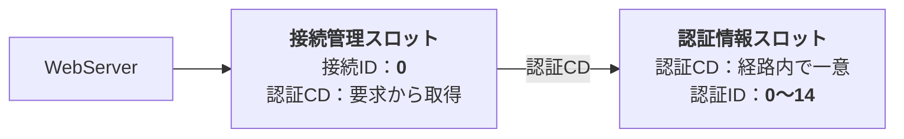

# 🌐 セッション管理
最終更新日：2026年08月11日
～作成中～

ＭＭＰでは様々な通信経路に対応していますが、（その特性にあわせ）様々な管理をしています。

主に以下のデータを管理しています。
|名称|説明|備考|
|----|----|----|
|<b>接続管理スロット</b>|コマンドの実行が完了するまで、受信データを管理します。 受信データが1コマンド分溜まるまでバッファに蓄えます。|一定時間以上、未使用の場合は削除される|
|<b>認証情報スロット</b>|ネットワーク接続のユーザ認証情報を管理します。 認証に失敗すると処理を継続できなくなります|一定時間以上、未使用の場合は削除される|
|<b>ユーザ情報スロット</b> |各機能モジュール内にあるユーザ別のデータ保存領域です。 様々な用途に使われます。|上記2つのスロットが削除されてもクリアしない 他ユーザに割り当てられても内容が残る|

---
## １. 通信経路によるスロット構成の違い
### 【シリアル】
ユーザ認証・接続認証のどちらもおこないません。
物理ポートで常時接続する為、(一切の認証はせずに)常に信頼した通信として扱います。
物理ポートそのものが接続単位なので、物理ポート ⇔ 接続管理スロットが1対1です。
シリアルだけが固有の`ポート番号`という項目を持ちます。

### 【ＴＣＰブリッジ】
ユーザ認証・接続認証のどちらもおこないます。
接続管理単位は`TCP接続ごと`で、最大10スロットまで持てます。
つまり、接続情報スロットの有効単位は、TCP接続(が切れるまでの)単位になります。
認証情報は、(接続情報スロットの数に関係なく)最大20スロットまで持てます。

### 【ＷｅｂＡＰＩ】
ユーザ認証だけをおこないます。
1リクエストで処理が完結し、接続が終わるからです。
つまり、接続情報スロットの有効単位は、リクエスト単位になります。
このような理由から、接続管理単位は`HTTPサーバ全体`で1つ、つまり1スロットを全リクエストで使いまわします。
認証情報は、(接続情報スロットの数に関係なく)最大20スロットまで持てます。

## ２. セッション管理
接続には
---
## 2-1. 接続管理
各通信経路が管理テーブルをもち、スロット(テーブルレコード)と呼ぶ単位で**接続情報**を管理します。
ひとつのＭＭＰコマンドを受信しきるまで、受信データをスロットにバッファに一時保持します。

通信経路ごとの特徴は以下の表のとおりです。

| 項目| Serial | TCP | HTTP |
|---|---|---|---|
| スロット数 | 固定 (物理ポート単位) | 複数 (TCP接続単位) | 1 (使いまわし) |
| 接続資源 | `Stream*` | `WiFiClient` | `WebServer*` |
| 接続資源の所有 | しない (ポインタ) | する (実体) | しない (ポインタ) |
| スロット割当タイミング | 起動時 | 接続発生時 | 起動時 |
| 切断時のスロットの開放 | 不要 | 必要 | 不要 |

各スロットには**接続ID**というスロット番号を持ちます。
（接続ID＝接続管理のテーブルレコード番号）

※先頭の接続IDは0から始まります。

---
## 2-2. 認証情報
各通信経路が管理テーブルをもち、スロット(テーブルレコード)と呼ぶ単位で**認証情報**を管理します。

通信経路ごとの特徴は以下の表のとおりです。

| 項目| Serial | TCP | HTTP |
|---|---|---|---|
| スロット数 | なし | なし | 最大15個 |
| スロット割当タイミング | 起動時 | 接続発生時 | 起動時 |

各スロットには**認証ID**というスロット番号を持ちます。
（認証ID＝認証情報のテーブルレコード番号）

※先頭の接続IDは0から始まります。
※スロット管理対象外の通信経路は、認証IDを０として内部処理しています。

---
## 2-3. ユーザアプリ情報
ユーザ別のデータを保持することが可能な、機能モジュールがあります。
このデータを<b>ユーザアプリ情報</b>と呼びます。

アクセスする際、<b>アクセスID</b>という番号が必要になります。
（アクセスID＝ユーザアプリ情報のテーブルレコード番号）

ユーザアプリ情報は、全通信経路で一つのテーブルにまとめられています。
割り当ては、以下の表のとおりです。
| アクセスID | 通信経路 |認証ID| 備考             |
|------------|----------|------|------------------|
| 00         | シリアル (USB-CDC)| -- | <b>ポートIDと同時</b>|
| 01         | シリアル (UART)   | -- | <b>ポートIDと同時</b>|
|||||
| 02         | TCP  | 00 | 未使用の場合あり|
| ～         | 〃   | ～ | 〃 |
| 21         | 〃   | 14 | 〃 |
|||||
| 22         | HTTP | 00 | 未使用の場合あり|
| ～         | 〃   | ～ | 〃 |
| 41         | 〃   | 14 | 〃 |

※通信経路ごとに連番でまとまっています。
※実際には共通部品でアクセスIDを求めます。
