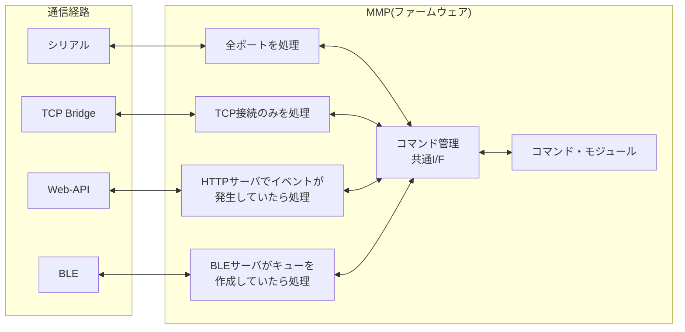
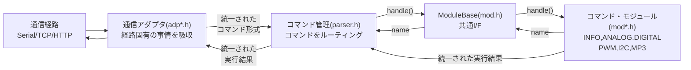
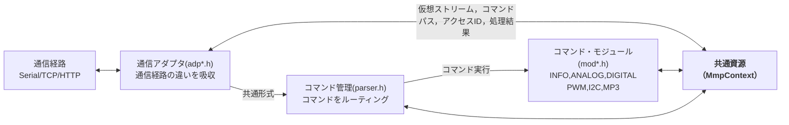
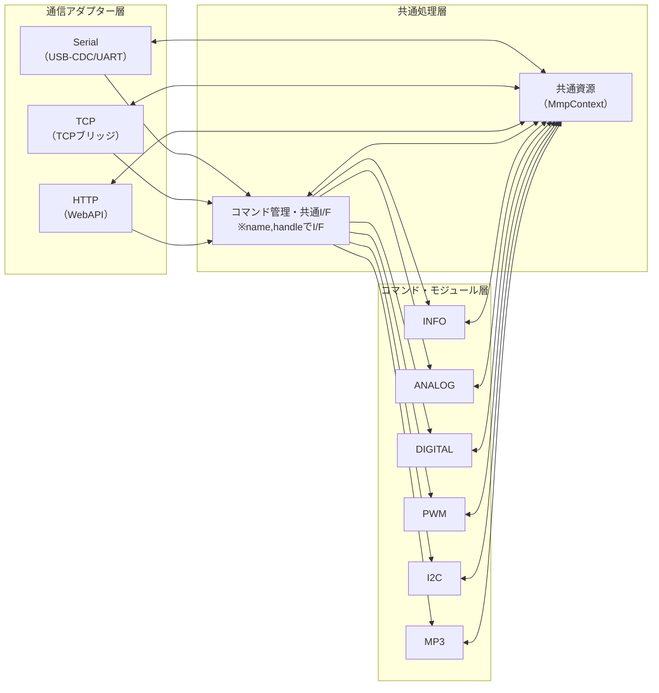

# はじめに
最終更新日：2026年08月11日

---
#### このファームウェアとは
**「通信経路の違いを完全に吸収し、  
すべての制御を '文字列コマンド' に統一した、  
拡張性と教育性に優れたマルチモジュール制御ファームウェア」**

---
## 1. 全体アーキテクチャ概要
- 複数の通信経路を**単一のコマンド管理**へ集約し、**統一された処理フロー**でコマンド実行
- **責務を明確に分離**し、各層の役割を一貫させた設計
- 通信経路固有の処理は、**早い段階で吸収**  
- コマンド管理以降は**通信経路を意識しない**設計  
- 各コマンド・モジュールは機能単位で独立しており、**高い保守性**を持つ

---
## ２. 特徴
### 🔹**マルチ通信・マルチユーザに対応**
- 全通信経路(シリアル/TCP/HTTP/BLE)を同時に扱える  
- 接続ごとに独立したユーザ認証・接続管理がある
- 各コマンド・モジュールは、ユーザーごとのデータを独立して扱える(アクセスIDで識別)

### 🔹**コマンド・モジュールの構造が単純で新規追加が容易**
- 各機能は独立したクラス・オブジェクトとして実装
- 共通処理は抽象基底クラスが担当、コマンド・モジュールは固有の処理に集中できる

### 🔹**通信経路を意識しない共通コマンド文法**
Python / Arduino / .NET からの命令は、URI形式の同じ文法で統一  
**`send("PWM/OUTPUT:0:100!")` のように文字列を送るだけ**。

内部でのクライアントID割当、IPスロット管理などはすべてファームウェアが担当。

### 🔹**拡張性の高さ**
- ひな形・共通関数が豊富で、新しい通信経路(LoRa/CANなど)の追加が容易  
- 利用制限(同時接続数・認証ユーザ数)の変更も定数変更のみでＯＫ
- コマンド・モジュールの追加は、ほぼ純粋な機能部分だけの開発でＯＫ

---
## ３. 接続と認証

### 3-1.接続情報
リクエストのデータ受信が途中であっても、接続情報を個別に保持しながら、他の接続とタイムシェアリングします。保持には個別の保存メモリ(スロット)が必要となり、通信経路毎にその個数が異なります。
| 経路       | 接続情報の管理 |
|------------|----------|
| シリアル   | 物理ポート数 |
| TCPブリッジ| TCP接続数(制限あり)|
| Web-API    | １(リクエスト単位で受信する為)|
| BLE        | １(リクエスト単位で受信する為)|

（特徴）
- 動的に IP を登録するので、複数デバイスの同時接続に強い  
- 任意の経路から同一コマンド体系を実行可能  
- 経路数増加（LoRa、CAN など）にも拡張しやすい

---

## ４. 全体の流れ
### (概要)
1. **経路別処理(通信アダプタ)**：認証したのちに、リクエスト内容を取り出しコマンド管理へ
1. **コマンド管理**：リクエスト内容を該当のコマンド・モジュールへ
1. **コマンド・モジュール**：リクエスト内容の機能を実行し、処理結果を仮想ストリーム `StringStream` に出力
1. **コマンド管理**：仮想ストリームに蓄積された処理結果を取得し、通信アダプタへ返す
1. **経路別処理(通信アダプタ)**：実行結果を編集し、通信経路に返す

### (詳細１)

リクエストは、責務別のモジュールを経て処理されます。

### (詳細２)
各レイヤで共有する実行コンテキストや共通資源は、MmpContext を介して受け渡します。 
通信アダプタが受け取る処理結果は、実際には共通資源(MmpContext)経由で取得します。

---
## ５. コマンド・モジュールとの連携
各コマンド・モジュールは 共通IF(抽象基底クラス) を継承し、以下の特徴を持ちます。
- **コマンド所有判定 (`name`) と処理本体 (`handle()`) の明確な分離**
- 出力は **仮想ストリーム(MmpContext内)** へ統一  
- モジュール追加/削除が非常に簡単

