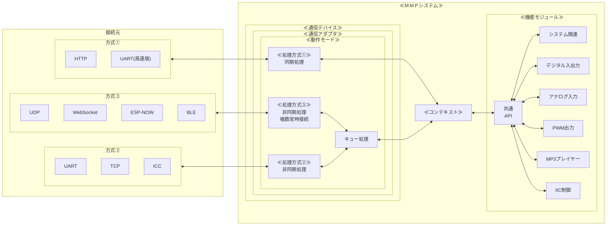
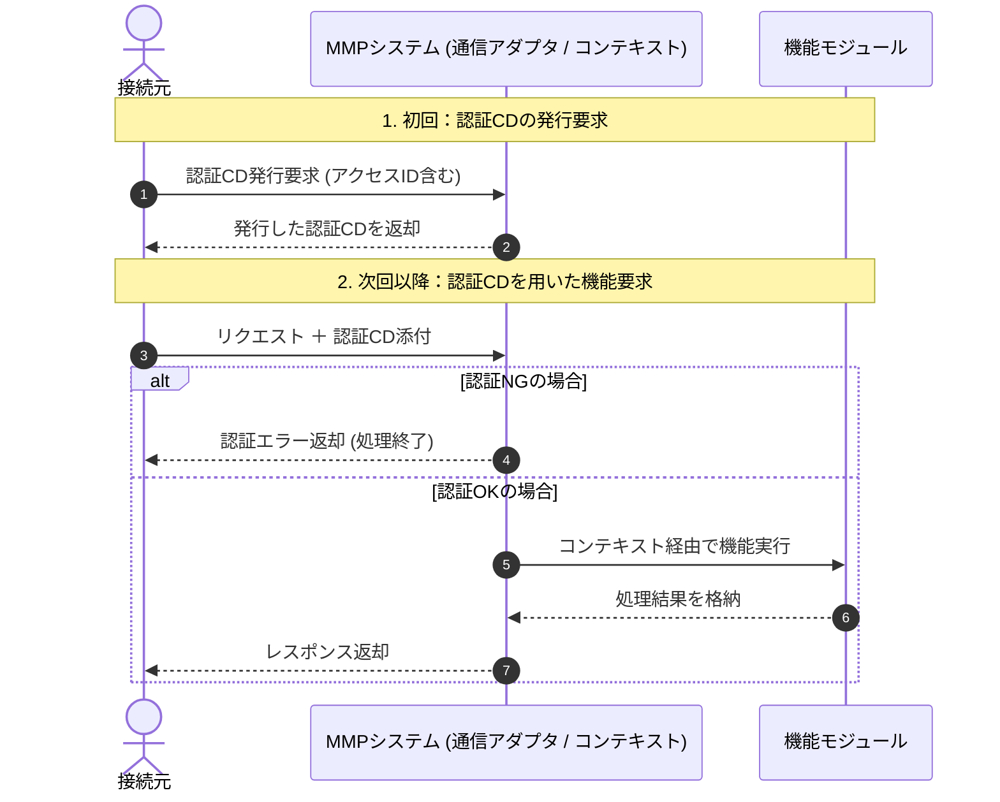

# はじめに
最終更新日：2026年08月11日

---
### このファームウェアが目指すこと
- 拡張性・保守性に優れた**設計思想を学ぶ教材**
- 様々なIOデバイスを繋ぎ、**豊かな表現力をもつアプリを簡単開発**

---
## 1. アーキテクチャ
- **明確な責任分界点**をもつ ➡ コードモジュールの**独立性・保守性**が高い
- 複数の**通信方式の違いを吸収** ➡ 同じ機能をスマートに提供
- 洗練された**抽象クラス**を用意 ➡ **シンプル**で**僅かなコード量**で機能拡張が可能

---
## ２. 機能
### 🔹**マルチ通信・マルチユーザに対応**
- 多彩な通信経路を**同時に接続**できる　
対応プロトコル：**UART / UDP / TCP / WebSocet / HTTP / ESP-NOW / BLE / IIC**  
- **ユーザ認証**・**常時接続**を維持する機能をもつ
- 各機能モジュールに、**ユーザ固有のデータ**を持つことができる

### 🔹**通信経路を意識しない共通コマンド文法**
単純な文字列(URI形式)によるコマンド文法で統一。
 ➡ **開発言語の制約**を受けにくい。  
`send("PWM/OUTPUT:0:100!")` のように文字列を送るだけ**。

---
## ３. システム構成

4つに大別される資源で構成され、以下のように情報を連携します。
1. 接続元の**要求**は、対応する≪通信アダプタ≫に送信されます。
1. 通信アダプタ内では、**動作モード別・特性にあう方式**で処理され、**共通情報≪コンテキスト≫** に格納します。
1. ≪機能モジュール≫は≪コンテキスト≫を基に**機能を実行**し、**処理結果**を≪コンテキスト≫に格納します。
1. ≪通信アダプタ≫は≪コンテキスト≫の**処理結果**を接続元に送信します。

```mermaid
flowchart LR
  subgraph Client["接続元"]
    subgraph Client1["方式①"]
      RouteHTTP["HTTP"]
      RouteUARTT["UART(高速版)"]
    end
    subgraph Client2["方式③"]
      RouteUDP["UDP"]
      RouteWEBS["WebSocket"]
      RouteESPN["ESP-NOW"]
      RouteBLE["BLE"]
    end
    subgraph Client3["方式②"]
      RouteUART["UART"]
      RouteTCP["TCP"]
      RouteIIC["ICC"]
    end
  end

  subgraph MMP["≪ＭＭＰシステム≫"]
    subgraph Device["≪通信デバイス≫"]
    subgraph Adapter["≪通信アダプタ≫"]
    subgraph Mode["≪動作モード≫"]
      SyncMono["≪処理方式①≫<br>同期処理"] 
      PushCb["≪処理方式②≫<br>非同期処理"] 
      PushTh["≪処理方式③≫<br>非同期処理<br>複数常時接続"] 
      PopQue["キュー処理"]
    end
    end
    end

    ctx["≪コンテキスト≫"]

    subgraph Mod["≪機能モジュール≫"]
      Mod_["共通<br>API"]
      Mod_SYS["システム関連"]
      Mod_DIG["デジタル入出力"]
      Mod_ANA["アナログ入力"]
      Mod_PWM["PWM出力"]
      Mod_MP3["MP3プレイヤー"]
      Mod_IIC["IIC制御"]
    end
  end

  Client1 <--> SyncMono
  Client2 <--> PushTh
  Client3 <--> PushCb

  SyncMono <--> ctx
  PushTh   <--> PopQue
  PushCb   <--> PopQue

  PopQue <--> ctx
  ctx    <--> Mod_

  Mod_ <--> Mod_SYS
  Mod_ <--> Mod_DIG
  Mod_ <--> Mod_ANA
  Mod_ <--> Mod_PWM
  Mod_ <--> Mod_MP3
  Mod_ <--> Mod_IIC
```
| 資源 | 解説 |
|------|------|
|**接続元**|様々な通信手段でMMPに節ぞ出来ます。３つの方式に分類できます。 方式の分類は、後述「処理方式」を参照してください。|
|**通信デバイス**|通信アダプタが必要とする通信基盤を用意します。 種類：**UART / WiFi / BLE / IIC**|
|**通信アダプタ**|接続元の種類別に用意された通信窓口です。 種類：**UART / UDP / TCP / WebSocket / HTTP / BLE / ESP-NOW / IIC**|
|**動作モード**|通信アダプタの用途ごとに振る舞いを分類します。 ①**メイン**：MMP本体です。通信アダプタ・機能モジュールを持ちます。 ②**サブ**：通信アダプタだけを持ち、メインと連携します。 ③**ブリッジ**：接続元に直接接続します。通信アダプタだけを持ち、メイン／サブと連携します。|
|**処理方式**|通信アダプタや動作モードにより異なります。 **方式①**要求ごと(同期)に機能実行・処理結果を送信する通信を扱います。 **方式②**非同期処理で、複数の常時接続の通信を扱います。 **方式③**非同期処理で、常時接続ではない通信を扱います。 **※非同期処理**：非同期でデータ受信しながら**要求内容・接続元を特定する情報**をキューに登録し、同期処理側で１つずつ処理します。|
|**コンテキスト**|リクエスト内容・付随情報を格納するデータ保管庫です。 通信アダプタ・機能モジュールのデータ連携に利用します。 １要求ずつ同期処理するため、１セットのコンテキストを使いまわします。|
|**機能モジュール**|コンテキストに従い、該当する機能・コマンドを実行します。 処理結果はコンテキストに格納します。|

---
## ４. 複数の常時接続

通信アダプタのうち、複数の常時接続を持つものがあります。
このような通信アダプタでは、**接続元を正確に追跡**する必要があります。

接続ごとに**接続スロット**と呼ぶ構造体データで管理します。
`接続スロット`には、接続元を特定するための情報(**接続識別子**)を格納します。

通信アダプタごとに、`接続数`、`接続識別子`の「データ/型」が異なります。

| 通信アダプタ | スロット単位 |接続数|接続識別子|データ型|
|--------------|--------------|------|----------|--------|
| UART | 固定ポート|最大 3|ポートを静的割当 ・Serial(USB-CDC) ・Serial1(GPIO) ・Serial2(GPIO)|Stream* ※オブジェクト(参照)|
| TCP  | TCP接続(不定)|最大10|接続クライアントを動的割当 |TCPClient ※オブジェクト(実体)|
| IIC  | 固定IICアドレス|5|アドレス値を静的割当 ・0xA0 ・0xA1 ・0xA2 ・0xA3 ・0xA4| 数値|

---
## ５. 非同期処理（非同期キュー処理）

前章４と同様、他の通信アダプタ(HTTTP除く)でも`接続識別子`が必要です。
非同期キュー処理の方式では、キューに`接続識別子`を格納します。

接続スロットを扱う場合、接続スロットIDも格納します。
※これにより、正しいスロットへ処理結果を送信できます。

このように、キューには要求内容以外にも、**接続元に正しく処理結果を届ける為の情報**が格納されます。

| 通信アダプタ | 接続識別子      | データ型|接続スロット番号|
|--------------|-----------------|---------|----------------|
| UART         | Object(参照)    |Stream*  |**格納が必要**|
| TCP          | Object(実体)    |TCPClient|**格納が必要**|
| UDP          | IP + ":" + PORT |String   ||
| WebSocket    | 接続番号        |uint8_t  ||
| ESP-NOW      | MACアドレス     |String   ||
| BLE          | 接続番号        |uint8_t  ||
| IIC          | IICアドレス     |uint8_t  |**格納が必要**|
| HTTP         | －              |－       |－|

※HTTPは接続スロット・非同期処理も行わないので対象外

---
## ６. ユーザ認証

機能モジュールのなかには、ユーザ個別のデータを持つものがあります。

ユーザの識別には**アクセスID**を用います。
ユーザは初めに`アクセスID`と対になる**認証CD**の発行を要求します。
次回以降は取得した`認証CD`を用いることで、ユーザ個別のデータを活用できます。

要求に**認証CD**を添付すると、該当する`アクセスID`が≪コンテキスト≫に格納されます。
機能モジュールは≪コンテキスト≫を通じて`アクセスID`を取得し、ユーザ個別のデータを特定します。

一連の処理には、**ユーザ認証モジュール**が介在します。
各資源は **≪コンテキスト≫を用いてデータ連携**します。

```mermaid
sequenceDiagram
    autonumber
    actor Client as 接続元
    participant MMP as MMPシステム (通信アダプタ / コンテキスト)
    participant Module as 機能モジュール

    Note over Client, Module: 1. 初回：認証CDの発行要求
    Client->>MMP: 認証CD発行要求 (アクセスID含む)
    MMP-->>Client: 発行した認証CDを返却

    Note over Client, Module: 2. 次回以降：認証CDを用いた機能要求
    Client->>MMP: リクエスト ＋ 認証CD添付
    alt 認証NGの場合
        MMP-->>Client: 認証エラー返却 (処理終了)
    else 認証OKの場合
        MMP->>Module: コンテキスト経由で機能実行
        Module-->>MMP: 処理結果を格納
        MMP-->>Client: レスポンス返却
    end
```