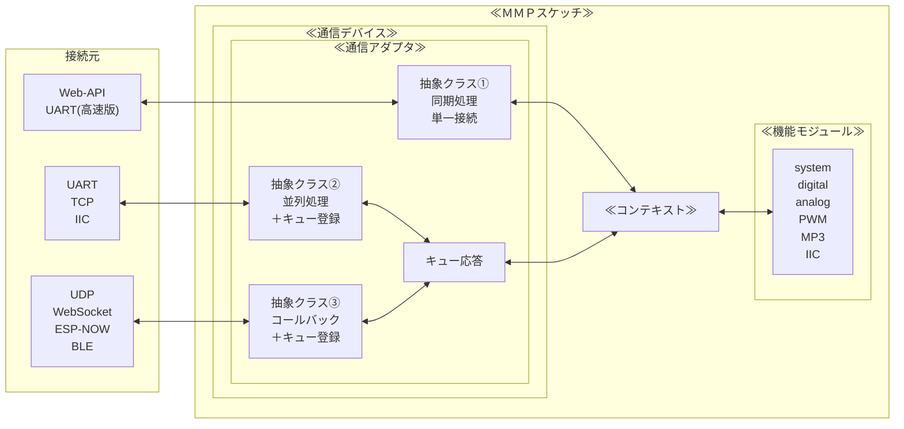

# はじめに
最終更新日：2026年08月11日

---
### このファームウェアが目指すこと
- 拡張性・保守性に優れた**設計思想を学ぶ教材**
- 様々なIOデバイスを繋ぎ、**豊かな表現力をもつアプリを簡単開発**

---
## 1. アーキテクチャ
- **明確な責任分界点**をもつ ➡ コードモジュールの**独立性・保守性**が高い
- 複数の**通信方式の違いを吸収** ➡ 同じ機能をスマートに提供
- 洗練された**抽象クラス**を用意 ➡ **シンプル**で**僅かなコード量**で機能拡張が可能

---
## ２. 機能
### 🔹**マルチ通信・マルチユーザに対応**
- 多彩な通信経路を**同時に接続**できる　
対応プロトコル：**UART / UDP / TCP / WebSocet / HTTP / ESP-NOW / BLE / IIC**  
- **ユーザ認証**・**常時接続**を維持する機能をもつ
- 各機能モジュールに、**ユーザ固有のデータ**を持つことができる

### 🔹**通信経路を意識しない共通コマンド文法**
単純な文字列(URI形式)によるコマンド文法で統一。
 ➡ **開発言語の制約**を受けにくい。  
`send("PWM/OUTPUT:0:100!")` のように文字列を送るだけ**。

---
## ３. システム構成

4つに大別される資源で構成され、以下のように情報を連携します。
1. 接続元の**リクエスト**は、対応する≪通信アダプタ≫を通して≪コンテキスト≫に集約されます。
1. ≪機能モジュール≫は≪コンテキスト≫を基に処理を実行し、**処理結果**を≪コンテキスト≫に格納します。
1. ≪通信アダプタ≫は≪コンテキスト≫の**処理結果**を接続元にレスポンスします。

```mermaid
flowchart LR
  subgraph Client["接続元"]
    RouteSyncMono["Web-API<br>UART(高速版)"]
    RouteCBack["UDP<br>WebSocket<br>ESP-NOW<br>BLE"]
    RouteSlot["UART<br>TCP<br>IIC"] 
  end

  subgraph MMP["≪ＭＭＰスケッチ≫"]
    subgraph Device["≪通信デバイス≫<br>(UART,WiFi,Bluetooth,IIC 等)"]
      subgraph Adapter["≪通信アダプタ≫"]
        SyncMono["抽象クラス①<br>同期処理<br>単一接続"] 
        PushTh["抽象クラス②<br>並列処理<br>＋キュー登録"] 
        PushCb["抽象クラス③<br>コールバック<br>＋キュー登録"] 
        PopQue["キュー応答"]
      end
    end

      ctx["≪コンテキスト≫"]
    subgraph Mod["≪機能モジュール≫"]
      ModR["system<br>digital<br>analog<br>PWM<br>MP3<br>IIC"]
    end
  end

  RouteSyncMono  <--> SyncMono
  RouteSlot  <--> PushTh
  RouteCBack <--> PushCb

  SyncMono <--> ctx
  PushTh  <--> PopQue
  PushCb  <--> PopQue

  PopQue  <--> ctx

  ctx  <--> ModR
```
#### (資源の解説)
1. **ＭＭＰスケッチ**：以下4つの資源を統括します。(最上位の資源)
1. **通信デバイス**：通信アダプタが必要とする通信基盤を用意します。
1. **通信アダプタ**：通信経路別に3つの処理方式(抽象クラス①～③)のいずれかで処理します。
1. **コンテキスト**：リクエスト内容を転記することで、通信アダプタ・機能モジュールがデータ連携します。
1. **機能モジュール**：コンテキストに従い機能を実行し、処理結果をコンテキストに反映します。

---
## ４. 接続と認証

### 3-1.複数の常時接続に対応
通信経路のうち、通信サービス内に複数の同時接続を持つものがあります。
MMPはこれに対応し、トランザクション終了まで、**接続元を正確に追跡**します。
接続ごとの情報は、**接続スロット**と呼ぶ構造体データで管理しています。

| 経路 | スロットの単位 |接続数| 接続元の識別方法 |
|------|----------------|------|------------------|
| UART | 物理ポートごと |最大 3| オブジェクト：**Serial**xx(ポインタ)|
| TCP  | TCP接続ごと    |最大10| オブジェクト：**TCPClient**(実体)   |
| IIC  | アドレスごと   |最大 4| 数値型データ：IICスレーブ・アドレス|

*接続数はシステムで変更可能