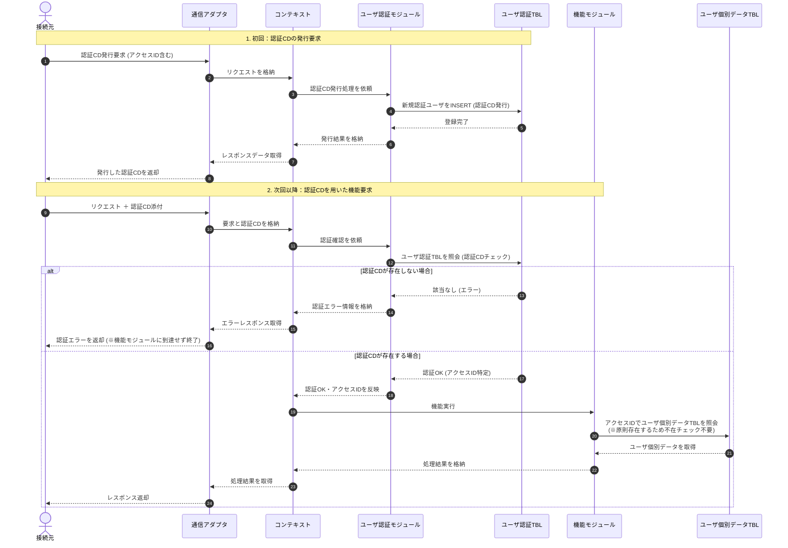

# ユーザ認証
最終更新日：2026年08月11日

## はじめに

機能モジュールのなかには、ユーザ個別のデータを持つものがあります。

ユーザの識別には**アクセスID**を用います。
ユーザは初めに`アクセスID`と対になる**認証CD**の発行を要求します。
次回以降は取得した`認証CD`を用いることで、ユーザ個別のデータを活用できます。

要求に**認証CD**を添付すると、該当する`アクセスID`が≪コンテキスト≫に格納されます。
機能モジュールは≪コンテキスト≫を通じて`アクセスID`を取得し、ユーザ個別のデータを特定します。

## 処理シーケンス

