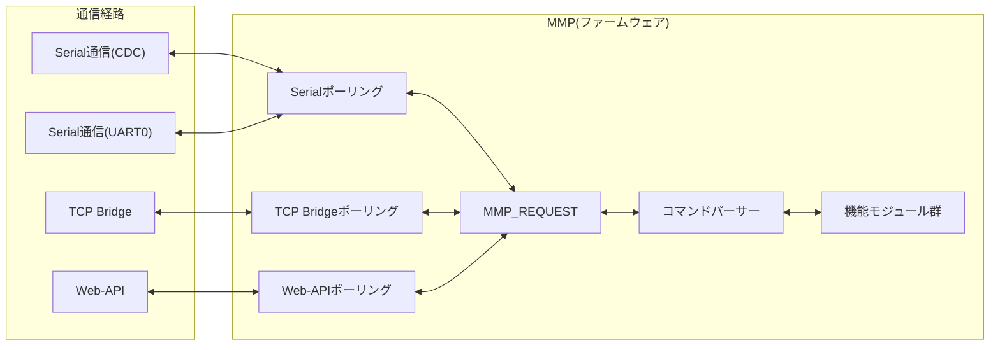

# はじめに
最終更新日：2025年11月14日

---

#### このファームウェアを一言で説明すると？
**「通信経路の違いを完全に吸収し、  
すべての制御を '文字列コマンド' に統一した、  
拡張性と教育性に優れたマルチモジュール制御ファームウェア」**

---

## 1. 全体アーキテクチャ概要
複数の通信経路を**単一のパーサー**へ集約、**統一処理フロー**でコマンド実行が可能な、高度・洗練・シンプルな設計である。

- **クライアント識別はすべてファームウェア側で実施**  
- **これにより、ドライバ側(アプリやライブラリ)は、通信経路を意識した実装は不要**  
- **各機能モジュール構成は完全に独立し、高い保守性を持つ**

---

## 2. クライアント管理と経路統合

### ● 経路一覧
| 経路 | ID | 説明 |
|------|-----|------|
| USB CDC | 0 | PC接続用 |
| UART0 | 1 | GPIO Serial |
| TCP Bridge | 2〜11 | IPごとに最大10クライアント |
| HTTP Web API | 12〜21 | IPごとに最大10クライアント |

### ● 特徴
- 動的に IP を登録するので、複数デバイスの同時接続に強い  
- 任意の経路から同一コマンド体系を実行可能  
- 経路数増加（LoRa、BLE など）にも拡張しやすい

---

## 3. 処理フロー

1. **各ポーリング**：`通信経路`からのリクエストを`統一書式`を整形
1. **MMP_REQUEST**：`統一書式`に`通信経路`を添えて`コマンドパーサー`に連携する
1. **コマンドパーサー**：`統一書式`を`コマンド＋引数`に分解→コマンドが該当する機能モジュールを探す→`機能モジュール`に連携
1. **機能モジュール**：`コマンド＋引数`に従い機能を実行→`実行結果`を`コマンドパーサー`に連携  
1. **コマンドパーサー**：`実行結果`を`各ポーリング`へ連携
1. **各ポーリング**：`実行結果`を整形し、`通信経路`へレスポンス

---
## 4. 機能モジュール構成
各機能モジュール(*)は ModuleBase を継承し、以下の特徴を持つ。
> *機能モジュール：INFO / ANALOG / DIGITAL / PWM / I2C / MP3

- **コマンド所有判定 (`owns()`) と処理本体 (`handle()`) の明確な分離**
- LED 点灯用の RAII ガード  
- 出力は **仮想ストリーム StringStream** へ統一  
- モジュール追加/削除が非常に簡単

---

## 5. 特徴
### 🔹**完全マルチクライアント対応**
- USB / UART / TCP / HTTP を同時に扱える  
- 各クライアントは独立したバッファ・独立したセッションを保持  
- アナログ・PWMなど全データは「クライアントごとに完全分離」

### 🔹**モジュールが完全に独立して動作**
- 各機能は独立したクラスとして実装  
- 機能追加は「ファイル 1 枚追加するだけ」で可能  
- 依存関係が小さく、学習教材としても最適

### 🔹**通信経路を意識しない共通インターフェース**
Python / Arduino / .NET からは、  
**`send("ANALOG/IN!")` のように文字列を送るだけ**。

内部でのクライアントID割当、IPスロット管理などはすべてファームウェアが担当。

→ **アプリ側は常に同一APIで使えるため、実装ミスが減る**

### 🔹**安全性の高い RAII / 固定長バッファ設計**
- LED 点灯は RAII（スコープガード）で安全に実行  
- StringStream への出力も RAIIで安全に退避  
- Stack/Heap を最小限に抑え、ESP32-S3でも安定動作

### 🔹**拡張性の高さ**
- LoRa / BLE / USB-HID / WebSocket なども追加が容易  
- IPスロット方式なので、無限にクライアント追加が可能  
- PWM / アナログ / MP3 / I2C のようなデバイス制御もモジュール化済み  