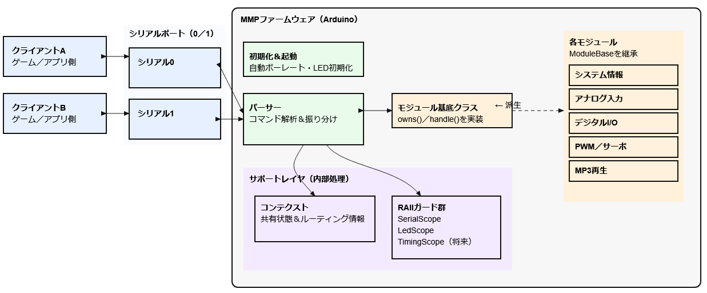

# MMPファームウェア アーキテクチャ概要

## このソフトウェア
**RAII × モジュール基底クラス**で“安全に拡張できる”シリアル指向ファームウェア。  
2ポート同時のクライアントを**取り違えず**処理し、**例外や早期 return でも必ず原状回復**。
モジュール追加は **`owns` / `handle`** を実装して登録するだけ、という“拡張しやすい構造”になっています。

---
## 設計の特徴

この設計は、**「壊れにくさ」と「増やしやすさ」** を両立させた“素直に強い”アーキテクチャです。  
**RAII で安全・一貫・簡潔**、**基底クラスで拡張が速い**、**2ポート同時を迷わず捌く**。  
保守の現場で“ストレスなく手を入れられる”——そんな気持ちよさを、触ってすぐに感じてもらえるはずです。

---
## 全体像

- **入出力**：クライアントは **2 系統のシリアル**（Serial0 / Serial1）で同時接続。
- **パーサ**：全入力を監視し、メッセージを **「:`コロン` 区切り」＋「`!` 終端」** のフレームとして取得。先頭トークン（コマンド名）で **担当モジュールへ振り分け**。
- **モジュール層**：各機能は **`ModuleBase` 派生**として独立実装。`owns(cmd)` で受付可否、`handle(args)` で処理。
- **サポート層（Context / RAII）**  
  - `Context` が **現在のクライアント/ストリーム** や **LED**、共通状態を一元管理。  
  - `SerialScope`（**発呼元ポートに切替・終了時自動復旧**）、`LedScope`（**処理中のみ点灯・終了時自動消灯**）など **RAII ガード**が“入退出の儀式”を自動化。  

> 結果：2ポートからのリクエストが交錯しても、**レスポンスは必ず発呼元へ**戻ります（スコープ終端で確実に復旧）。

---

## 設計の“キーとなる特徴”
1. **RAII で前後処理を“自動”に「バインド～実行～解放」**  
   - ルーティングと状態表示（LED）が **スコープ入退出だけで完結**。  
   - 早期 return や複数のエラーパスでも **後始末漏れが論理的に起こらない**。

2. **モジュールとのインターフェースが小さい・統一的**  
   - 実装者は **`owns` / `handle`** に集中。起動・LED・送信先切替などの横断関心事は **基盤が面倒を見る**。  
   - 新機能を **別ファイルの 1 モジュール** として増やしやすい（差分が明確、レビューも簡単）。

3. **プロトコルが単純明快で扱いやすい**  
   - **フレーミング**：`:` で引数区切り、`!` で終端。  
   - **正常応答**：**固定長 HEX + `!`** の **読みやすい** 形式（実装規約に準拠）。  
   - **エラー応答**：`<CMD>!!` の **一目で分かる** シグナル（どのコマンドで失敗したかが即判別）。

4. **2ポート同時を“素で”扱える**  
   - 入口は **パーサが一元化**、返信先は **RAII で自動指定**。  
   - マルチクライアントでも **取り違え・取りこぼし** が起きにくい。

5. **観測可能性（Observability）を内蔵**  
   - モジュール処理中の **LED 点灯** で“いまどの機能が動いているか”が外から分かる。  
   - レスポンスは終端 `!`、エラーは `!!` で **ログやテストが書きやすい**。

---

## 保守上のメリット
- **バグ封じ**：クリーンアップ漏れが構造的に起きにくい（RAIIの採用）。  
- **レビューが楽**：派生モジュールの差分は **コマンド受け付けと処理** にほぼ限定。横断処理は **読まなくていい**。  
- **段階的リリース**：モジュールは **登録 / 未登録** で出し入れでき、危険な実装は **切り離したまま評価** 可能。  
- **テストしやすい**：  
  - 2ポート独立の双方向を **そのまま試験** できる（ポート跨ぎの取り違え検知が容易）。  
  - プロトコルが簡潔なので **スクリプト自動化** が容易。  
- **運用も安心**：LEDの色 で **現場のトラブルシュート** が速い（「固まってる？」が一目で分かる）。

---

## 実装上のメリット
- **“小さなマイクロサービス群”が 1 バイナリに同居**：各モジュールが **疎結合** で増減自在。  
- **RAII ガードを増やせる**：`TimingScope` や `LogScope` など、**計測やロギング** を **1 行で差し込み、スコープで回収**。  
- **デバイス多彩**：アナログ・デジタル・PWM/サーボ・MP3… **周辺機能を横に拡張** する遊びが効く。

---

## これから触る人へ
1. **パーサの入口**（フレーム取得 → `owns` ディスパッチ）を読む。  
2. **`ModuleBase` のコントラクト**（`owns` / `handle` の責務）を掴む。  
3. **`Context` と RAII**（`SerialScope` / `LedScope`）の“入退出の儀式”を確認。  
4. 似た機能の既存モジュールを **雛形** にして新モジュールを増やす。  
5. 2ポート同時の簡単な試験シナリオで **応答の“取り違えゼロ”を体感** する。

---

