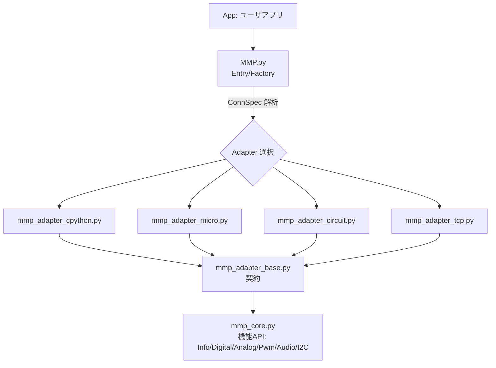
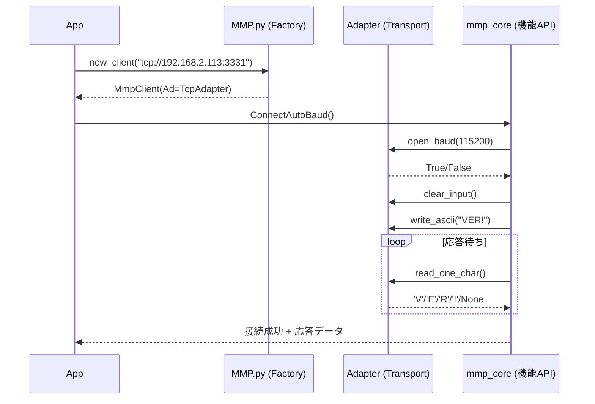
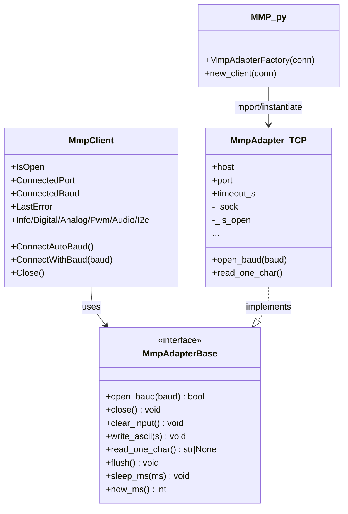
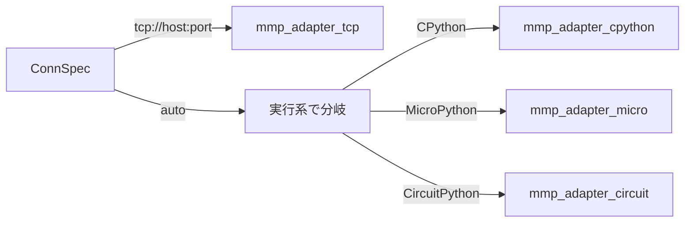

# MMP Python ライブラリ

本書は **MMP Python ライブラリ**の構造や設計思想を説明します。  
> 目的：アプリ開発者・実装者が「頭に地図を入れたまま」実装/運用/拡張できる状態にする

.Net Framework(DLL/COM)版やArduino版とは異なり、Pythonは多くの**Python言語処理系**や**通信経路**に対応します。その為、他のライブラリとは異なる、特殊な構造を持ちます。

---

## 0. 全体像(レイヤ構造)
`ユーザアプリ`は`MMP.py`を用いて**接続経路を確保し、APIが利用できる**ようにします。
> `MMP.py`の背後には、複数のモジュールが動的に連携し、さまざまな利用シーンに応えます。

はじめに、`ユーザアプリ`は`MMP.py`に利用シーン(`Python種別`,`接続方式`)を指定します。すると、適切な`Adapter`が選択され、どの利用シーンでも同じ方法で`API`が利用できるように構成されます。
> `ユーザアプリ`は`MMP.py`で生成された`通信ハンドル`を通して、APIを利用します。
> `ユーザアプリ`は`MMP.py`と`API`の間にある仕組みを意識することなく、開発することが出来ます。


<br>

各ファイルは **アプリと同じフォルダ** または **PYTHONPATH** に配置します。
|ファイル名|内容|
|-----------------------|----------------------------|
| MMP.py                |本書の入口 |
| mmp_core.py           |機能API・ロジック|
| mmp_adapter_base.py   |アダプタ抽象クラス|
| mmp_adapter_cpython.py|CPythonアダプタ|
| mmp_adapter_micro.py  |MicroPythonアダプタ|
| mmp_adapter_circuit.py|CircuitPythonアダプタ|
| mmp_adapter_tcp.py    |TCPブリッジ[CPython]アダプタ|

<br>

**ポイント**
- `App` は **MMP.py** を唯一の入口として利用(`new_client()` / `MmpAdapterFactory()`)。
- **ConnSpec**(`tcp://...` / `auto`)を **MMP.py** が解釈し、適切な Adapter を import。
- `mmp_core.py` は **通信を知らない**。**Adapter** だけを相手にする。

---

## 1. シーケンス(接続〜コマンド応答)
2つの段階を経て、接続経路を確立します。

1. 初めに通信ポートを確保します。
> 通信ポートを開きます。物理的なシリアルポートやＴＣＰポートで開きます。

2. 通信ポートを用い、相手がMMPであることを確認します。
> MMPが持つバージョン取得のコマンドで判断します。

各Adapterが`mmp_adapter_base.py`がもつ主要メソッドをオーバーロードし、`mmp_core.py`が備える`低レイヤ用ラッパー`がアクセスします。



**要旨**
- 上位(Core)は **1文字読み**で応答を組み立てる。
- Adapter は **I/O とタイムアウト**を責任持って処理(`select` 等)。
- **ボーレートは Adapter に渡すが、TCPでは実通信に影響しない**(記録のみ)。

---

## 2. クラス関係(主要コンポーネント)
各Adapterは`mmp_adapter_base.py`がもつ主要メソッドをオーバーロードします。
> これらは、`mmp_core.py`が備える`低レイヤ用ラッパー`から利用されます。



---

## 3. 使い方(最短)

### 3-1 TCPブリッジ方式
> `ser2netサーバ`を経由した、もっとも簡単な接続経路です。
> ユーザアプリを搭載するマシンに、物理的なシリアル接続は不要です。
> LAN環境さえあれば、容易な運用形態を実現できます。
> wifi環境であれば、無線化することにより、より簡便になります。

#### 3-1.1. `new_client()` を使う
```python
from MMP import new_client

# TCP(ser2net, socket://)
cli = new_client("tcp://192.168.2.113:3331?timeout=0.2")

# 直結(実行系で自動選択：CPython/Micro/Circuit)
cli = new_client("auto")

if cli.ConnectAutoBaud():
    print("VER:", cli.Info.Version())
else:
    print("接続失敗:", cli.LastError)
```

#### 3-1.2. `MmpAdapterFactory()` を直接使う
```python
from mmp_core import MmpClient
from MMP      import MmpAdapterFactory

adapter = MmpAdapterFactory(conn="tcp://192.168.2.113:3331?timeout=0.5")
cli     = MmpClient(adapter)
```

### 3-2. シリアル方式
> シリアル通信を経由した、小規模な接続経路です。
> ユーザアプリを搭載するマシンとMMPを、シリアルケーブルで接続します。
> TCPブリッジよりもケーブルが邪魔になりますが、通信環境が不要であるメリットがあります。

#### 3-2.1. CPython(Windows/Linux/macOS)
ポート・通信速度を自動検出します。
走査ではじめに接続確認できたポートを採用します。
ポート番号が若いものから順に捜査します。
```python
from MMP import new_client

# 実行系に合わせて CPython 用シリアルアダプタが選ばれ、
# COM/tty を自動スキャンして接続します。
cli = new_client("auto")

if cli.ConnectAutoBaud():
    print("Port :", cli.ConnectedPort)   # 例) COM5 / /dev/ttyACM0 / /dev/tty.usbmodem*
    print("Baud :", cli.ConnectedBaud)
    print("VER  :", cli.Info.Version())
else:
    print("接続失敗:", cli.LastError)
```

### 3-2.2. MicroPython
通信速度を自動検出します。
```python
from MMP import new_client

# 実行系が MicroPython なら、自動で Micro 用アダプタを選択します。
cli = new_client("auto")

if cli.ConnectAutoBaud():
    print("VER:", cli.Info.Version())
else:
    print("接続失敗:", cli.LastError)
```
### 3-2.3. CircuitPython
通信速度を自動検出します。
```py
from MMP import new_client

# 実行系が CircuitPython なら、自動で Circuit 用アダプタを選択します。
cli = new_client("auto")

if cli.ConnectAutoBaud():
    print("VER:", cli.Info.Version())
else:
    print("接続失敗:", cli.LastError)
```

---
## 4. Adapter
各`Adapter` は `mmp_adapter_base.py` の **同一I/F** を実装(オーバーロード)します。
これらは、`mmp_core.py`が備える`低レイヤ用ラッパー`から利用されます。

4部のグループで構成されています。
|グループ    |説明                    |
|------------|------------------------|
|通信ハンドル|通信を司るオブジェクト  |
|プロパティ  |様々なステータスを参照  |
|通信関連    |MMPと通信するための機能 |
|ヘルパー    |時間に関するヘルパー機能|

```python
class MmpAdapterBase:

    # 通信ハンドル
    _uart           = None

    # プロパティ
    _is_open        = False
    _connected_port = None
    _connected_baud = None
    _lastError      = None

    # 通信関連
    def open_baud(self, baud:int) -> bool: ...
    def close(self) -> None: ...
    def clear_input(self) -> None: ...
    def write_ascii(self, s:str) -> None: ...
    def read_one_char(self) -> str|None: ...
    def flush(self) -> None: ...

    # ヘルパー
    def sleep_ms(self, ms:int) -> None: ...
    def now_ms(self) -> int: ...
```

#### 実装状況
|通信ハンドル|C(Pydroid)|C(PC)|Micro|Circuit|
|---|---|---|---|---|
|_uart|CDC(usb4a)<br>TCP(非CDCをブリッジ)<br>TCP(ser2net)<br>|非CDC･CDC<br>TCP(ser2net)|非CDCT<br>TCP(ser2net)|非CDC<br>TCP(ser2net)|

| プロパティ|C(CDC,非CDC)|Micro(非CDC)|Circuit(非CDC)|C(TCP)|C(TCP)|C(TCP)|
|---|---|---|---|---|---|---|
|_is_open       |○|○|○|○|
|_connected_port|○(例: `COM5`/`/dev/ttyACM0`)|○|○|○(`tcp://host:port`)|
|_connected_baud|○(物理値)|○|○|○(**記録のみ**)|
|_lastError     |○|○|○|○|

|メソッド|C(Serial)|Micro(Serial)|Circuit(Serial)|C(TCP)|備考|
|---|---|---|---|---|---|
|open_baud(baud)|○|○|○|○|TCPは**ボーレートは記録のみ**|
|close()         |○|○|○|○|TCPは`shutdown/close`|
|clear_input()   |○|○|○|○|TCPは`select`で読み捨て|
|write_ascii(s)  |○|○|○|○|TCPは`sendall`|
|read_one_char() |○|○|○|○|TCPは`select+recv(1)`|
|flush()         |○(UART flush)|○(簡易)|○(簡易)|－|TCPは**no-op**|
|sleep_ms()      |○|○|  ○|○|`time.sleep`系|
|now_ms()        |○|○|  ○|○|`monotonic()`系|
> 注：Micro/Circuit の flush() は環境差が大きいため簡易、TCPは概念なしでno-op。

## 5. Adapterの個別情報
各`Adapter` は `mmp_adapter_base.py` の **同一I/F** を実装しますが、`Adapter`によっては実装に差異があります。
この章では、`Adapter`個々の詳細を解説します。

#### 5-1. TCPブリッジ方式
#### 5-1.1. CPython
|トピック|解説|
|---|---|
|依存      |`socket`, `select`, `time`(標準ライブラリのみ)|
|低遅延    |`TCP_NODELAY` を既定ON(小パケット即送信)|
|安定性    |`SO_KEEPALIVE`(Linuxでは `TCP_KEEP*` を任意設定)|
|ボーレート|`ConnectedBaud` に**記録のみ**(通信には無関係)|

|メソッド|要点|
|---|---|
|open_baud    |接続確立・内部状態更新。失敗時は`False`＋`_lastError`|
|clear_input  |`select`で可読分を複数回読み捨て|
|write_ascii  |`sendall`で全送出|
|read_one_char|`select`＋`recv(1)`／EOF検出で`_is_open=False`|
|flush`       |**no-op**|

#### 5-1.2. MicroPython
～作成中～

#### 5-1.3. CircuitPython
～作成中～


#### 5-2. シリアル方式
#### 5-2.1. CPython
|トピック|解説|
|---|---|
|依存      |`pyserial`(列挙・接続・flush対応)|
|ポート検出|COM/`/dev/tty*`/`/dev/cu.*` を**若番→順に総当たり**|
|同期      |`clear_input()`で残骸を捨て**コマンド前に整流**|

|メソッド|要点|
|---|---|
|open_baud    |指定ボーレートで`Serial`をopen／タイムアウト設定|
|clear_input  |`reset_input_buffer()` 等で受信側クリア|
|write_ascii  |`write(s.encode('ascii','ignore'))`|
|read_one_char|`read(1)`／無ければ`None`|
|flush`       |`flush()`(出力バッファのドレイン)|


#### 5-2.2. MicroPython
|トピック|解説|
|---|---|
|依存|`machine.UART` 等／ボード固有のピン割当|
|注意|`typing` 不要・`select` 非依存で軽量に|

|メソッド|要点|
|---|---|
|open_baud    | `UART(id, baudrate, bits, parity, stop)`|
|clear_input  | `while uart.any(): uart.read()`|
|write_ascii  | `uart.write()`|
|read_one_char| `uart.read(1)`／無ければ`None`|
|flush`       | 簡易(概念限定)|


#### 5-2.3. CircuitPython
|トピック|解説|
|---|---|
|依存|`busio.UART`(ボードにより`board.TX/RX`指定)|
|注意|`select` 非対応／`wifi+socketpool`は**別アダプタ**で扱う予定|

|メソッド|要点|
|---|---|
|open_baud    |`busio.UART(tx, rx, baudrate, parity, bits, stop)`|
|clear_input  |`while uart.in_waiting: uart.read(1)`|
|write_ascii  |`uart.write(bytes)`|
|read_one_char|`uart.read(1)`／無ければ`None`|
|flush        |簡易(概念限定)|

---

## 6. ConnSpec(接続指定子)と分岐
`ユーザアプリ`の指示に応じて、適切な通信経路を確立します。



- `tcp://192.168.2.113:3331?timeout=0.2`
- `auto`(直結の自動選択)

---

## 7. エラーハンドリングと再試行(指針)

- `open_baud()`：成功/失敗の **bool** を返し、`LastError` に理由文字列。
- 読み取り：切断(`recv==0`)を検知したら `IsOpen=False` に落とす。
- 明示的リトライ(例)：
```python
from MMP import new_client
for attempt in range(3):
    cli = new_client("tcp://192.168.2.113:3331?timeout=0.5")
    if cli.ConnectAutoBaud():
        break
    cli.Close()
```

---

## 8. テスト・拡張(ロードマップ)

- **モックアダプタ**で Core の単体試験(`read_one_char()` が None を返すケースなど)。
- 将来：`mmp_adapter_tcp_tls.py`(`tls://`)や `mmp_adapter_rfc2217.py` の追加。
- Android 直結(usb4a/Kivy)は **別アダプタ**として維持(TCPを使う限り不要)。

---

## 9. 参考用：最小スケルトン

```python
from MMP import new_client

def main():
    cli = new_client("tcp://192.168.2.113:3331?timeout=0.2")
    if not cli.ConnectAutoBaud():
        print("接続失敗:", cli.LastError); return
    print("VER:", cli.Info.Version())
    cli.Digital.Out(10, 1)
    cli.Pwm.Out(0, 2048)
    cli.Close()

if __name__ == "__main__":
    main()
```

---

## 10. まとめ
- **MMP.py = 入口/Factory**、**Adapter = 交通整理**、**Core = 機能API**。
- App は **ConnSpec ひとつ**でどの接続でも同じコードで利用可能。
- 新規媒体(BLE/TLS/WebSocket 等)は **Adapter 追加**で拡張できる。

