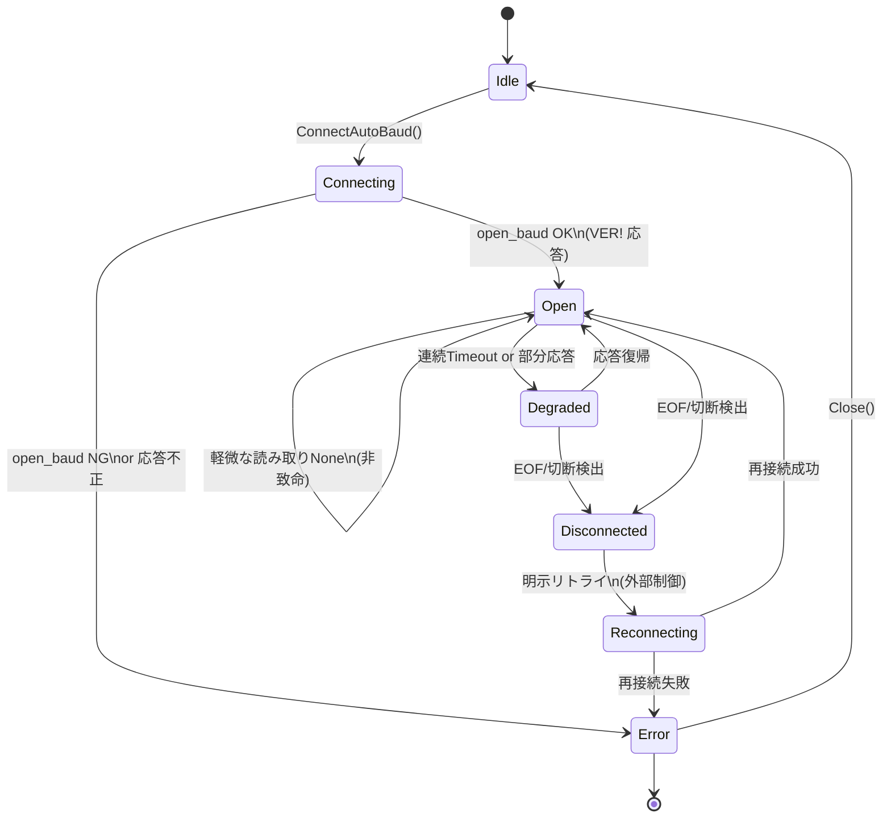

# 運用仕様（現状把握版）
**タイムアウト既定**
**例外メッセージ標準化**
**再接続ポリシー**

> **注意**：本章は「現状把握（暫定）」です。実装差や未統一な点を含みます。  
> 将来、ここを“単一の仕様”に収束させます。

---

## 1. 既定タイムアウト（現状）

| 実行環境 / Adapter | 接続（open） | 受信1文字待ち（read_one_char） | 備考 |
|---|---|---|---|
| **CPython (TCP)** | `socket.settimeout(max(timeout_s, 0.01))`（接続時のみ） | `select.select(..., timeout_s)`（既定 `0.2s`、ConnSpecの`?timeout=`で変更） | 接続後は `blocking=True` で `select` 管理 |
| **CPython (Serial)** | pySerial の `timeout` を `ConnectWithBaud` 側で設定 | `read(1)`（pySerial の `timeout` 依存） | ポート総当たり時は候補ごとに `timeout` 設定 |
| **MicroPython (Serial)** | UART 初期化時の `timeout` 相当が未統一 | `uart.read(1)`（無ければ `None`） | 実装差あり（ボード依存） |
| **CircuitPython (Serial)** | `busio.UART(..., timeout=...)` がボード依存 | `uart.read(1)`（無ければ `None`） | 実装差あり（ボード依存） |

**TODO（統一方針案）**  
- `ConnSpec` で `?timeout=` を受け取れるのは **TCPのみ** → 将来 **Serial系にも適用**。  
- `MmpClient.ConnectAutoBaud()` から **I/O待ちの既定秒**を一元管理（例：0.2s→可変）。

---

## 2. 例外/エラー文言の標準化（現状）

`MmpClient.LastError` に格納する **メッセージの“型”** を下表へ整理。  
（実装メッセージ例は現状のもの。将来、共通の語彙に統一します）

| カテゴリ | 代表メッセージ例（現状） | 典型的原因 | 発生層 |
|---|---|---|---|
| 接続失敗 | `TCP接続エラー: <詳細>` / `Serial open error: <詳細>` | 相手がいない／権限不足／占有中 | Adapter |
| 切断/EOF | `peer closed`（内部）| 相手側クローズ／ケーブル抜け | Adapter |
| 応答なし | `Timeout waiting response`（検討中） | 装置停止／無応答 | Core or Adapter |
| プロトコル不一致 | `Unexpected response`（検討中） | ターゲットがMMPでない | Core |
| 設定不正 | `Invalid ConnSpec` / `Invalid parameter` | `tcp://`文法ミス等 | Factory |
| 内部例外 | `Internal error: <詳細>` | 実装バグ | いずれか |

**TODO（統一方針案）**  
- 先頭に **エラーコード**（短い英大文字）を付与：`E_CONN`, `E_TIMEOUT`, `E_PROTO`, `E_PARAM`, `E_INTERNAL`。  
- ユーザ向け短文 + 詳細（元例外）を `; ` 区切りで保存。  
  例）`E_CONN: TCP connect failed; [Errno 111] Connection refused`

---

## 3. 再接続ポリシー（状態遷移：現状）


---
**現状の動作要点**
- read_one_char() は None を返すだけで 例外を投げない（上位でリトライ可）。
- EOF/切断検出時、Adapter が IsOpen=False を落とし、上位判断で Close() → 再接続。
- 自動再接続ループは アプリ側で実装（例：3回まで試す、クールダウン）。

**TODO（統一方針案）**
- MmpClient に 簡易オートリトライ（回数/インターバル）を追加。
- Degraded の判定（連続 None 回数や経過秒）を仕様化。

---
## 4. テンプレ：再接続ラッパ（アプリ側）

```
from MMP import new_client
import time

def connect_with_retry(conn, tries=3, wait_s=0.5):
    for i in range(tries):
        cli = new_client(conn)
        if cli.ConnectAutoBaud():
            return cli
        cli.Close()
        time.sleep(wait_s)
    return None

# 例：TCP
cli = connect_with_retry("tcp://192.168.2.113:3331?timeout=0.5", tries=3, wait_s=0.7)
if not cli:
    print("E_CONN: 接続できませんでした")
else:
    try:
        print("VER:", cli.Info.Version())
    finally:
        cli.Close()
```

---
## 5. 今後の収束ポイント（ToDo）
- Timeout 統一：ConnSpec から Serial 系にも反映／ConnectAutoBaud で一元管理。
- エラー標準化：E_* コード付け（ユーザ向け短文＋詳細）。
- 再接続API：ConnectWithRetry() の提供（回数・待ち・指数バックオフ）。
- 状態通知：on_disconnect コールバック／イベントフックの検討。
