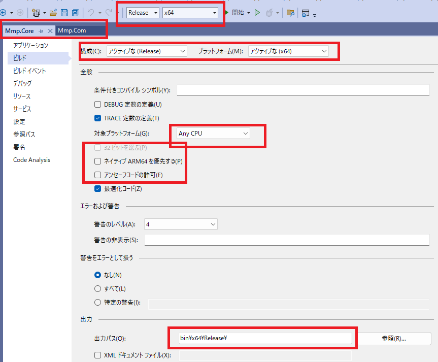

# MMP .NET ライブラリ インストール & 登録ガイド

本書は **Mmp.Core.dll**（クラスライブラリ）および **Mmp.Com.dll**（COM 連携用）の配布・インストール手順をまとめたものです。  
32bit/64bit 共通の構成、Inno Setup を用いたインストーラー作成、インストーラーを使わない手動登録の方法を含みます。

---

## 1. 前提条件

- 対象 OS: Windows 10/11（管理者権限が必要）
- .NET Framework 4.x（C# 7.3 相当）
- 配布物（最低限）  
  - `Mmp.Core.dll`（AnyCPU 推奨）  
  - `Mmp.Com.dll`（**x86 用** と **x64 用** の 2 種類をビルドして用意）  
  - 依存 DLL がある場合は同梱
- COM 利用クライアント:
  - Excel VBA (Office 32bit/64bit 両方想定)

> **注意**: Office のビット数（32/64）は「ファイル > アカウント > バージョン情報」で確認できます。  
> Office 32bit からは **x86 版** `Mmp.Com.dll`、Office 64bit からは **x64 版** `Mmp.Com.dll` を登録して使用します。


---

## 2. 想定フォルダ構成（インストール先）

```
x:\～\MMP\DotNet\        … 64bit 用（既定）
x:\～\MMP\DotNet\  … 32bit 用
    ├─ x86    │   └─ Mmp.Com.dll
    ├─ x64    │   └─ Mmp.Com.dll
    ├─ lib    │   └─ Mmp.Core.dll（AnyCPU 推奨）
    └─ tools        └─ Register_MmpCom.cmd / Unregister_MmpCom.cmd（任意）
```

- 実運用では x86 と x64 を別フォルダへ格納し、**それぞれ別々に regasm 登録**します。

---

## 3. インストーラー（Inno Setup）での登録

### 3.1 事前準備
- `Mmp.Core.dll`（AnyCPU）, `Mmp.Com.dll`（x86）, `Mmp.Com.dll`（x64）をビルドしておく。
- Inno Setup 6.x をインストール。

### 3.2 サンプルスクリプト（両用インストーラー）

> 下記は **1 本のインストーラー**で x86/x64 の両方を同梱し、環境に応じてレジストレーションを実施する例です。  
> `#define MyAppName` やファイルパスは実環境に合わせて調整してください。

```ini
; MMP DotNet Installer (x86/x64)
#define MyAppName       "MMP .NET Components"
#define MyAppVersion    "1.0.0"
#define BaseDir         "C:\Build\MMP_DotNet"       ; 例: ビルド成果物の配置場所
#define CoreLib         BaseDir + "\lib\Mmp.Core.dll"
#define ComX86          BaseDir + "†\Mmp.Com.dll"
#define ComX64          BaseDir + "d\Mmp.Com.dll"

[Setup]
AppName={#MyAppName}
AppVersion={#MyAppVersion}
DefaultDirName={pf}\MMP\DotNet
DisableProgramGroupPage=yes
OutputDir=.
OutputBaseFilename=MMP_DotNet_Setup
ArchitecturesAllowed=x86 x64
ArchitecturesInstallIn64BitMode=x64
PrivilegesRequired=admin
Compression=lzma
SolidCompression=yes

[Languages]
Name: "japanese"; MessagesFile: "compiler:Languages\Japanese.isl"

[Files]
; 共通ライブラリ（AnyCPU）
Source: "{#CoreLib}"; DestDir: "{app}\lib"; Flags: ignoreversion

; COM 本体 x86 / x64 を同梱
Source: "{#ComX86}"; DestDir: "{app}†"; Flags: ignoreversion
Source: "{#ComX64}"; DestDir: "{app}d"; Flags: ignoreversion

[Run]
; --- x64 OS かつ 64bit Office/クライアント向け登録 ---
Filename: "regasm.exe";   Parameters: """{app}d\Mmp.Com.dll"" /codebase /tlb:""{app}d\Mmp.Com.tlb""";   StatusMsg: "Registering COM (x64) ...";   Flags: runhidden waituntilterminated;   Check: Is64BitInstallMode

; --- 32bit Office/クライアント向け登録（x86） ---
; 64bit OS でも 32bit Office を使うケースがあるため、x86 も登録しておくと安全
Filename: "{syswow64}
egasm.exe";   Parameters: """{app}†\Mmp.Com.dll"" /codebase /tlb:""{app}†\Mmp.Com.tlb""";   StatusMsg: "Registering COM (x86) ...";   Flags: runhidden waituntilterminated

[UninstallRun]
; アンインストーラー時の登録解除
Filename: "regasm.exe";   Parameters: "/u ""{app}d\Mmp.Com.dll""";   Flags: runhidden waituntilterminated; Check: Is64BitInstallMode

Filename: "{syswow64}
egasm.exe";   Parameters: "/u ""{app}†\Mmp.Com.dll""";   Flags: runhidden waituntilterminated

[Code]
function IsOffice64(): Boolean;
begin
  // 必要なら Office ビット数検出を実装（レジストリ参照等）。今回は常に False を返す例。
  Result := False;
end;
```

#### ポイント
- `regasm.exe` は **対象のビット数**に合わせて使い分けます。  
  - x64 登録: `C:\Windows\Microsoft.NET\Framework644.0.30319
egasm.exe`（Inno では `regasm.exe` で十分）  
  - x86 登録: `C:\Windows\Microsoft.NET\Framework4.0.30319
egasm.exe` だが、64bit OS で 32bit 登録する場合は `SysWOW64
egasm.exe` を使うと確実。
- `/codebase` は DLL を GAC に入れずに参照させるための指定です（配布フォルダ固定）。
- `/tlb` で Type Library も併せて生成・配置できます。

> **推奨**: 64bit OS では **x64 と x86 の両方**を登録しておくと、Office のビット数に依存せずに使い回せます。

---

## 4. インストーラー不要の **手動登録**（任意）

### 4.1 配置
- 任意のフォルダに `Mmp.Core.dll` と `Mmp.Com.dll`（ビット数に合わせて x86 or x64）を配置。  
  例: `C:\Tools\MMP\DotNetd` または `C:\Tools\MMP\DotNet†`

### 4.2 管理者権限のコマンドプロンプトで regasm

**64bit を登録**（64bit OS の場合）:
```bat
C:\Windows\Microsoft.NET\Framework644.0.30319
egasm.exe "C:\Tools\MMP\DotNetd\Mmp.Com.dll" /codebase /tlb
```

**32bit を登録**（64bit OS で 32bit Office を使う場合）:
```bat
C:\Windows\SysWOW64
egasm.exe "C:\Tools\MMP\DotNet†\Mmp.Com.dll" /codebase /tlb
```

**解除（アンレジスト）**:
```bat
C:\Windows\Microsoft.NET\Framework644.0.30319
egasm.exe /u "C:\Tools\MMP\DotNetd\Mmp.Com.dll"
C:\Windows\SysWOW64
egasm.exe /u "C:\Tools\MMP\DotNet†\Mmp.Com.dll"
```

> `Mmp.Core.dll` は COM 登録不要（同じフォルダに置くだけで OK）。

---

## 5. テスト手順（VBA）

1. Excel を **管理者権限不要**で起動（通常起動）。  
2. 下記の最小コードで動作を確認。

```vb
Option Explicit
Sub Test_MmpCom()
    Dim m As Object
    Set m = CreateObject("Mmp.Com")
    
    Dim port As String
    port = m.Connect(vbNullString, 115200, 200, 400)
    If LenB(port) = 0 Then
        Debug.Print "Connect failed:", m.LastError
        Exit Sub
    End If
    
    Debug.Print "Port:", port
    Debug.Print "VER:", m.Info.Version()
    
    ' 音声テスト（環境に応じてフォルダ/トラック番号）
    m.Audio.Volume 1, 15
    Debug.Print "DIR:", m.Audio.Play.FolderTrack(1, 1, 1)
    m.Audio.Stop 1
End Sub
```

---

## 6. よくあるエラーと対処

| 事象 | 原因 | 対処 |
|---|---|---|
| `ActiveX コンポーネントはオブジェクトを作成できません` | COM 未登録 / ビット数不一致 | Office のビット数に合わせて `Mmp.Com.dll` を **正しい regasm** で登録（x86 or x64）。 |
| `ファイルが見つかりません` | `/codebase` で配置先が参照されていない | DLL を移動したら再登録。配置パスは固定運用が安全。 |
| `アクセスが拒否されました` | 権限不足 | regasm は **管理者コマンドプロンプト**で実行。 |
| 登録は成功だが Excel から見えない | 32/64bit の取り違え | `SysWOW64
egasm.exe`（x86）と `Framework64
egasm.exe`（x64）の使い分けを再確認。 |

---

## 7. 配布のベストプラクティス

- **x86 / x64 の両方**を常に用意して同梱。
- `Mmp.Core.dll` は AnyCPU ビルドで 1 本化。
- インストーラーでは **両方登録**（x64 OS の場合）。
- 署名（Strong Name）は **GAC 配布時のみ**必須。`/codebase` 配布なら不要。
- 将来の更新に備え、**アンインストーラーで必ず登録解除**を実施。

---

## 変更履歴
- 1.0.0 初版
