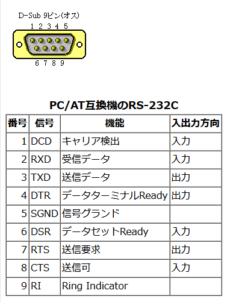

# ＭＳＸで扱うには
## ～作成中～
---
懐かしの MSX でMMPを利用する方法を解説します。

---
## 1. MMPとの接続
| MSX(D-SUB端子) | MMP                |
| -------------- | ------------------ |
| RX  ２番ピン   | GPIO0 (Serial1 TX) |
| TX  ３番ピン   | GPIO1 (Serial1 RX) |
| GND ５番ピン   | GND                |



---
## 2. 通信設定
#### 書式：OPEN CMINI(`<ポートID>`,`<制御>`,`<通信速度>`)
OPEN "COM0:" はモード省略で送受両用になります（FOR OUTPUT/FOR INPUTを分けてもOK）。
| 引数      |値 | 説明            |
| --------- |---| --------------- |
| 諸設定    |   | `0:8N1NNN`にする  |
| 通信速度  |   | 9600 推奨       |
※`0:8N1NNN`とは、`ポート0`/`8bit`/`No parity`/`1 stop`/`XONXOFFなし`/`ハンドシェイクなし`/`LF自動削除なし`/`自動挿入なし`の意味
---
## 3. コマンドの実行(送受信)
`OPEN "COM0:"`をモード省略＝送受両用で開き、`LOC(#1)`で受信バッファの蓄積を待ってから`INPUT$(5,#1)`で5文字をまとめて取得します。

### 3-1. コマンドの送信
#### 書式：PRINT #`<ストリーム番号>`,"`<文字列>`";
一括で送信できます。
MMPコマンドは改行コードは使わず、`!`文字を終端として扱います。
末尾には必ず`!`にしてください。
※末尾に`;`を置くと`CR+LF`を付けません。

### 3-2. コマンド結果の受信
#### 書式：LOC(#`<ストリーム番号>`)
受信バッファ内の未読文字数を参照します。
MMPコマンドの返信が5バイトなので、この関数で返信しきったかを判定します。

#### 書式：INPUT$(`<取り込バイト数>`,#`<ストリーム番号>`)
一括で受信できます。
指定サイズでデータを取り込めます。
MMPコマンドの返信が5バイトなので、まとめて5バイトずつ取り込みましょう。


---
## 4. サンプルコード
```bas
10 ' 9600bps / 8N1 / フロー制御なし
20 CALL COMINI("0:8N1NNNN",9600)
30 OPEN "COM0:" AS #1          ' 送受両用で開く
40 PRINT #1,"VER!";             ' 改行を付けないで送信
50 TIME=0                       ' タイムアウト用（約5～6秒）
60 WHILE LOC(#1) < 5 AND TIME < 300: WEND
70 IF LOC(#1) >= 5 THEN A$=INPUT$(5,#1): PRINT "RX=";A$ ELSE PRINT "TIMEOUT"
80 CLOSE #1
```