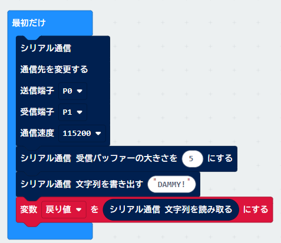

# micro:bitで扱うには
## ～拡張中～
 micro:bitでMMPを利用する方法を解説します。

---
## 1. MMPとの接続
| micro:bit  | MMP                |
| ---------- | ------------------ |
| RXD        | GPIO0 (Serial1 TX) |
| TXD        | GPIO1 (Serial1 RX) |
| GND        | GND                |

---
## 2. 通信設定


### 2-1. シリアル通信ブロック 
`高度なブロック`→`シリアル通信`→`その他`の`シリアル通信 受信バッファの大きさを○にする`ブロックを使います。

| 項目名   | 設定値   |説明|
| -------- | ---------|----|
| 送信端子 | いろいろ | Txにあたります。<br>0を推奨 |
| 受信端子 | いろいろ | Rxにあたります。<br>1を推奨 |
| 通信速度 | いろいろ | ＭＭＰに合わせる|

### 2-2. シリアル通信 受信バッファの大きさ ブロック
`高度なブロック`→`シリアル通信`の`シリアル通信`ブロックを使います。<br>
| 項目名 | 設定値 |説明|
| ------ | -------|----|
| ○     | 5      | MMPコマンドの戻り値のバイト数である5にあわせる|

### 2-3. 受信バッファをクリア 
接続直後は受信バッファにゴミが入ります。そこで、ダミーで１つコマンドを実行してから、受信バッファを読み取ることで、空にします。変数をひとつ用意し、`シリアル通信 文字列を読み取る`で、受信バッファを空にします。仮に変数にでも取り込めばよいでしょう。

---
## 3. コマンドの実行(送受信)


### 3-1. コマンドの送信
`シリアル通信 文字列を書き出す`ブロックを使い、MMPのコマンドを入力します。

### 3-2. コマンド結果の受信
コマンド実行後には必ず、`シリアル通信 文字列を読み取る`で、結果を受信します。これを行わないと、受信バッファに値が残ってしまいます。変数に取得しておいて、後の処理にし宇要することが出来ます。

---
## 4. サンプルコード
`Microsoft MakeCord for micro:bit`のエディタ画面で、Pythonモードに切り替えて貼りつけてください。Aボタンを押すとMP3ファイルを演奏します。
```py
def on_button_pressed_a():
    global 戻り値
    basic.show_icon(IconNames.HAPPY)
    serial.write_string("DIR:1:4:2!")
    basic.pause(500)
    戻り値 = serial.read_string()
    basic.show_string(戻り値)
input.on_button_pressed(Button.A, on_button_pressed_a)

戻り値 = ""
serial.redirect(SerialPin.P0, SerialPin.P1, BaudRate.BAUD_RATE115200)
serial.set_rx_buffer_size(5)
serial.write_string("DAMMY!")
戻り値 = serial.read_string()

def on_forever():
    pass
basic.forever(on_forever)
```